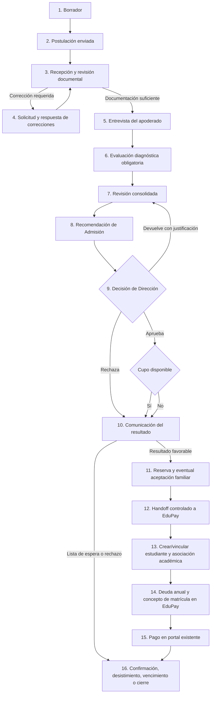

# Flujo conceptual de admisión

## Propósito y estado

Este documento define la semántica común aprobada en `D-001` y describe el flujo funcional conocido del piloto. No constituye todavía una máquina de estados implementable: guardas, plazos, reaperturas y textos requieren diseño funcional y validación institucional.

## Separación de conceptos

| Concepto | Qué representa | Ejemplo |
| --- | --- | --- |
| Etapa | Agrupación estable para navegación, métricas y tableros | Revisión documental |
| Estado interno | Situación operativa actual que determina acciones válidas | `ACTION_REQUIRED` |
| Subestado o razón | Detalle configurable que no cambia el ciclo principal | `MISSING_BIRTH_CERTIFICATE` |
| Evento | Hecho inmutable ocurrido en un instante | `DocumentRejected` |
| Resultado | Conclusión de una evaluación o decisión | Elegible, no elegible, lista de espera |
| Estado mostrado | Explicación deliberadamente simple para la familia | “Necesitamos información” |
| Tarea | Trabajo asignable con responsable y vencimiento | Revisar documento |

### Recomendación

Mantener un conjunto pequeño de estados canónicos y modelar entrevistas, evaluaciones, documentos, ofertas y tareas como conceptos con ciclo propio. Las instituciones podrían configurar qué etapas aplican y sus reglas, pero no redefinir el significado de los hechos canónicos.

## Etapas comunes propuestas

1. **Preparación:** borrador familiar antes del envío.
2. **Recepción:** validaciones de ingreso y acuse de recibo.
3. **Revisión documental:** revisión, observaciones y correcciones iterativas.
4. **Interacción con la familia:** entrevista del apoderado cuando corresponda.
5. **Evaluación del estudiante:** entrevista o diagnóstico cuando corresponda.
6. **Revisión final y capacidad:** consolidación de antecedentes, decisión y disponibilidad.
7. **Oferta y respuesta:** comunicación de vacante, espera, rechazo o aceptación familiar.
8. **Derivación a matrícula:** handoff controlado a EduPay.
9. **Cierre:** matriculada, desistida, rechazada o expirada.

En el núcleo, las etapas 4 y 5 pueden ser configurables. En el piloto Conquistadores 2027 ambas son obligatorias por `D-015`, aunque la diferencia con `SRC-002` permanece en `C-009` hasta validación del colegio. Omitir una etapa en otra configuración debe producir un evento auditable con la regla aplicada; no debe fingir que una actividad ocurrió.

## Diagrama de alto nivel

```mermaid
stateDiagram-v2
    [*] --> DRAFT
    DRAFT --> SUBMITTED: Enviar postulación
    DRAFT --> WITHDRAWN: Desistir
    DRAFT --> EXPIRED: Vence ventana de borrador

    SUBMITTED --> UNDER_REVIEW: Validación de recepción
    UNDER_REVIEW --> ACTION_REQUIRED: Faltan antecedentes o correcciones
    ACTION_REQUIRED --> UNDER_REVIEW: Familia responde
    UNDER_REVIEW --> PROCESSING: Antecedentes suficientes

    state PROCESSING {
        [*] --> GuardianStep
        GuardianStep --> StudentStep: Completa o no aplica según configuración
        StudentStep --> ConsolidatedReview: Completa o no aplica según configuración
        ConsolidatedReview --> Recommendation: Admisión revisa
        Recommendation --> DirectionDecision: Recomendación enviada
        DirectionDecision --> ConsolidatedReview: Dirección devuelve con justificación
    }

    PROCESSING --> OFFERED: Dirección aprueba y hay vacante reservable
    PROCESSING --> WAITLISTED: Dirección aprueba; no hay vacante disponible
    PROCESSING --> REJECTED: Dirección rechaza
    WAITLISTED --> OFFERED: Se asigna vacante
    WAITLISTED --> WITHDRAWN: Familia desiste
    WAITLISTED --> EXPIRED: Cierra vigencia

    OFFERED --> OFFER_ACCEPTED: Familia acepta si el proceso lo exige
    OFFERED --> ENROLLMENT_PENDING: Handoff sin aceptación separada si se aprueba esa regla
    OFFERED --> WITHDRAWN: Familia rechaza o desiste
    OFFERED --> EXPIRED: Vence oferta
    OFFER_ACCEPTED --> ENROLLMENT_PENDING: Se inicia derivación
    ENROLLMENT_PENDING --> ENROLLED: Matrícula confirmada
    ENROLLMENT_PENDING --> ACTION_REQUIRED: Matrícula requiere acción familiar
    ACTION_REQUIRED --> ENROLLMENT_PENDING: Acción resuelta

    REJECTED --> [*]
    WITHDRAWN --> [*]
    EXPIRED --> [*]
    ENROLLED --> [*]
```

`PROCESSING` agrupa subprocesos y no necesariamente sería un valor persistido. El diagrama omite reaperturas excepcionales, que requerirían permiso elevado, motivo y auditoría.

La recomendación de Admisión y la decisión de Dirección son objetos distintos. Crear o enviar una recomendación no publica un resultado ni reserva por sí solo un cupo.

## Mapeo de la lista original

| Elemento propuesto originalmente | Clasificación recomendada | Observación |
| --- | --- | --- |
| `DRAFT` | Estado interno | Editable y aún no presentado. |
| `SUBMITTED` | Estado transitorio + evento `ApplicationSubmitted` | Debe existir como acuse, aunque pronto pase a revisión. |
| `DOCUMENT_REVIEW` | Etapa; estado canónico sugerido `UNDER_REVIEW` | La revisión documental puede iterar. |
| `ACTION_REQUIRED` | Estado interno transversal | Debe incluir razón, vencimiento y audiencia. |
| `DOCUMENTS_COMPLETE` | Hito/evento | Puede revertirse si vence o se reemplaza un documento. |
| `*_INTERVIEW_PENDING` | Estado del agregado Entrevista o tarea | No debería dominar toda la postulación. |
| `*_INTERVIEW_SCHEDULED` | Estado de Entrevista + evento | Puede haber reprogramaciones y múltiples intentos. |
| `*_INTERVIEW_COMPLETED` | Evento/hito y resultado separado | Completar no implica aprobar. |
| `STUDENT_ASSESSMENT_*` | Estado del agregado Evaluación | Igual separación entre agenda, ejecución y resultado. |
| `FINAL_REVIEW` | Etapa o estado operativo | Requiere responsable y reglas de decisión. |
| `ACCEPTED` | Resultado ambiguo; reemplazar por decisión favorable y `OFFERED` | Falta aceptación familiar. |
| `WAITLISTED` | Resultado y estado de espera | Requiere posición/criterio sin promesa indebida. |
| `REJECTED` | Resultado terminal | Motivo interno y mensaje familiar pueden diferir. |
| `ENROLLMENT_PENDING` | Estado de handoff | No implica éxito de EduPay. |
| `ENROLLED` | Hecho confirmado por dominio responsable | Debe llegar con correlación e idempotencia. |
| `WITHDRAWN` | Estado terminal transversal | Registrar quién, cuándo y motivo. |
| `EXPIRED` | Estado terminal por regla temporal | Registrar regla y notificaciones previas. |

## Transiciones y guardas propuestas

| Desde | Hacia | Actor o disparador | Guardas mínimas |
| --- | --- | --- | --- |
| `DRAFT` | `SUBMITTED` | Apoderado | Campos y consentimientos requeridos; oferta abierta; identidad autorizada |
| `SUBMITTED` | `UNDER_REVIEW` | Sistema | Recepción persistida y acuse registrado |
| `UNDER_REVIEW` | `ACTION_REQUIRED` | Revisor | Observación comunicable, responsable, plazo y datos mínimos |
| `ACTION_REQUIRED` | `UNDER_REVIEW` | Apoderado/sistema | Respuesta enviada; preservar versiones anteriores |
| Revisión | Entrevista/evaluación | Sistema o encargado | Documentos suficientes y etapa aplicable |
| Entrevista/evaluación | Revisión final | Encargado | Actividades requeridas completas o exención aprobada |
| Revisión consolidada | Recomendación enviada | Admisión | Antecedentes consolidados; recomendación versionada y auditada |
| Recomendación enviada | Revisión consolidada | Dirección | Devolución justificada, sin publicar resultado |
| Recomendación enviada | `OFFERED` | Dirección | Aprobación final y reserva válida según política de cupos |
| Recomendación enviada | `WAITLISTED` | Dirección aprueba; sistema/Admisión aplica cupos | Decisión favorable y ausencia/priorización de cupo documentada |
| Recomendación enviada | `REJECTED` | Dirección | Motivo interno y comunicación aprobada |
| `WAITLISTED` | `OFFERED` | Encargado/sistema | Regla de orden válida, cupo y reserva atómica |
| `OFFERED` | `OFFER_ACCEPTED` | Apoderado | Oferta vigente, identidad y aceptación de condiciones |
| `OFFER_ACCEPTED` | `ENROLLMENT_PENDING` | Sistema | Handoff idempotente creado |
| `ENROLLMENT_PENDING` | `ENROLLED` | Evento externo confirmado | Contrato válido y correlación conocida |
| No terminal | `WITHDRAWN` | Apoderado o autorizado | Confirmación, motivo opcional y efectos explicados |
| Estado temporizable | `EXPIRED` | Sistema | Regla versionada, reloj consistente y notificación según política |

## Entrevistas y evaluaciones

Cada actividad debe tener ciclo propio: `PENDING`, `SCHEDULED`, `RESCHEDULE_REQUESTED`, `COMPLETED`, `NO_SHOW`, `CANCELLED`, `WAIVED`. La conclusión o pauta se registra separada de la asistencia. Reprogramar crea historial; no sobrescribe silenciosamente la cita anterior.

Una evaluación puede contener datos especialmente sensibles. El hecho de que exista puede ser visible para más roles que su contenido detallado.

En el piloto, el colegio asigna directamente los horarios de entrevista del apoderado y evaluación diagnóstica. La familia recibe la cita por correo y puede tener una acción de confirmación o solicitud de cambio sólo si esa regla se aprueba en G1.

## Recomendación y decisión

La recomendación de Admisión tiene ciclo propio tentativo: `DRAFT`, `SUBMITTED_TO_DIRECTION`, `RETURNED_FOR_REVIEW`, `SUPERSEDED` y `CLOSED_BY_DECISION`. Cada versión registra autor, fundamento permitido, instante y relación con la anterior.

Dirección puede:

- aprobar;
- rechazar;
- devolver a revisión con justificación.

Ninguna de estas acciones expone automáticamente notas o fundamentos internos a la familia. Sólo una decisión final autorizada habilita la comunicación del resultado.

## Flujo específico del piloto Conquistadores 2027

Los pasos 11 y 12 conservan una decisión abierta: si el handoff ocurre tras la aprobación de Dirección o después de una aceptación familiar explícita. El diagrama expresa orden de negocio, no transacciones ni integración implementada.

## Documentos incompletos y correcciones

- La revisión se realiza por requisito documental, no sólo por archivo.
- Estados tentativos del requisito: `MISSING`, `UPLOADED`, `SCANNING`, `READY_FOR_REVIEW`, `ACCEPTED`, `REJECTED`, `SUPERSEDED`, `EXEMPTED`.
- Una observación debe indicar de forma segura qué corregir, sin exponer notas internas.
- Cada nueva versión conserva relación con la anterior.
- El sistema no debe afirmar “documentos completos” mientras haya escaneo pendiente o requisitos no resueltos.
- Las exenciones requieren rol autorizado, razón y auditoría.

## Lista de espera

- Es resultado de elegibilidad sin oferta inmediata, no una garantía.
- La política de orden puede variar por institución, año, sede y curso, pero debe versionarse.
- La posición exacta puede ser interna, visible o no visible según política aprobada.
- Promover desde lista de espera debe reservar cupo de forma consistente y evitar ofertas simultáneas por el mismo cupo.
- Cierre, expiración y desistimiento deben liberar cualquier reserva aplicable y registrar el hecho.

## Desistimiento y expiración

El desistimiento es una acción explícita de la familia o, excepcionalmente, de personal autorizado con evidencia. La expiración es automática según una regla preexistente. Ambos requieren motivo/código, autor o regla, marca temporal, comunicación y efectos sobre cupos. La reapertura no es transición normal.

## Estado interno versus estado familiar

| Situación interna | Vista sugerida para familia | Información no expuesta por defecto |
| --- | --- | --- |
| `UNDER_REVIEW`, cola interna | “Postulación en revisión” | Responsable, puntajes, notas y posición de cola |
| `ACTION_REQUIRED` | “Necesitamos información” + acción y plazo | Comentarios internos y señales de riesgo |
| Entrevista pendiente | “Próximo paso: entrevista” | Asignación interna o pauta confidencial |
| Revisión final | “Estamos revisando el resultado” | Deliberaciones, recomendaciones y cupos de terceros |
| Recomendación enviada a Dirección | “Estamos revisando el resultado” | Recomendación, autor, devoluciones y deliberación |
| `WAITLISTED` | “En lista de espera” + política aprobada | Datos de otras familias y posición si no es pública |
| `REJECTED` | Mensaje institucional aprobado | Razones sensibles o notas de evaluación no comunicables |
| Integración pendiente | “Preparando matrícula” | Reintentos, errores técnicos y payloads |

El mapeo debe ser configurable sólo dentro de mensajes y opciones aprobadas, y mantener coherencia con el estado real.

## Acciones automáticas tentativas

- Validar ventana y versión de oferta al enviar.
- Generar acuse de recibo y tareas iniciales.
- Escanear archivos y ponerlos en cuarentena antes de revisión.
- Enviar recordatorios de acciones o citas según consentimiento y política.
- Expirar borradores, solicitudes u ofertas mediante reglas versionadas.
- Promover lista de espera sólo si la política permite automatización; inicialmente se recomienda confirmación humana.
- Emitir mensajes de integración mediante mecanismo idempotente.
- Registrar eventos y accesos auditables.

## Acciones manuales tentativas

- Aceptar, observar o eximir requisitos documentales.
- Programar, reprogramar, ejecutar y concluir entrevistas/evaluaciones.
- Agregar notas internas con visibilidad restringida.
- Recomendar y aprobar decisiones según separación de funciones.
- Ajustar cupos con justificación.
- Corregir excepciones o reabrir casos mediante permiso elevado.

## Decisiones pendientes antes de una máquina de estados definitiva

- Etapas mínimas invariables y etapas repetibles.
- Reglas de excepción, reprogramación e inasistencia para entrevista/evaluación; el piloto las exige a todos, pendiente C-009.
- Relación exacta entre elegibilidad, decisión, oferta y reserva.
- Si el piloto requiere aceptación familiar separada y si precede al handoff.
- Política de cupos, espera, caducidad y reapertura.
- Estados y textos visibles para familias.
- Qué transiciones pueden automatizarse y cuáles requieren doble control.
