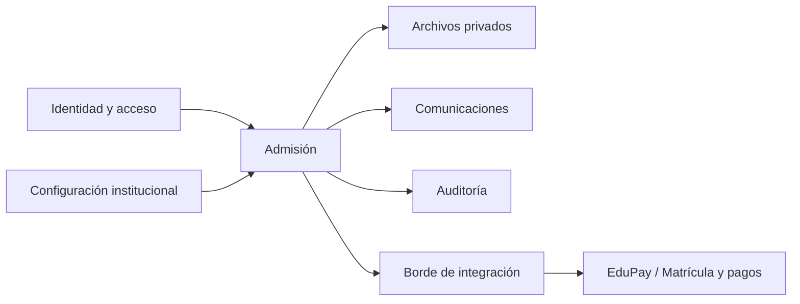
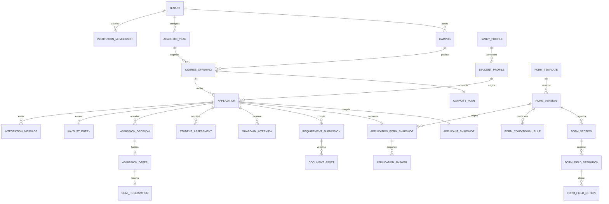

# Modelo conceptual de dominio

## Objetivo

Definir lenguaje, responsabilidades, relaciones y límites tentativos sin fijar tablas SQL, framework ni topología de servicios.

## Contextos conceptuales

Los bloques no implican microservicios. Son límites de responsabilidad que pueden implementarse inicialmente en una arquitectura simple si se mantienen sus contratos internos.

## Entidades y responsabilidades

### Organización académica

| Concepto | Responsabilidad | Pertenencia al tenant |
| --- | --- | --- |
| `Tenant` / Institución | Raíz de configuración, aislamiento y ciclo institucional | Es el tenant |
| `Campus` / Sede | Unidad física u operacional de la institución | `tenantId` directo |
| `AcademicYear` | Periodo académico con calendario y estado | `tenantId` directo |
| `EducationLevel` | Clasificación académica institucional o mapeada a catálogo | Institucional si es configurable; catálogo global sólo como referencia |
| `CourseOffering` | Curso/nivel ofrecido en sede y año para recibir postulaciones | `tenantId` directo y referencias del mismo tenant |
| `CapacityPlan` | Capacidad autorizada, ajustes y política de consumo | `tenantId` directo, ligado a oferta |
| `SeatReservation` | Retención temporal de capacidad para una postulación | `tenantId` directo, oferta y postulación del mismo tenant |
| `WaitlistEntry` | Participación y orden bajo una política versionada | `tenantId` directo |

### Identidad y personas

| Concepto | Responsabilidad | Pertenencia al tenant |
| --- | --- | --- |
| `UserAccount` | Identidad autenticable de plataforma | Global; no concede acceso institucional |
| `InstitutionMembership` | Relación de una cuenta con institución, rol, alcance y vigencia | `tenantId` directo |
| `FamilyProfile` | Datos reutilizables controlados por la familia | Global/propiedad familiar; nunca consultable por institución directamente |
| `StudentProfile` | Estudiante gestionado por una familia | Global/propiedad familiar; acceso institucional sólo mediante postulación |
| `FamilyRelationship` | Relación declarada y autorizaciones entre adultos y estudiantes | Global/propiedad familiar |
| `ApplicantSnapshot` | Copia versionada de datos enviados a una institución | `tenantId` directo, dentro de postulación |

La separación perfil/instantánea evita que una institución vea datos de otra postulación y evita cambios retroactivos al editar el perfil familiar.

### Configuración de admisión

| Concepto | Responsabilidad | Pertenencia al tenant |
| --- | --- | --- |
| `AdmissionCycle` | Ventana y reglas generales de admisión para un año | `tenantId` directo |
| `FormTemplate` | Identidad estable y propósito de un formulario institucional | `tenantId` directo |
| `FormVersion` | Versión `DRAFT`, `PUBLISHED` o `ARCHIVED`; publicada es inmutable | `tenantId` directo, dentro de `FormTemplate` |
| `FormSection` | Sección ordenable y contenido descriptivo seguro | `tenantId` directo, dentro de `FormVersion` |
| `FormFieldDefinition` | Tipo controlado, etiqueta, ayuda, obligatoriedad, validación y acceso | `tenantId` directo, dentro de `FormVersion` |
| `FormFieldOption` | Opción estable y ordenada de un campo de selección | `tenantId` directo, dentro de `FormFieldDefinition` |
| `FormConditionalRule` | Condición declarativa mediante operadores permitidos | `tenantId` directo, dentro de `FormVersion` |
| `DataClassification` | Clasificación canónica que condiciona propósito y permisos | Global si es catálogo cerrado; aplicación institucional siempre explícita |
| `DocumentRequirementVersion` | Requisito, condiciones, formatos y vigencia | `tenantId` directo |
| `WorkflowDefinitionVersion` | Etapas habilitadas, guardas, roles y tiempos | `tenantId` directo |
| `CommunicationTemplateVersion` | Contenido y variables aprobadas por canal/propósito | `tenantId` directo |
| `WaitlistPolicyVersion` | Reglas de ingreso, orden, promoción y cierre | `tenantId` directo |

Las versiones publicadas son inmutables. Una nueva publicación no debe cambiar el fundamento de postulaciones existentes salvo una migración funcional explícita y auditada.

### Postulación y revisión

| Concepto | Responsabilidad | Pertenencia al tenant |
| --- | --- | --- |
| `Application` | Ciclo de vida de una postulación a una oferta | `tenantId` directo y anclaje a `CourseOffering` |
| `ApplicationPartySnapshot` | Datos aportados de estudiante y adultos para este caso | `tenantId` directo, contenido restringido |
| `ApplicationFormSnapshot` | Copia inmutable del esquema publicado usado al enviar | `tenantId` directo, dentro de postulación |
| `ApplicationAnswer` | Respuesta a un campo del snapshot, con clasificación heredada | `tenantId` directo, dentro de postulación |
| `RequirementSubmission` | Cumplimiento de un requisito y versiones aportadas | `tenantId` directo |
| `DocumentAsset` | Metadatos seguros y referencia a objeto privado | `tenantId` directo; clave física no confiada desde cliente |
| `DocumentReview` | Dictamen sobre una versión documental | `tenantId` directo |
| `CorrectionRequest` | Acción solicitada a la familia, razón y plazo | `tenantId` directo |
| `InternalNote` | Nota clasificada por visibilidad y propósito | `tenantId` directo |
| `Assignment` / `Task` | Trabajo, responsable, vencimiento y resultado | `tenantId` directo |

### Actividades y decisiones

| Concepto | Responsabilidad | Pertenencia al tenant |
| --- | --- | --- |
| `GuardianInterview` | Ciclo, citas y conclusión de entrevista | `tenantId` directo |
| `StudentAssessment` | Ciclo, pauta, aplicación y resultado restringido | `tenantId` directo |
| `Appointment` | Instancia agendada, confirmaciones y reprogramación | `tenantId` directo |
| `AdmissionRecommendation` | Recomendación no final y fundamento | `tenantId` directo |
| `AdmissionDecision` | Resolución autorizada y versión | `tenantId` directo |
| `AdmissionOffer` | Oferta de vacante con condiciones y vencimiento | `tenantId` directo |
| `OfferResponse` | Aceptación o rechazo familiar de una oferta | `tenantId` directo |

### Comunicación, consentimiento e integración

| Concepto | Responsabilidad | Pertenencia al tenant |
| --- | --- | --- |
| `ConsentRecord` | Texto/versiones aceptadas, actor, propósito e instante | Global o `tenantId` según propósito; pertenencia siempre explícita |
| `Communication` | Mensaje preparado con audiencia y plantilla | `tenantId` directo para mensajes institucionales |
| `DeliveryAttempt` | Intento, proveedor, estado y evidencia mínima | Heredada de `Communication`, materializada para control |
| `IntegrationMessage` | Evento/comando saliente versionado e idempotente | `tenantId` directo |
| `ExternalReference` | Mapeo opaco a identificadores de otro dominio | `tenantId` directo y sistema origen |
| `SyncStatus` | Progreso técnico, reintentos y error sanitizado | `tenantId` directo |
| `AuditEvent` | Evidencia de acción o acceso | `tenantId` directo o ámbito plataforma explícito |

## Relaciones principales

El diagrama muestra relaciones conceptuales, no cardinalidades físicas definitivas.

## Límites de agregados tentativos

### `TenantConfiguration`

Protege publicación y versionado de configuración institucional. No debe contener todas las postulaciones. Invariantes: referencias internas del mismo tenant, versiones publicadas inmutables y fechas coherentes.

### `FormTemplate`

Protege la identidad del formulario y sus versiones. Una `FormVersion` usa los estados `DRAFT`, `PUBLISHED` y `ARCHIVED`; la máquina de transición exacta se cerrará en G1. Publicar congela secciones, campos, opciones, reglas, clasificaciones y permisos. Modificar un formulario publicado crea una nueva versión borrador. No admite JavaScript, HTML ejecutable ni código arbitrario.

`ApplicationFormSnapshot` pertenece a la postulación y permite reconstruir exactamente el esquema enviado aunque la plantilla evolucione. `ApplicationAnswer` conserva la referencia estable al campo y su clasificación aplicable.

### `CourseOffering` y `CapacityPlan`

Protege apertura, capacidad, reservas y disponibilidad. Debe resolver concurrencia sin cargar el agregado `Application`. Queda pendiente definir si capacidad y reservas forman un solo agregado o coordinan mediante transacción/servicio de dominio.

### `Application`

Raíz del caso de admisión. Protege identidad de oferta, estado canónico, versión de configuración, hitos y transiciones autorizadas. No debe incorporar binarios ni historiales completos como un único objeto mutable.

### `RequirementSubmission`

Protege versiones de evidencia y dictámenes documentales. Permite iteraciones independientes sin bloquear todo el agregado de postulación.

### `AdmissionActivity`

Entrevistas y evaluaciones podrían compartir contrato de agenda, pero mantener agregados distintos por sensibilidad y reglas. Invariantes: historial de reprogramación, no solapar estados incompatibles y conclusión autorizada.

### `AdmissionDecision`

`AdmissionRecommendation` protege borrador, envío a Dirección, devolución justificada, reemplazo y cierre. `AdmissionDecision` protege la resolución final de Dirección. La recomendación no publica resultado ni consume cupo por sí sola. Una decisión favorable no equivale a oferta aceptada ni matrícula.

### `AdmissionOffer` y `SeatReservation`

Protegen plazo, condiciones y respuesta de la familia. Su coordinación con capacidad debe ser atómica o compensable de manera explícita.

### `IntegrationDelivery`

Protege mensajes salientes, clave de idempotencia, intentos y confirmaciones. No cambia estados de negocio sin una reacción de dominio autorizada.

## Invariantes conceptuales

- Toda referencia entre entidades institucionales pertenece al mismo tenant.
- Una membresía válida es necesaria, pero puede no ser suficiente para datos restringidos.
- Una postulación enviada conserva su configuración y respuestas históricas.
- Una versión publicada de formulario es inmutable y cada postulación conserva su snapshot.
- Reglas condicionales usan sólo tipos y operadores controlados; nunca código ejecutable.
- Un documento en cuarentena no puede revisarse ni descargarse como seguro.
- Una decisión requiere el rol y las guardas vigentes al decidir.
- Una oferta no excede la capacidad/reserva permitida.
- Aceptación institucional, oferta, respuesta familiar y matrícula son hitos diferentes.
- Reintentos de integración no duplican efectos.
- Correcciones relevantes agregan historia; no borran el hecho anterior.

## Eventos de dominio tentativos

### Postulación y documentos

- `ApplicationDraftCreated`
- `ApplicationSubmitted`
- `ApplicationActionRequested`
- `ApplicantResponseSubmitted`
- `DocumentUploaded`
- `DocumentScanCompleted`
- `DocumentAccepted`
- `DocumentRejected`
- `DocumentationCompleted`

### Actividades

- `GuardianInterviewScheduled`
- `GuardianInterviewRescheduled`
- `GuardianInterviewCompleted`
- `StudentAssessmentScheduled`
- `StudentAssessmentCompleted`
- `AdmissionActivityWaived`

### Decisión y capacidad

- `ApplicationReadyForFinalReview`
- `AdmissionRecommendationDrafted`
- `AdmissionRecommendationSubmitted`
- `AdmissionRecommendationReturned`
- `AdmissionRecommendationSuperseded`
- `AdmissionDecisionRecorded`
- `ApplicationWaitlisted`
- `SeatReserved`
- `AdmissionOfferIssued`
- `AdmissionOfferAccepted`
- `AdmissionOfferDeclined`
- `SeatReservationReleased`
- `ApplicationWithdrawn`
- `ApplicationExpired`

### Integración

- `EnrollmentHandoffRequested`
- `EnrollmentHandoffAccepted`
- `AcademicPartyLinked`
- `StudentCourseAssociationConfirmed`
- `PaymentObligationRequested` o un hecho alternativo por acordar
- `EnrollmentConfirmed`
- `IntegrationDeliveryFailed`

Los nombres no son contratos aprobados. Antes de publicarlos se debe definir versión, productor, consumidor, semántica, privacidad y compatibilidad.

## Datos sensibles por área

| Área | Ejemplos | Acceso conceptual |
| --- | --- | --- |
| Identificación | RUT, nacimiento, domicilio, contacto | Sólo propósito operacional autorizado |
| Menores | Datos del estudiante y relaciones | Acceso reforzado y minimizado |
| Salud/educación | PIE, especialistas, NEE, evaluaciones | Permiso específico; no visible por defecto |
| Finanzas | Ingreso del hogar, apoderado financiero | Permiso financiero/admisión explícito por definir |
| Deliberación | Notas, pautas, recomendación | Personal asignado y aprobadores según política |
| Documentos | Certificados y adjuntos | Por requisito, propósito y vínculo temporal |

## Decisiones diferidas

- Modelo físico, claves, índices y particionamiento.
- Monolito modular versus servicios separados.
- Proveedor y modelo de identidad.
- Estrategia concreta de almacenamiento y cifrado.
- Motor de flujo propio, reglas declarativas o producto externo.
- Representación técnica y editor UX del constructor de formularios.
- Consistencia técnica de capacidad y reservas.
- Bus, webhook, cola o API para integración.
