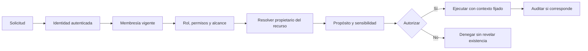

# Multiempresa, seguridad y privacidad

## Objetivo

Definir controles conceptuales obligatorios antes de elegir implementación. El aislamiento multiempresa no es una optimización futura: es una invariante del producto.

## Modelo de contexto institucional

### Principio

El servidor determina el contexto efectivo a partir de:

1. identidad autenticada;
2. membresía institucional vigente;
3. rol y permisos concedidos;
4. alcance (institución, sede, año, curso o casos asignados);
5. tenant propietario del recurso;
6. propósito y sensibilidad de la acción.

Un `tenantId`, `campusId`, `applicationId` o ruta enviada por el cliente es solamente un selector no confiable. Nunca otorga autoridad.

### Familias

Una familia no necesita una membresía administrativa del tenant. Obtiene acceso a una postulación por una relación autorizada con el caso y por la política de la institución. La autorización se resuelve en servidor y no permite descubrir otras postulaciones cambiando identificadores.

### Personal de plataforma

Ser superadministrador no debe equivaler a leer contenido institucional. Operaciones de soporte con datos requieren elevación temporal, ticket/motivo, alcance mínimo, aprobación cuando corresponda, aviso y auditoría reforzada.

## Estrategia de pertenencia

### Entidades institucionales

Todas las entidades de configuración, operación, comunicación e integración contienen `tenantId` directo en el modelo lógico, incluso cuando podría derivarse de un padre. La duplicación controlada facilita restricciones, autorización, partición y auditoría; el diseño físico debe asegurar consistencia entre el tenant directo y sus referencias.

Incluye sedes, años, niveles configurados, ofertas, cupos, plantillas, requisitos, flujos, postulaciones, instantáneas, documentos, entrevistas, evaluaciones, decisiones, ofertas, reservas, listas de espera, mensajes, tareas, auditoría e integración.

### Entidades globales

`UserAccount`, `FamilyProfile` y `StudentProfile` pueden ser globales de plataforma. No son un canal de consulta institucional. Una institución accede solamente a datos contenidos o referenciados explícitamente por una postulación de su tenant y según el consentimiento/propósito aplicable.

Catálogos globales, si se crean, no deben contener configuración confidencial ni permitir relaciones cruzadas sin validación.

## Defensas en profundidad

- Repositorios/servicios reciben un contexto de tenant fijado por servidor.
- Claves y restricciones evitan relaciones entre tenants.
- Políticas a nivel de almacenamiento se evaluarán como capa adicional, no única.
- Cachés incluyen tenant, usuario/rol y versión de permiso cuando corresponda.
- Índices de búsqueda y documentos incorporan partición y filtro obligatorio.
- Trabajos asíncronos cargan contexto firmado o resuelven nuevamente la pertenencia; no aceptan un tenant arbitrario desde payload externo.
- Eventos y colas incluyen tenant y correlación, con validación del consumidor.
- Rutas de archivos se generan en servidor y nunca se construyen desde nombres del usuario.
- Logs, métricas y trazas no registran payloads personales.
- Exportaciones y backups mantienen alcance, cifrado y registro de acceso.
- Pruebas incluyen al menos dos tenants sintéticos y verifican ausencia de fuga en éxito, error, conteos, búsqueda y temporización razonable.

## Autorización

Se recomienda un modelo híbrido:

- **RBAC:** rol base entrega conjuntos de capacidades.
- **Scopes:** limitan sede, año, curso, caso asignado o función.
- **ABAC:** sensibilidad, propósito, estado, relación familiar y separación de funciones agregan condiciones.

Ejemplo conceptual: `application.health.read` puede requerir rol evaluador, asignación al caso, tenant coincidente y propósito vigente. `application.read` por sí solo no basta.

### Reglas obligatorias

- Denegación por defecto.
- Evaluación en servidor para cada acción.
- Revocación efectiva de membresías y sesiones.
- Nadie puede delegar privilegios superiores a su alcance.
- Acciones de alto impacto pueden exigir autenticación reforzada o doble control; alcance pendiente.
- Respuestas denegadas no confirman la existencia de recursos ajenos.

## Clasificación propuesta de datos

| Clase | Ejemplos | Controles mínimos |
| --- | --- | --- |
| Pública | Información publicada de una oferta | Integridad, versionado y protección contra abuso |
| Interna | Configuración operativa no sensible | Membresía y tenant |
| Personal | Contactos, domicilio, datos laborales | Propósito, minimización, cifrado y auditoría de cambios |
| Restringida | Datos de menores, documentos, RUT | Permiso específico, auditoría de acceso y exportación limitada |
| Altamente restringida | Salud, PIE/NEE, evaluaciones, ingreso familiar | Acceso por sección/campo, asignación, justificación y revisión periódica |

La clasificación final debe validarse con responsables legales, de seguridad y del colegio.

## Identidad y sesión

- Proceso de alta con verificación de canal y mensajes que no enumeren cuentas.
- Recuperación con tokens aleatorios, breves, de un uso y revocación de sesiones según riesgo.
- Protección contra credential stuffing y fuerza bruta mediante límites adaptativos.
- Política de MFA pendiente; se recomienda obligatoria para administradores y acciones críticas.
- Cookies/tokens con almacenamiento y atributos seguros según arquitectura futura.
- Rotación de sesión tras autenticación y elevación.
- Cierre global, revocación al cambiar privilegios y registro de sesiones relevantes.
- No usar RUT, correo o teléfono como identificador público de recursos.

## Archivos privados

### Flujo conceptual de carga

1. Autorizar intención de carga contra postulación y requisito.
2. Emitir destino limitado sin revelar estructura interna.
3. Validar límite, extensión permitida y firma real.
4. Guardar en cuarentena con nombre generado.
5. Escanear malware y, si aplica, contenido activo.
6. Promover a estado revisable sólo ante resultado seguro.
7. Generar acceso temporal después de cada autorización.
8. Auditar lectura de documentos restringidos.

Un timeout o fallo del escáner debe cerrar de forma segura y permitir reintento controlado. Proveedor, SLA, tratamiento de archivos cifrados y formatos permitidos requieren ADR.

## Auditoría

### Eventos mínimos

- Inicio/cierre/recuperación de sesión y cambios de seguridad.
- Creación, revocación y cambio de membresías o roles.
- Vista y descarga de datos/documentos restringidos.
- Exportaciones y accesos excepcionales de soporte.
- Cambios de configuración publicada, cupos y política de espera.
- Envíos, correcciones, evaluaciones, decisiones, ofertas y respuestas.
- Consentimientos y aceptación de documentos.
- Mensajes de integración, reintentos y confirmaciones.

### Contenido mínimo

Actor, tipo de identidad, tenant/ámbito plataforma, acción, recurso opaco, resultado, marca temporal, correlación, canal y motivo cuando corresponda. No almacenar el contenido sensible completo en el evento; registrar referencias y cambios minimizados.

La inmutabilidad debe ser práctica y verificable: acceso de escritura restringido, almacenamiento append-only o controles equivalentes, retención definida y monitoreo de integridad. La tecnología queda pendiente.

## Privacidad por ciclo de vida

### Captura

- Cada campo tiene propósito, obligatoriedad, audiencia y periodo tentativo.
- Se evita pedir información “por si acaso”.
- El consentimiento no sustituye otras obligaciones y debe validarse legalmente.

### Uso y compartición

- Mostrar sólo lo necesario para la tarea actual.
- Separar notas internas, datos de salud y finanzas.
- Plantillas de mensaje usan variables aprobadas y minimizadas.
- Proveedores futuros requieren evaluación contractual y de datos.

### Retención y eliminación

Se necesita una matriz por categoría y resultado de postulación. Debe resolver:

- plazo de borradores abandonados;
- postulaciones rechazadas, retiradas o expiradas;
- postulaciones matriculadas y evidencia transferida;
- archivos sustituidos;
- auditoría y obligaciones de conservación;
- anonimización de estadísticas;
- bloqueos por disputa o exigencia legal.

Eliminar datos personales y conservar auditoría pueden coexistir si el evento se minimiza o seudonimiza. No se definirá una solución sin política aprobada.

## Amenazas prioritarias para modelado futuro

- Acceso horizontal a postulación o archivo de otra familia.
- Acceso entre instituciones por filtro omitido, caché o exportación.
- Abuso de privilegios internos y soporte de plataforma.
- Enumeración por RUT, correo, identificadores o mensajes de error.
- Carga de malware, archivos polimórficos o contenido activo.
- Robo de sesión y recuperación fraudulenta.
- Manipulación concurrente de cupos u ofertas.
- Inyección en formularios, notas, plantillas o exportaciones.
- Exfiltración por logs, analítica, copias o enlaces duraderos.
- Duplicación o falsificación de eventos hacia EduPay.

## Pruebas de seguridad mínimas antes de piloto

- Matriz positiva y negativa de permisos.
- Suite de aislamiento con dos o más tenants y familias sintéticas.
- Acceso directo a IDs, búsquedas, conteos, archivos, exportaciones y trabajos asíncronos.
- Sesión, revocación, recuperación, rate limits y enumeración.
- Cargas maliciosas, formatos engañosos y fallos del escáner.
- Concurrencia de reservas, aceptación e idempotencia.
- Revisión de dependencias, secretos, configuración y amenazas.
- Ejercicio de restauración, incidente y acceso excepcional.

## Decisiones pendientes

- Topología concreta de tenancy y defensas de almacenamiento.
- Proveedor de identidad y MFA.
- Gestión de claves y eventual cifrado adicional por campo/tenant.
- Almacenamiento privado y escáner antimalware.
- Política de auditoría, retención y residencia.
- Herramientas de monitoreo y respuesta.

Ninguna de estas decisiones debe tomarse sólo por conveniencia del stack.
