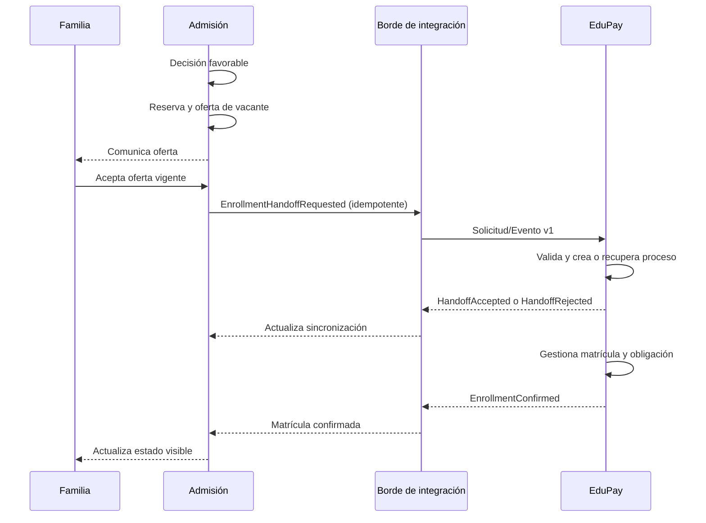

# Límite conceptual de integración con EduPay

## Objetivo

Preparar una integración futura entre Admisión y EduPay sin implementarla ni compartir tablas. Este documento define responsabilidades y opciones para aprobación posterior.

## Principios

- Cada dominio conserva su modelo, almacenamiento y reglas.
- Los contratos usan identificadores externos opacos; no claves internas compartidas.
- Todo mensaje es versionado, correlacionable, autenticado e idempotente.
- La entrega técnica y el resultado de negocio son estados diferentes.
- Reintentos no crean matrículas, reservas u obligaciones duplicadas.
- Los payloads contienen el mínimo de datos personales necesario.
- Fallos se hacen visibles y reconciliables; no se ocultan con estados optimistas.

## Responsabilidades propuestas

### Admisión

- Gestionar postulación, decisión, lista de espera, oferta y respuesta familiar.
- Determinar que se alcanzó una condición de handoff aprobada.
- Emitir hechos o solicitudes mediante un contrato.
- Mantener correlación y estado técnico de sincronización.
- Procesar confirmaciones válidas sin adjudicarse acciones de EduPay.

### EduPay

- Validar si puede iniciar matrícula bajo su propio contrato.
- Crear y gestionar su proceso de matrícula.
- Generar obligaciones de pago si le corresponde.
- Confirmar o rechazar solicitudes de forma idempotente.
- Emitir hechos de matrícula/pago relevantes para Admisión.

### Propiedad por decidir

- Identidad maestra de persona, estudiante y apoderado.
- Catálogo compartido de instituciones/sedes/años o mapeos externos.
- Condición exacta que habilita obligación de pago.
- Qué dominio reserva la vacante si la matrícula excede el plazo de oferta.

## Secuencia conceptual



Emitir señales antes de la aceptación familiar puede ser necesario para reserva o preparación, pero requiere una decisión explícita sobre propósito y minimización.

## Hechos y comandos candidatos

| Momento de negocio | Opción recomendada inicial | Alternativa | Pregunta clave |
| --- | --- | --- | --- |
| Decisión favorable | Evento interno `AdmissionDecisionApproved` | Evento externo informativo | ¿EduPay necesita conocerlo antes de la aceptación? |
| Vacante reservada | Evento interno `AdmissionSeatReserved` | Comando hacia servicio de capacidad si es externo | ¿Quién es dueño de la capacidad? |
| Familia acepta vacante | Evento `AdmissionOfferAccepted` | Parte del comando de handoff | ¿Qué datos mínimos necesita EduPay? |
| Iniciar matrícula | Comando `StartEnrollment` / `EnrollmentHandoffRequested` | Evento consumido por EduPay | ¿Se necesita respuesta inmediata o aceptación asíncrona? |
| Generar obligación | Comando `RequestPaymentObligation` sólo si EduPay lo exige | EduPay deriva la obligación desde matrícula | ¿Quién decide monto, vencimiento y conceptos? |
| Matrícula confirmada | Evento de EduPay `EnrollmentConfirmed` | Consulta de reconciliación | ¿Qué significa confirmada y qué revierte? |

Recomendación provisional: publicar hechos dentro de Admisión y usar un comando idempotente para iniciar el proceso externo. EduPay debería derivar sus obligaciones con sus propias reglas, salvo que su contrato requiera una solicitud explícita.

## Identificadores

Cada intercambio debería incluir identificadores opacos y estables:

- `messageId`: único por mensaje.
- `idempotencyKey`: estable para el efecto lógico, no para cada reintento.
- `correlationId`: agrupa el handoff completo.
- `causationId`: mensaje o acción que originó el actual.
- `tenantExternalId`: mapeo acordado de institución.
- `admissionApplicationExternalId`: referencia pública de integración, distinta del ID mostrado a familia.
- `studentExternalId` y `guardianExternalId`: sólo si existe identidad maestra o mapeo aprobado.
- `academicYearExternalId`, `campusExternalId`, `courseExternalId`: referencias contractuales o catálogos mapeados.
- `occurredAt`: instante del hecho.
- `schemaVersion`: versión de contrato.

No deben exponerse IDs secuenciales ni usarse RUT/correo como claves de idempotencia.

## Sobre idempotencia

- La clave representa una intención estable, por ejemplo “iniciar matrícula para esta oferta aceptada versión 1”.
- El consumidor conserva resultado previo y responde consistentemente a duplicados.
- Mismo `idempotencyKey` con payload incompatible debe rechazarse y alertar.
- Productor registra mensaje y cambio de negocio en una unidad confiable o mecanismo equivalente al outbox.
- Consumidor procesa mediante inbox/deduplicación o garantía equivalente.
- Reintentos usan backoff, límite y cola de errores.
- Operación manual de reenvío preserva correlación y deja auditoría.

Los patrones concretos dependen de arquitectura posterior.

## Contrato envolvente tentativo

Ejemplo ilustrativo, no implementable ni aprobado:

```json
{
  "messageId": "synthetic-message-id",
  "messageType": "EnrollmentHandoffRequested",
  "schemaVersion": 1,
  "occurredAt": "2030-01-01T12:00:00Z",
  "tenantExternalId": "synthetic-tenant-id",
  "correlationId": "synthetic-correlation-id",
  "causationId": "synthetic-causation-id",
  "idempotencyKey": "synthetic-idempotency-key",
  "data": {
    "admissionApplicationExternalId": "synthetic-application-id",
    "admissionOfferExternalId": "synthetic-offer-id"
  }
}
```

Los valores son deliberadamente sintéticos. El contrato real debe definir campos requeridos, semántica de ausencia, clasificación, firma/autenticación, tamaño, compatibilidad y errores.

## Estado de sincronización

No debe mezclarse con el estado de admisión. Propuesta:

- `NOT_REQUIRED`
- `PENDING`
- `DELIVERING`
- `DELIVERED` (aceptado técnicamente, no completado)
- `ACKNOWLEDGED` (EduPay aceptó procesar)
- `COMPLETED` (resultado de negocio confirmado)
- `RETRY_SCHEDULED`
- `FAILED_REQUIRES_ATTENTION`
- `CANCELLED`

Debe existir historial de intentos con errores sanitizados. La familia verá una proyección simple y sólo cuando sea accionable.

## Versionado y compatibilidad

- Versión explícita de esquema y catálogo de tipos.
- Cambios aditivos compatibles dentro de una versión cuando sea posible.
- Cambios semánticos o eliminaciones requieren nueva versión y ventana de migración.
- Consumidores ignoran campos desconocidos sólo si el contrato lo permite.
- Pruebas de contrato entre equipos antes de despliegue.
- Documentación de deprecación, responsables y plazo.

## Seguridad y privacidad

- Autenticación de sistema a sistema y autorización por operación/tenant.
- Protección contra replay además de idempotencia.
- Cifrado en tránsito; cifrado en reposo y gestión de secretos fuera del repositorio.
- Lista mínima de datos; preferir referencias y consulta autorizada cuando sea adecuado.
- Evitar antecedentes de salud, NEE, notas internas o documentos salvo requisito explícito y validado.
- Auditoría de envío, recepción, consulta y corrección.
- Política de retención de mensajes y payloads.
- Validación estricta de esquema y límites.

## Errores y reconciliación

- Distinguir error transitorio, rechazo contractual y rechazo de negocio.
- No marcar `ENROLLED` por timeout ni por entrega de mensaje.
- Exponer una cola operativa de casos que requieren atención.
- Disponer de una reconciliación por correlación/estado que no duplique efectos.
- Definir compensación para oferta expirada o desistimiento durante matrícula.
- Definir autoridad ante estados divergentes y procedimiento manual auditado.

## Fuera de alcance actual

- Elegir REST, eventos, webhook, cola o proveedor.
- Implementar endpoints, tópicos, credenciales o código.
- Definir payload con datos personales reales.
- Compartir esquema o acceso directo a bases de datos.

## Aprobaciones requeridas

1. Propiedad de cada paso de negocio.
2. Momento exacto del handoff y condición de reversión.
3. Hecho versus comando por interacción.
4. Identidad maestra y mapeos.
5. Datos mínimos, retención y fundamento de transferencia.
6. Semántica de matrícula y obligación confirmada.
7. SLA, reintentos, reconciliación y soporte.
