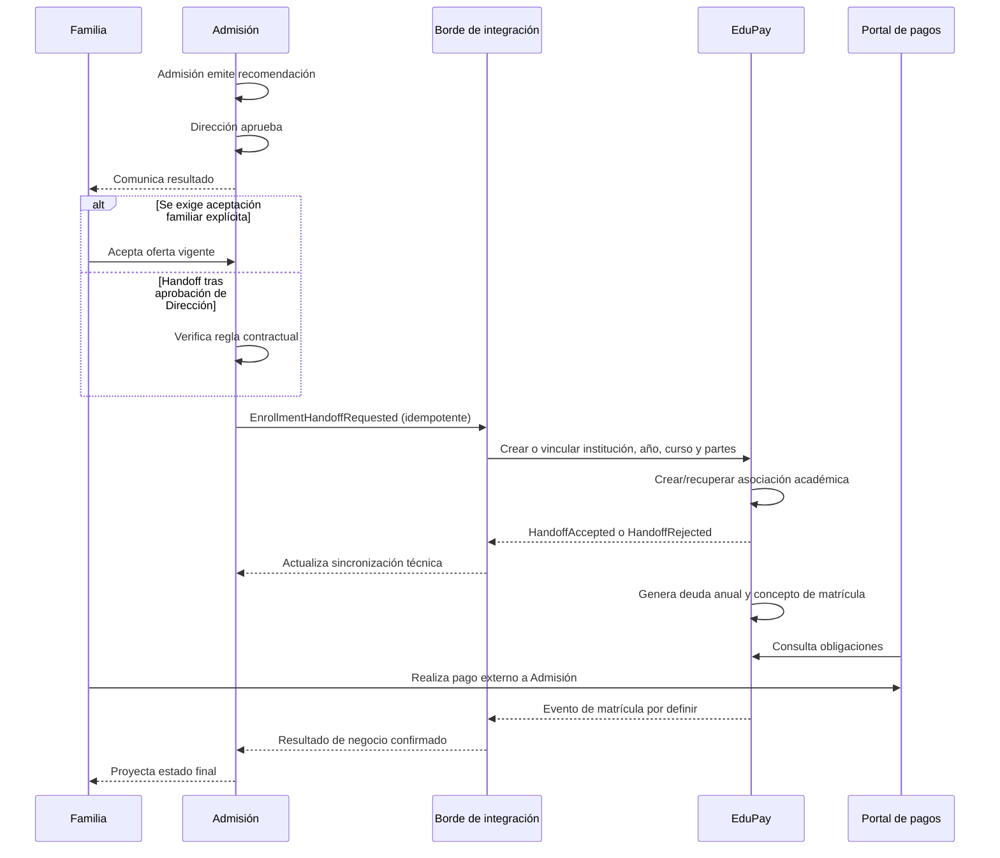

# Límite conceptual de integración con EduPay

## Estado

- **Fuentes:** `SRC-001`, `SRC-004` y `SRC-005`.
- **Propietario de integración:** Nicolás Sena.
- **Decisión G0:** `D-007` aprobada — integración idempotente sin tablas compartidas.
- **Implementación:** fuera de alcance; contrato y mecanismo pendientes.

## Propiedad de dominios

### Admisión

Es dueña de:

- postulación y snapshot de formulario;
- documentos, revisión y correcciones;
- entrevista, evaluación y recomendación;
- decisión institucional y cupo de admisión;
- lista de espera, reserva, comunicación y eventual respuesta familiar;
- intención y trazabilidad del handoff.

### EduPay

Es dueño de:

- registro académico y financiero definitivo;
- creación o vinculación de estudiante y apoderado en su dominio;
- asociación o matrícula del estudiante en un curso;
- proceso de matrícula y sus estados;
- deuda anual, concepto de matrícula y demás obligaciones;
- confirmación financiera/académica que defina como matrícula;
- datos consultados por el portal de pagos existente.

El portal de pagos consulta EduPay, no Admisión. Admisión no calcula ni sirve saldos como fuente de verdad.

## Principios aprobados

- No compartir tablas, modelos ORM ni acceso directo a bases de datos.
- Usar contratos explícitos, versionados y con mínima información personal.
- Usar identificadores externos opacos; RUT y correo nunca son `idempotencyKey`.
- Hacer idempotentes creación, vinculación, asociación y generación de efectos.
- Distinguir entrega técnica, aceptación del procesamiento y resultado de negocio.
- No marcar una postulación `ENROLLED` sólo porque un mensaje fue entregado.
- Conservar reintentos, errores sanitizados, correlación y reconciliación.
- Resolver tenant e institución desde mapeos autorizados, no desde valores arbitrarios del cliente.

## Precondiciones conocidas

Según `SRC-004`, para generar deuda anual y concepto de matrícula:

1. el estudiante debe existir o quedar vinculado idempotentemente en EduPay;
2. debe estar asociado o matriculado en un curso según el estado que EduPay defina;
3. institución, año y curso deben resolverse mediante referencias contractuales válidas;
4. EduPay aplica sus propias reglas financieras.

El handoff debe poder crear o vincular de forma idempotente:

- institución;
- año académico;
- curso;
- apoderado;
- estudiante;
- relación académica necesaria.

“Crear o vincular” no autoriza emparejamientos débiles por nombre, RUT o correo. El contrato debe definir identidad, coincidencias, conflictos y revisión manual.

## Secuencia conceptual con punto de decisión abierto

El `alt` representa `Q-310`: todavía no se decide si el handoff ocurre inmediatamente tras la aprobación de Dirección o después de aceptación explícita de la familia.

## Hechos y comandos candidatos

| Momento | Propietario | Contrato tentativo | Estado |
| --- | --- | --- | --- |
| Recomendación enviada | Admisión | `AdmissionRecommendationSubmitted` interno | No sale a EduPay |
| Decisión favorable | Admisión | `AdmissionDecisionApproved` interno | Confirmado como hecho separado |
| Reserva de cupo | Admisión | `AdmissionSeatReserved` interno | Política pendiente |
| Aceptación familiar | Admisión | `AdmissionOfferAccepted` | Uso en piloto pendiente |
| Inicio de handoff | Admisión → EduPay | comando `StartEnrollment` o equivalente | Mecanismo/nombre pendiente |
| Partes vinculadas | EduPay | confirmación idempotente | Contrato pendiente |
| Asociación académica | EduPay | evento/resultado por definir | Bloquea generación financiera |
| Obligaciones generadas | EduPay | evento informativo si Admisión lo necesita | Propiedad confirmada |
| Matrícula confirmada | EduPay | evento por definir | Pregunta bloqueante Q-309 |

No se ha decidido REST, eventos, webhook, cola ni combinación. Swagger/OpenAPI 3.0 existe en EduPay y es una opción de alineación, no una selección automática.

## Identificadores y mapeos

Cada intercambio debería incluir:

- `messageId`: único por mensaje;
- `idempotencyKey`: estable para el efecto lógico;
- `correlationId`: agrupa el handoff;
- `causationId`: identifica causa inmediata;
- `tenantExternalId`: mapeo de institución;
- `admissionApplicationExternalId` y `admissionDecisionExternalId`;
- referencias externas de año, curso, apoderado y estudiante;
- `occurredAt` y `schemaVersion`.

No deben usarse RUT, correo, teléfono ni nombres como claves de idempotencia. Esos datos sólo podrían formar parte del payload mínimo si el contrato y su fundamento lo requieren.

## Idempotencia

- La clave representa una intención estable y versionada, no un intento de red.
- Reintentar devuelve el resultado previo y no duplica personas, asociaciones, deudas o matrículas.
- La misma clave con payload incompatible se rechaza y alerta.
- Productor conserva de forma confiable cambio de negocio y mensaje saliente, mediante outbox o garantía equivalente.
- Consumidor deduplica mediante inbox o garantía equivalente.
- Los efectos internos de EduPay también deben ser idempotentes, no sólo la recepción.
- Reintentos tienen backoff, límite y cola operativa.
- Reenvío y reconciliación manual dejan auditoría.

## Estado de sincronización

El estado técnico no reemplaza el estado de admisión:

- `NOT_REQUIRED`
- `PENDING`
- `DELIVERING`
- `DELIVERED`
- `ACKNOWLEDGED`
- `COMPLETED`
- `RETRY_SCHEDULED`
- `FAILED_REQUIRES_ATTENTION`
- `CANCELLED`

`DELIVERED` sólo indica entrega técnica. `ACKNOWLEDGED` indica que EduPay aceptó procesar. `COMPLETED` exige el resultado contractual correspondiente; no se presume matrícula.

## Seguridad y privacidad

- Autenticación sistema a sistema y autorización por operación/tenant.
- Protección contra replay además de idempotencia.
- Cifrado en tránsito y reposo; secretos fuera del repositorio.
- Esquema y tamaño validados estrictamente.
- Payload mínimo; excluir salud, PIE/NEE, evaluaciones, notas internas y documentos salvo aprobación expresa.
- Auditoría de emisión, recepción, consulta, conflicto y corrección.
- Retención del payload y referencias definida antes de producción.
- Conflictos de identidad se detienen para revisión; no se fusionan automáticamente.

## Fallos y reconciliación

- Distinguir error transitorio, rechazo de contrato y rechazo de negocio.
- No avanzar a matrícula por timeout, `2xx`, entrega de cola ni acuse técnico.
- Mantener cola de casos con atención y errores sanitizados.
- Reconciliar por referencias externas e idempotencia sin duplicar efectos.
- Definir compensación si la oferta expira, la familia desiste o Dirección revierte antes de completar matrícula.
- EduPay es autoridad sobre estado académico/financiero; Admisión es autoridad sobre postulación y cupo de admisión.

## Preguntas bloqueantes

- **Q-309:** ¿Qué estado exacto utiliza EduPay antes del pago de matrícula y qué evento contractual confirma que la matrícula quedó realizada? Responsable: Nicolás Sena; resolver antes de aprobar el contrato de integración.
- **Q-310:** ¿El handoff ocurre inmediatamente después de la aprobación de Dirección o después de una aceptación familiar explícita? Responsable: Nicolás Sena con validación del colegio; resolver en G1 antes de fijar el flujo del piloto.
- **Q-301:** ¿Cuál es el sistema maestro y el identificador externo de institución, año, curso, persona y estudiante?
- **Q-305:** ¿Cuál es el payload mínimo y fundamento de transferencia?
- **Q-306:** ¿Cuál será la interfaz, autenticación, versionado y límites?
- **Q-307:** ¿Cuáles serán SLA, reintentos, reconciliación y soporte?

## Decisiones técnicas diferidas

- REST, eventos, webhook, cola o combinación.
- Outbox/inbox concretos.
- Contrato de identidad y resolución de duplicados.
- Mecanismo de firma/autenticación.
- Estrategia de despliegue y observabilidad.
- Política de reversión y reconciliación.

Ninguna de estas decisiones se implementa en esta etapa.
