# Roadmap y compuertas de aprobación

## Principio

El roadmap es secuencial en decisiones, no necesariamente en toda actividad exploratoria. Ninguna etapa autoriza implementar la siguiente sin evidencia y aprobación humana explícita. Una aprobación debe identificar versión/commit, revisores, excepciones y condiciones.

```mermaid
flowchart LR
    E0["E0 Descubrimiento"] --> G0{"G0 Aprobada / cerrada"}
    G0 --> E1["E1 Diseño funcional — cerrada"]
    E1 --> G1{"G1 Aprobada / cerrada"}
    G1 --> E2["E2 Arquitectura — cerrada"]
    E2 --> G2{"G2 Aprobada / cerrada"}
    G2 --> E3["E3 Prototipo UX — cerrada"]
    E3 --> G3{"G3 Aprobada / cerrada"}
    G3 --> E4["E4 Fundación técnica — autorizada"]
    E4 --> G4{"G4 Autorizar construcción MVP"}
    G4 --> E5["E5 MVP"]
    E5 --> G5{"G5 Autorizar piloto"}
    G5 --> E6["E6 Piloto Conquistadores"]
    E6 --> G6{"G6 Evaluar salida"}
    G6 --> E7["E7 Integración EduPay"]
    E7 --> G7{"G7 Aprobar integración"}
    G7 --> E8["E8 Preparación multiinstitución"]
    E8 --> G8{"G8 Autorizar expansión"}
```

## E0 — Descubrimiento y fundación documental

**Estado:** cerrado por G0.

### G0 — Aprobación de fundación

**Estado:** `APPROVED / CLOSED`.

- Aprobación: `2026-08-06T14:16:00-04:00`.
- Commit: `1d33191d7b0bb9e4d6f2c99dfa9a8baed701a379`.
- Registro: `docs/approvals/G0-foundation-closure-2026-08-06.md`.
- Etapa autorizada: E1.

## E1 — Diseño funcional

**Estado:** `CLOSED / FUNCTIONAL SPECIFICATION APPROVED`.

E1 consolidó comportamiento funcional, 58 criterios de aceptación, 22 escenarios end-to-end, backlog funcional 22 P0/6 P1/5 P2, diferidos y trazabilidad.

### G1 — Aprobación funcional

**Estado:** `APPROVED / CLOSED`.

- Aprobación: `2026-08-08T06:20:00-04:00`.
- Commit: `e233927659b0709d37de8c4b66b55439a854e0e1`.
- PR: #4.
- Registro: `docs/approvals/G1-functional-approval-2026-08-08.md`.
- Etapa autorizada: E2.

Q-310 permanece `APPROVED_PRODUCT / FUNCTIONALLY_RESOLVED`; Q-301..Q-309 continúan para E7/G7. C-013 permanece legalmente pendiente antes de datos reales/piloto productivo.

## E2 — Arquitectura

**Estado:** `CLOSED / ARCHITECTURE APPROVED`.

- E2-D-001..017 aprobadas.
- ADR-0001, ADR-0002, ADR-0004 y ADR-0005: `ACCEPTED`.
- ADR-0003: `ACCEPTED_WITH_CONDITION`.

La arquitectura aprobada establece modular monolith, monorepo independiente, stack TypeScript/NestJS/Next.js/React/Prisma/PostgreSQL, shared schema + `tenantId`, RLS condicionada a PoC, sesión opaca server-side, object storage privado, jobs/outbox PostgreSQL y runtime Linux containerizado.

### G2 — Aprobación arquitectónica

**Estado:** `APPROVED / CLOSED`.

- Aprobación: `2026-08-08T07:08:00-04:00`.
- Commit: `15b49e284ca642761f2df744ce73bb6a3d10e289`.
- PR: #5.
- Registro: `docs/approvals/G2-architecture-approval-2026-08-08.md`.
- Etapa autorizada: E3.

Condición obligatoria heredada: antes de G4 debe existir PoC sintética tenant/RLS/Prisma que demuestre request/job correctos, ausencia de contexto y cross-tenant en deny, pooling sin fuga, compatibilidad Prisma/transacciones/RLS, roles DB separados y fail-closed. Si falla, RLS no se deshabilita silenciosamente.

## E3 — Prototipo UX

**Estado:** `CLOSED / UX APPROVED`.

E3 consolidó:

- IA por audiencia;
- 42 pantallas conceptuales;
- wireflows Familia/Secretaría/Admisión/Dirección;
- workspace de expediente;
- estados técnicos y de negocio;
- visibilidad por rol/tenant/sensibilidad/propósito;
- WCAG 2.2 AA y responsive;
- formularios y builder mínimo;
- cupos/waitlist/oferta;
- sesión y SELF-ELEVATION;
- 20 tareas sintéticas;
- UX-D-001..UX-D-013;
- HUX-001..HUX-005 resueltas;
- checklist `PASS_WITH_DEFERRED`, sin bloqueantes UX materiales.

### G3 — Validación UX

**Estado:** `APPROVED / CLOSED`.

- Aprobación: `2026-08-08T15:30:00-04:00`.
- Commit UX aprobado: `a659191f5b5190ddf6913b6417cdfccb7baf1a90`.
- PR: #6 — `E3: Prototype UX and G3 preparation`.
- Aprobador: Nicolás Sena.
- Registro: `docs/approvals/G3-ux-approval-2026-08-08.md`.
- Resultado: `PASS_WITH_DEFERRED`, sin bloqueantes UX materiales.
- Etapa autorizada: E4 — Fundación técnica, después de fusionar PR #6.

G3 ratifica HUX-001..HUX-005. HUX-005 incorpora UX-D-010 para confirmaciones críticas. La disponibilidad del proceso debe seguir diferenciándose de una oferta emitida.

G3 no autoriza G4, datos reales, infraestructura productiva ni integración técnica EduPay.

## E4 — Fundación técnica

**Estado:** `AUTHORIZED TO START` después de fusionar PR #6.

### Objetivo

Crear la base mínima segura y verificable para implementar posteriormente el MVP aprobado.

### Trabajo autorizado en E4

Con datos sintéticos y respetando G1/G2/G3:

- crear monorepo y workspaces;
- instalar/fijar dependencias;
- scaffolding Next.js, NestJS y worker;
- Prisma y PostgreSQL de desarrollo;
- schemas/migraciones iniciales de fundación técnica;
- identidad/sesión/autorización base;
- contexto tenant y aislamiento;
- PoC tenant/RLS/Prisma;
- testing automatizado;
- CI y herramientas de calidad/seguridad;
- Docker/Compose o infraestructura local/de desarrollo necesaria;
- observabilidad, auditoría y manejo de errores base;
- datos sintéticos y fixtures seguros.

### Límites de E4

E4 no autoriza:

- G4 ni construcción funcional completa del MVP;
- datos reales o piloto productivo;
- infraestructura productiva;
- secretos productivos;
- integración técnica con EduPay;
- resolución de Q-301..Q-309.

### G4 — Autorización de construcción MVP

**Estado:** `NO APROBADA`.

G4 requiere como mínimo:

- PoC tenant/RLS/Prisma aprobada o defensa equivalente revisada;
- pruebas de aislamiento multiempresa;
- escaneo de secretos/dependencias y controles base;
- despliegue y recuperación mínimos demostrados en entorno autorizado;
- alcance MVP y criterios de salida confirmados;
- responsables operacionales identificados.

## E5 — MVP

### Objetivo

Implementar el recorrido mínimo de postulación y gestión para el piloto después de G4.

### Entregables tentativos

- oferta, cuenta, familia, estudiante, formulario y envío;
- constructor controlado/versionado;
- documentos privados, escaneo, revisión y corrección;
- actividades;
- revisión, decisión, cupos, waitlist, oferta y respuesta;
- vista familiar y comunicaciones;
- administración/configuración/permisos mínimos;
- pruebas funcionales, accesibilidad, seguridad, concurrencia y recuperación.

### G5 — Autorización de piloto

Requiere criterios críticos aprobados, seguridad, aislamiento, respaldo/restauración, operación, legal/privacidad y autorización explícita de datos reales.

## E6 — Piloto Colegio Conquistadores

Validar el producto con una institución sin introducir excepciones ocultas específicas del colegio.

### G6 — Evaluación de salida del piloto

Decidir continuar, ajustar, pausar o revertir; documentar incidentes, deuda y autorización explícita para integración productiva EduPay.

## E7 — Integración con EduPay

Implementar y certificar el handoff desacoplado aprobado.

### G7 — Aprobación de integración

Cerrar Q-301..Q-309, contratos, autenticación, idempotencia, reconciliación, owner/SLA y pruebas seguras. Q-310 llega funcionalmente resuelta.

## E8 — Preparación multiinstitución

Fortalecer onboarding y operación multiinstitución; no agregar multitenancy tardíamente.

### G8 — Autorización de expansión

Revalidar aislamiento, onboarding/offboarding, capacidad, soporte y ausencia de reglas del piloto codificadas como universales.

## Registro de compuertas

Cada cierre debe registrar:

- compuerta y fecha;
- commit/documentos revisados;
- aprobadores y ámbito;
- decisiones, condiciones y excepciones;
- riesgos aceptados;
- etapa autorizada.

El silencio, merge o inicio exploratorio no cuentan por sí solos como aprobación.