# Roadmap y compuertas de aprobación

## Principio

El roadmap es secuencial en decisiones, no necesariamente en toda actividad exploratoria. Ninguna etapa autoriza implementar la siguiente sin evidencia y aprobación humana explícita. Una aprobación debe identificar versión/commit, revisores, excepciones y condiciones.

```mermaid
flowchart LR
    E0["E0 Descubrimiento"] --> G0{"G0 Aprobada / cerrada"}
    G0 --> E1["E1 Diseño funcional — autorizada"]
    E1 --> G1{"G1 Aprobar comportamiento"}
    G1 --> E2["E2 Arquitectura"]
    E2 --> G2{"G2 Aprobar decisiones técnicas"}
    G2 --> E3["E3 Prototipo UX"]
    E3 --> G3{"G3 Validar experiencia"}
    G3 --> E4["E4 Fundación técnica"]
    E4 --> G4{"G4 Autorizar construcción MVP"}
    G4 --> E5["E5 MVP"]
    E5 --> G5{"G5 Autorizar piloto"}
    G5 --> E6["E6 Piloto Conquistadores"]
    E6 --> G6{"G6 Evaluar salida"}
    G6 --> E7["E7 Integración EduPay"]
    E7 --> G7{"G7 Aprobar integración"}
    G7 --> E8["E8 Preparación multiinstitución"]
    E8 --> G8{"G8 Autorizar expansión"}
```

## E0 — Descubrimiento y fundación documental

### Objetivo

Establecer lenguaje común, alcance, evidencia, requisitos iniciales, riesgos y preguntas sin comprometer tecnología.

### Entregables

- Visión y alcance.
- Análisis de fuentes y vacíos.
- Flujo conceptual y separación de estados/eventos/resultados.
- Requisitos funcionales y no funcionales.
- Modelo de dominio conceptual.
- Estrategia conceptual multiempresa, seguridad y privacidad.
- Borde de integración EduPay.
- Matriz preliminar de roles y permisos.
- Preguntas, supuestos, contradicciones y decisiones.
- Proceso ADR y roadmap.
- Configuración inicial del piloto Conquistadores 2027 separada del núcleo.
- `ADR-0001` como propuesta de alineación de stack, sin adopción ni scaffolding.

### G0 — Aprobación de fundación

**Estado:** `APPROVED / CLOSED`.

- **Aprobación:** `2026-08-06T14:16:00-04:00`.
- **Commit sustantivo aprobado:** `1d33191d7b0bb9e4d6f2c99dfa9a8baed701a379`.
- **Aprobador de producto/técnica:** Nicolás Sena.
- **Representante formal institucional:** Arturo Javier Galleguillos Trigo, Sostenedor de Colegio Particular Conquistadores.
- **Fuentes:** SRC-001 a SRC-005.
- **Decisiones incluidas:** D-001 a D-024.
- **Contradicciones:** C-009, C-011 y C-014 `INSTITUTIONALLY_VALIDATED / OPERATIONAL_DETAIL_PENDING`; C-010 resuelta; C-013 `INSTITUTIONALLY_VALIDATED / LEGAL_VALIDATION_PENDING`.
- **ADR-0001:** `PROPOSED`.
- **Etapa autorizada:** E1 — Diseño funcional.

Registro formal: `docs/approvals/G0-foundation-closure-2026-08-06.md`.

El cierre no autoriza implementación, scaffolding, stack definitivo, datos reales ni integración ejecutable. Cambios sustantivos posteriores al commit aprobado requieren nueva revisión.

## E1 — Diseño funcional

**Estado:** AUTORIZADA; **E1-A — `CLOSED / PRODUCT DECISIONS RECORDED`**; **E1-B — `CLOSED / OPERATIONAL BASELINE APPROVED`**; **E1-C — autorizada para iniciar después de la fusión del PR #3**. Esta autorización cubre diseño funcional, no implementación.

E1 se divide en E1-A (base y workbook), E1-B (detalle incorporando validaciones institucionales) y E1-C (consolidación y evidencia para G1). La aprobación de producto de E1-A está registrada en `docs/approvals/E1-A-functional-decisions-2026-08-06.md`. El cierre de E1-B fue aprobado explícitamente sobre `b39150aaf933eda10a3030b9f2d69c6957df8449` y se registra en `docs/approvals/E1-B-functional-closure-2026-08-08.md`. Este cierre no aprueba G1 ni autoriza implementación.

### Objetivo

Validar el proceso real con usuarios y convertir requisitos en comportamientos y reglas verificables.

### Entregables

- Mapa de actores, journeys y casos de uso.
- Catálogo de oferta, formulario y requisitos documentales del piloto.
- Constructor de formularios: tipos, validaciones, reglas, sensibilidad y permisos.
- Máquina de estados y actividades aprobada, incluyendo excepciones.
- Ciclo de recomendación de Admisión y decisión de Dirección.
- Política de cupos, reserva, espera, expiración y reapertura.
- Proyección de estados/mensajes para familias.
- Matriz roles × permisos × alcance × sensibilidad.
- Reglas de comunicación, reportes y SLA funcionales.
- Criterios de aceptación y trazabilidad actualizada.

### G1 — Aprobación funcional

**Estado:** `NO APROBADA`.

La posición funcional de producto para las preguntas objetivo está registrada y E1-B tiene cierre humano explícito. El borde funcional de integración está definido: Admisión es dueña del proceso; EduPay es dominio separado; el handoff ocurre después de aceptación familiar expresa; no se comparten tablas; la integración futura debe ser idempotente; y los estados técnicos no equivalen a matrícula. Q-301 a Q-309 siguen abiertas como dependencias de E7/G7, no como requisito de G1. C-013 conserva `LEGAL_VALIDATION_PENDING` como condición antes de datos reales/piloto productivo, no como bloqueo del comportamiento funcional.

G1 continúa `NO APROBADA` porque E1-C debe todavía:

- consolidar la especificación funcional canónica;
- definir criterios de aceptación funcionales verificables;
- consolidar casos felices, alternos y excepciones;
- priorizar backlog MVP y fuera de alcance;
- resolver inconsistencias de trazabilidad remanentes;
- preparar evidencia y paquete de aprobación;
- obtener aprobación funcional humana explícita.

Q-301 a Q-309, Q-201/Q-202 y la validación legal de C-013 permanecen en sus compuertas futuras y no reabren E1-B.

## E2 — Arquitectura

### Objetivo

Elegir opciones reversibles y documentar decisiones necesarias para seguridad, consistencia y operación.

### Entregables

- Contextos y arquitectura lógica/de despliegue propuesta.
- Alternativas de stack con criterios, costos y riesgos.
- Resolución de `ADR-0001` antes de scaffolding.
- Modelo de datos lógico y estrategia concreta de tenancy.
- Identidad, autorización, sesiones y soporte excepcional.
- Archivos privados, escaneo, claves y secretos.
- Auditoría, observabilidad, backups y recuperación.
- Contratos conceptuales y pruebas de integración.
- Modelo de amenazas y ADR.
- Presupuesto y modelo de capacidad inicial.

### G2 — Aprobación arquitectónica

- ADR críticos aprobados.
- Monorepo/multirepo, archivos, correo, colas, integración, despliegue y tenancy física decididos sólo cuando corresponda.
- Preguntas Q-201 a Q-210 abordadas al nivel necesario.
- Revisión de seguridad, privacidad, operación y costos.
- Prueba conceptual sólo si fue autorizada y eliminable.
- No existen dependencias o decisiones irreversibles sin dueño.

## E3 — Prototipo UX

### Objetivo

Validar comprensión y eficiencia antes de construir producción.

### Entregables

- Arquitectura de información.
- Prototipos de familia y administración con datos sintéticos.
- Estados vacíos, carga, error, sesión expirada y recuperación.
- Flujos de documentos, correcciones, citas, decisión y espera.
- Contenido y estados visibles revisados.
- Pruebas de usabilidad y accesibilidad.

### G3 — Validación UX

- Familias y personal representativos completan tareas críticas.
- Hallazgos severos resueltos o aceptados con plan.
- WCAG objetivo confirmado y revisado.
- Diseño no expone información interna o de terceros.

El prototipo no constituye aplicación productiva ni autoriza conectar datos reales.

## E4 — Fundación técnica

### Objetivo

Crear la base mínima segura para implementar el MVP aprobado.

### Entregables

- Repositorio y módulos según ADR.
- Automatización de calidad y seguridad aprobada.
- Ambientes sin datos reales y gestión de secretos.
- Identidad/autorización base y contexto de tenant.
- Persistencia inicial con migraciones controladas.
- Observabilidad, auditoría y manejo de errores base.
- Estrategia de pruebas y datos sintéticos.

### G4 — Autorización de construcción MVP

- Pruebas de aislamiento multiempresa pasan.
- Escaneo de secretos/dependencias y controles base pasan.
- Despliegue y recuperación mínimos demostrados.
- Alcance MVP y criterios de salida confirmados.
- Propietarios operacionales identificados.

## E5 — MVP

### Objetivo

Implementar el recorrido mínimo de postulación y gestión para el piloto, sin integración financiera productiva salvo aprobación posterior.

### Entregables tentativos

- Oferta, cuenta, familia, estudiante, formulario y envío.
- Constructor controlado y versionado de formularios, sin código arbitrario.
- Documentos privados, escaneo, revisión y corrección.
- Actividades requeridas del piloto.
- Revisión, decisión, cupos, oferta y respuesta.
- Vista familiar, correo como canal inicial, comunicaciones mínimas y auditoría.
- Administración, configuración y permisos mínimos.
- Pruebas funcionales, accesibilidad, seguridad, concurrencia y recuperación.

### G5 — Autorización de piloto

- Criterios funcionales y no funcionales críticos aprobados.
- Sin vulnerabilidades críticas/altas abiertas sin aceptación formal.
- Ensayos de aislamiento, carga, respaldo, restauración e incidente.
- Capacitación, soporte, runbooks y rollback.
- Evaluación legal/privacidad y autorización de datos reales.

## E6 — Piloto Colegio Conquistadores

### Objetivo

Validar el producto con una institución sin introducir excepciones ocultas específicas del colegio.

### Actividades

- Configurar, no codificar, reglas institucionales.
- Migrar/cargar sólo datos autorizados y minimizados.
- Acompañar operación, medir, registrar incidentes y feedback.
- Comparar resultados con métricas acordadas.
- Identificar qué configuración falta para otras instituciones.

### G6 — Evaluación de salida del piloto

- Resultados, incidentes y deuda documentados.
- Decisión de continuar, ajustar, pausar o revertir.
- Requisitos específicos del colegio separados de capacidades comunes.
- Autorización explícita para integración productiva con EduPay.

## E7 — Integración con EduPay

### Objetivo

Implementar y certificar el handoff desacoplado aprobado.

### Entregables

- Contratos versionados, autenticación y autorización.
- Identificadores externos y mapeos.
- Idempotencia, outbox/inbox o garantías equivalentes.
- Reintentos, cola de errores y reconciliación.
- Estado operacional y auditoría.
- Pruebas de contrato, falla, duplicado, demora y reversión.

### G7 — Aprobación de integración

- Preguntas Q-301 a Q-309 cerradas, especialmente estado pre-pago y evento de matrícula; Q-310 ya llega funcionalmente resuelta desde E1.
- Propietarios y SLA de ambos dominios.
- Certificación en ambiente seguro con datos sintéticos.
- Plan de activación, monitoreo y rollback.

## E8 — Preparación multiinstitución

### Interpretación obligatoria

Esta etapa **no agrega multitenancy**. El aislamiento ya debe existir desde E4. Aquí se fortalece la capacidad operacional de incorporar instituciones adicionales.

### Entregables

- Onboarding y configuración repetible.
- Prueba con al menos un segundo tenant sintético o institución autorizada.
- Validación de variaciones de flujo sin forks de código.
- Administración de planes/límites si el modelo comercial lo requiere.
- Operación, soporte, capacidad, costos y documentación escalables.
- Revisión de residencia, contratos y configuración regional.

### G8 — Autorización de expansión

- Aislamiento revalidado en todos los canales.
- Onboarding y offboarding auditables.
- Capacidad y soporte demostrados.
- No existen reglas del piloto codificadas como universales.
- Aprobación comercial, legal, técnica y operacional.

## Registro de compuertas

Cada cierre debe agregarse mediante ADR o registro aprobado con:

- compuerta y fecha;
- commit/documentos revisados;
- aprobadores y ámbitos;
- decisiones y excepciones;
- riesgos aceptados con dueño y vencimiento;
- etapa autorizada.

El silencio, la fusión de un PR o el comienzo de trabajo exploratorio no cuentan por sí solos como aprobación de una compuerta.
