# Roadmap y compuertas de aprobación

## Principio

El roadmap es secuencial en decisiones, no necesariamente en toda actividad exploratoria. Ninguna etapa autoriza implementar la siguiente sin evidencia y aprobación humana explícita. Una aprobación debe identificar versión/commit, revisores, excepciones y condiciones.

```mermaid
flowchart LR
    E0["E0 Descubrimiento"] --> G0{"G0 Aprobada / cerrada"}
    G0 --> E1["E1 Diseño funcional — cerrada"]
    E1 --> G1{"G1 Aprobada / cerrada"}
    G1 --> E2["E2 Arquitectura — cerrada"]
    E2 --> G2{"G2 Aprobada / cerrada"}
    G2 --> E3["E3 Prototipo UX — cerrada"]
    E3 --> G3{"G3 Aprobada / cerrada"}
    G3 --> E4["E4 Fundación técnica — cerrada"]
    E4 --> G4{"G4 Aprobada / cerrada"}
    G4 --> E5["E5 MVP — autorizada"]
    E5 --> G5{"G5 Autorizar piloto"}
    G5 --> E6["E6 Piloto Conquistadores"]
    E6 --> G6{"G6 Evaluar salida"}
    G6 --> E7["E7 Integración EduPay"]
    E7 --> G7{"G7 Aprobar integración"}
    G7 --> E8["E8 Preparación multiinstitución"]
    E8 --> G8{"G8 Autorizar expansión"}
```

## E0 — Descubrimiento y fundación documental

**Estado:** cerrado por G0.

### G0 — Aprobación de fundación

**Estado:** `APPROVED / CLOSED`.

- Aprobación: `2026-08-06T14:16:00-04:00`.
- Commit: `1d33191d7b0bb9e4d6f2c99dfa9a8baed701a379`.
- Registro: `docs/approvals/G0-foundation-closure-2026-08-06.md`.
- Etapa autorizada: E1.

## E1 — Diseño funcional

**Estado:** `CLOSED / FUNCTIONAL SPECIFICATION APPROVED`.

E1 consolidó comportamiento funcional, 58 criterios de aceptación, 22 escenarios end-to-end, backlog funcional 22 P0/6 P1/5 P2, diferidos y trazabilidad.

### G1 — Aprobación funcional

**Estado:** `APPROVED / CLOSED`.

- Aprobación: `2026-08-08T06:20:00-04:00`.
- Commit: `e233927659b0709d37de8c4b66b55439a854e0e1`.
- PR: #4.
- Registro: `docs/approvals/G1-functional-approval-2026-08-08.md`.
- Etapa autorizada: E2.

Q-310 permanece `APPROVED_PRODUCT / FUNCTIONALLY_RESOLVED`; Q-301..Q-309 continúan para E7/G7. C-013 permanece legalmente pendiente antes de datos reales/piloto productivo.

## E2 — Arquitectura

**Estado:** `CLOSED / ARCHITECTURE APPROVED`.

- E2-D-001..017 aprobadas.
- ADR-0001, ADR-0002, ADR-0004 y ADR-0005: `ACCEPTED`.
- ADR-0003: `ACCEPTED_WITH_CONDITION`.

La arquitectura aprobada establece modular monolith, monorepo independiente, stack TypeScript/NestJS/Next.js/React/Prisma/PostgreSQL, shared schema + `tenantId`, RLS condicionada a PoC, sesión opaca server-side, object storage privado, jobs/outbox PostgreSQL y runtime Linux containerizado.

### G2 — Aprobación arquitectónica

**Estado:** `APPROVED / CLOSED`.

- Aprobación: `2026-08-08T07:08:00-04:00`.
- Commit: `15b49e284ca642761f2df744ce73bb6a3d10e289`.
- PR: #5.
- Registro: `docs/approvals/G2-architecture-approval-2026-08-08.md`.
- Etapa autorizada: E3.

La condición ADR-0003 quedó satisfecha en E4 mediante la PoC tenant/RLS/Prisma, sin deshabilitar RLS y con aislamiento/fail-closed comprobados.

## E3 — Prototipo UX

**Estado:** `CLOSED / UX APPROVED`.

E3 consolidó IA por audiencia, 42 pantallas conceptuales, wireflows P0, workspace de expediente, estados técnicos y de negocio, visibilidad por rol/tenant/sensibilidad/propósito, WCAG 2.2 AA, formularios, cupos/waitlist/oferta, sesión/SELF-ELEVATION, 20 tareas sintéticas, UX-D-001..UX-D-013 y HUX-001..HUX-005.

### G3 — Validación UX

**Estado:** `APPROVED / CLOSED`.

- Aprobación: `2026-08-08T15:30:00-04:00`.
- Commit UX aprobado: `a659191f5b5190ddf6913b6417cdfccb7baf1a90`.
- PR: #6.
- Registro: `docs/approvals/G3-ux-approval-2026-08-08.md`.
- Resultado: `PASS_WITH_DEFERRED`.
- Etapa autorizada: E4.

## E4 — Fundación técnica

**Estado:** `CLOSED / TECHNICAL FOUNDATION APPROVED`.

E4-A..E quedaron `COMPLETE` con resultado `PASS_WITH_DEFERRED`, sin bloqueantes G4 materiales. La fundación incluye monorepo reproducible, web/API/worker, PostgreSQL/Prisma, RLS, identidad/sesiones/autorización, SELF-ELEVATION, outbox, observabilidad base, CI, deployment smoke local/development y recovery sintético.

### G4 — Autorización de construcción MVP

**Estado:** `APPROVED / CLOSED`.

- Aprobación: `2026-08-08T20:25:00-04:00`.
- Commit técnico aprobado: `cb5d4be14fd9149a20e1acd36b5dfad563c2836a`.
- PR: #7.
- Resultado: `PASS_WITH_DEFERRED`, sin `BLOCKING_G4` material.
- Registro: `docs/approvals/G4-mvp-construction-approval-2026-08-08.md`.
- Etapa autorizada: E5 — construcción del MVP funcional.

G4 autoriza construir E5 dentro de `BL-001..BL-022`, `AC-001..AC-058` y `E2E-001..E2E-022` usando exclusivamente datos sintéticos/non-production e infraestructura local/development necesaria.

G4 **no** autoriza datos reales, piloto, producción, secretos productivos, aceptación legal C-013, integración técnica EduPay/Q-301..Q-309 ni G5. RPO 1 hora y RTO 4 horas continúan como objetivos técnicos iniciales, no SLA productivo.

## E5 — MVP

**Estado:** `AUTHORIZED TO START`.

### Objetivo

Implementar el recorrido mínimo de postulación y gestión aprobado para el MVP, manteniendo las fronteras de G1/G2/G3/G4 y usando sólo datos sintéticos/non-production durante desarrollo.

### Alcance autorizado

- `BL-001..BL-022`;
- `AC-001..AC-058`;
- `E2E-001..E2E-022`.

### Entregables previstos

- oferta, cuenta, familia, estudiante, formulario y envío;
- constructor controlado/versionado;
- documentos privados, escaneo, revisión y corrección;
- actividades;
- revisión, recomendación y decisión;
- cupos, waitlist, oferta y respuesta;
- vista familiar y comunicaciones;
- administración/configuración/permisos mínimos;
- pruebas funcionales, accesibilidad, seguridad, concurrencia y recuperación.

### Límites de E5

E5 no autoriza datos reales, piloto, producción ni integración técnica con EduPay. C-013 y Q-301..Q-309 mantienen sus compuertas. BL-022 sólo conserva el borde funcional conceptual de handoff, no una integración ejecutable.

### G5 — Autorización de piloto

**Estado:** `NO APROBADA`.

Requiere P0 funcional implementado, criterios críticos aprobados, seguridad, aislamiento, documentos privados, concurrencia, respaldo/restauración, operación, accesibilidad, legal/privacidad y autorización explícita de datos reales/piloto.

## E6 — Piloto Colegio Conquistadores

Validar el producto con una institución sin introducir excepciones ocultas específicas del colegio.

### G6 — Evaluación de salida del piloto

Decidir continuar, ajustar, pausar o revertir; documentar incidentes, deuda y autorización explícita para integración productiva EduPay.

## E7 — Integración con EduPay

Implementar y certificar el handoff desacoplado aprobado.

### G7 — Aprobación de integración

Cerrar Q-301..Q-309, contratos, autenticación, idempotencia, reconciliación, owner/SLA y pruebas seguras. Q-310 llega funcionalmente resuelta.

## E8 — Preparación multiinstitución

Fortalecer onboarding y operación multiinstitución; no agregar multitenancy tardíamente.

### G8 — Autorización de expansión

Revalidar aislamiento, onboarding/offboarding, capacidad, soporte y ausencia de reglas del piloto codificadas como universales.

## Registro de compuertas

Cada cierre debe registrar:

- compuerta y fecha;
- commit/documentos revisados;
- aprobadores y ámbito;
- decisiones, condiciones y excepciones;
- riesgos aceptados;
- etapa autorizada.

El silencio, merge o inicio exploratorio no cuentan por sí solos como aprobación.