# Roadmap y compuertas de aprobación

## Principio

El roadmap es secuencial en decisiones, no necesariamente en toda actividad exploratoria. Ninguna etapa autoriza implementar la siguiente sin evidencia y aprobación humana explícita. Una aprobación debe identificar versión/commit, revisores, excepciones y condiciones.

```mermaid
flowchart LR
    E0["E0 Descubrimiento"] --> G0{"G0 Aprobada / cerrada"}
    G0 --> E1["E1 Diseño funcional — cerrada"]
    E1 --> G1{"G1 Aprobada / cerrada"}
    G1 --> E2["E2 Arquitectura — cerrada"]
    E2 --> G2{"G2 Aprobada / cerrada"}
    G2 --> E3["E3 Prototipo UX — lista para G3"]
    E3 --> G3{"G3 Validar experiencia"}
    G3 --> E4["E4 Fundación técnica"]
    E4 --> G4{"G4 Autorizar construcción MVP"}
    G4 --> E5["E5 MVP"]
    E5 --> G5{"G5 Autorizar piloto"}
    G5 --> E6["E6 Piloto Conquistadores"]
    E6 --> G6{"G6 Evaluar salida"}
    G6 --> E7["E7 Integración EduPay"]
    E7 --> G7{"G7 Aprobar integración"}
    G7 --> E8["E8 Preparación multiinstitución"]
    E8 --> G8{"G8 Autorizar expansión"}
```

## E0 — Descubrimiento y fundación documental

### Objetivo

Establecer lenguaje común, alcance, evidencia, requisitos iniciales, riesgos y preguntas sin comprometer tecnología.

### Entregables

- Visión y alcance.
- Análisis de fuentes y vacíos.
- Flujo conceptual y separación de estados/eventos/resultados.
- Requisitos funcionales y no funcionales.
- Modelo de dominio conceptual.
- Estrategia conceptual multiempresa, seguridad y privacidad.
- Borde de integración EduPay.
- Matriz preliminar de roles y permisos.
- Preguntas, supuestos, contradicciones y decisiones.
- Proceso ADR y roadmap.
- Configuración inicial del piloto Conquistadores 2027 separada del núcleo.
- `ADR-0001` como propuesta de alineación de stack, sin adopción ni scaffolding.

### G0 — Aprobación de fundación

**Estado:** `APPROVED / CLOSED`.

- **Aprobación:** `2026-08-06T14:16:00-04:00`.
- **Commit sustantivo aprobado:** `1d33191d7b0bb9e4d6f2c99dfa9a8baed701a379`.
- **Aprobador de producto/técnica:** Nicolás Sena.
- **Representante formal institucional:** Arturo Javier Galleguillos Trigo, Sostenedor de Colegio Particular Conquistadores.
- **Fuentes:** SRC-001 a SRC-005.
- **Decisiones incluidas:** D-001 a D-024.
- **Contradicciones:** C-009, C-011 y C-014 `INSTITUTIONALLY_VALIDATED / OPERATIONAL_DETAIL_PENDING`; C-010 resuelta; C-013 `INSTITUTIONALLY_VALIDATED / LEGAL_VALIDATION_PENDING`.
- **Etapa autorizada:** E1 — Diseño funcional.

Registro formal: `docs/approvals/G0-foundation-closure-2026-08-06.md`.

## E1 — Diseño funcional

**Estado:** `CLOSED / FUNCTIONAL SPECIFICATION APPROVED`.

- E1-A — `CLOSED / PRODUCT DECISIONS RECORDED`.
- E1-B — `CLOSED / OPERATIONAL BASELINE APPROVED`.
- E1-C — `CLOSED / FUNCTIONAL SPECIFICATION APPROVED`.
- Commit funcional aprobado en G1: `e233927659b0709d37de8c4b66b55439a854e0e1`.
- Registro G1: `docs/approvals/G1-functional-approval-2026-08-08.md`.

E1 consolidó comportamiento funcional, 58 criterios de aceptación, 22 escenarios end-to-end, backlog funcional de 22 P0/6 P1/5 P2, diferidos clasificados y trazabilidad integral.

### G1 — Aprobación funcional

**Estado:** `APPROVED / CLOSED`.

- **Aprobación:** `2026-08-08T06:20:00-04:00`.
- **Commit funcional aprobado:** `e233927659b0709d37de8c4b66b55439a854e0e1`.
- **PR:** #4 — `E1-C: Consolidate functional specification for G1`.
- **Aprobador funcional:** Nicolás Sena.
- **Resultado de readiness:** `PASS_WITH_DEFERRED`.
- **Etapa autorizada:** E2 — Arquitectura.

Q-310 permanece `APPROVED_PRODUCT / FUNCTIONALLY_RESOLVED`. Q-301 a Q-309 continúan como `FUTURE_INTEGRATION_PENDING` para E7/G7. C-013 conserva `LEGAL_VALIDATION_PENDING` antes de datos reales/piloto productivo.

## E2 — Arquitectura

**Estado:** `CLOSED / ARCHITECTURE APPROVED`.

- **Commit arquitectónico aprobado:** `15b49e284ca642761f2df744ce73bb6a3d10e289`.
- **PR:** #5 — `E2: Architecture design and G2 preparation`.
- **Decisiones aprobadas:** E2-D-001 a E2-D-017.
- **ADR-0001:** `ACCEPTED`.
- **ADR-0002:** `ACCEPTED`.
- **ADR-0003:** `ACCEPTED_WITH_CONDITION`.
- **ADR-0004:** `ACCEPTED`.
- **ADR-0005:** `ACCEPTED`.
- **Registro:** `docs/approvals/G2-architecture-approval-2026-08-08.md`.

La arquitectura aprobada establece modular monolith, monorepo independiente, stack alineado con EduPay sin compartir dominios/datos/sesiones, PostgreSQL, shared schema + `tenantId`, RLS condicionada a PoC, sesión opaca server-side, object storage privado, jobs/outbox PostgreSQL y runtime Linux containerizado.

RPO inicial 1 hora y RTO inicial 4 horas son objetivos técnicos, no SLA contractual.

### G2 — Aprobación arquitectónica

**Estado:** `APPROVED / CLOSED`.

- **Aprobación:** `2026-08-08T07:08:00-04:00`.
- **Commit arquitectónico aprobado:** `15b49e284ca642761f2df744ce73bb6a3d10e289`.
- **Aprobador:** Nicolás Sena.
- **Resultado de readiness:** `PASS_WITH_DEFERRED`, sin bloqueantes arquitectónicos materiales.
- **Etapa autorizada:** E3 — Prototipo UX, después de fusionar el PR #5.

Condición obligatoria: antes de G4 debe existir PoC sintética de tenant/RLS/Prisma que demuestre request/job correcto, ausencia de contexto y cross-tenant en deny, pooling sin fuga, Prisma/transacciones/RLS compatibles, roles DB separados y comportamiento fail-closed. Si falla, RLS no se deshabilita silenciosamente: requiere revisión arquitectónica y defensa equivalente aprobada.

G2 no autoriza código, scaffolding, dependencias, infraestructura, datos reales ni integración técnica con EduPay. Q-301 a Q-309 siguen para E7/G7. C-013 continúa como condición legal previa a datos reales/piloto productivo.

## E3 — Prototipo UX

**Estado:** `IN PROGRESS / READY FOR G3 REVIEW`. Rama `docs/e3-ux-prototype`; G3 `NO APROBADA` y E4 `NO AUTORIZADA`.

### Objetivo

Validar comprensión y eficiencia antes de construir producción.

### Entregables

- Arquitectura de información e inventario de 42 pantallas conceptuales.
- Wireflows de Familia, Secretaría, Admisión y Dirección con datos sintéticos.
- Workspace de expediente con header, stepper, tabs/secciones y visibilidad por rol.
- Estados técnicos y de negocio: vacío, carga, error, sesión expirada, async, scanning, oferta y waitlist.
- Patrones de formularios, documentos, correcciones y builder administrativo mínimo.
- Responsive mobile-first para Familia, desktop-first/tablet para Personal y criterios WCAG 2.2 AA.
- Board consolidado, 20 tareas de validación y workbook UX con UX-D-001..UX-D-013.
- HUX-001..HUX-005 resueltas; HUX-005 incorpora UX-D-010 para confirmaciones apropiadas de acciones críticas.
- Copy de disponibilidad separado explícitamente de una oferta de admisión emitida.
- Checklist `PASS_WITH_DEFERRED` sin bloqueantes UX materiales y borrador G3 sin aprobación automática.

### G3 — Validación UX

**Estado:** `NO APROBADA`.

La evidencia E3 está lista para revisión final de G3. La compuerta debe confirmar:

- navegación y estructura P0;
- acciones críticas y confirmaciones;
- waitlist, disponibilidad y oferta sin inducir a error;
- recomendación y decisión separadas;
- seguridad/visibilidad por rol y tenant;
- responsive y WCAG 2.2 AA como criterio;
- hallazgos severos resueltos o aceptados con plan.

El prototipo no constituye aplicación productiva ni autoriza conectar datos reales. La aprobación G3 tampoco equivale a G4.

## E4 — Fundación técnica

### Objetivo

Crear la base mínima segura para implementar el MVP aprobado.

### Entregables

- Repositorio y módulos según ADR.
- Automatización de calidad y seguridad aprobada.
- Ambientes sin datos reales y gestión de secretos.
- Identidad/autorización base y contexto de tenant.
- Persistencia inicial con migraciones controladas.
- Observabilidad, auditoría y manejo de errores base.
- Estrategia de pruebas y datos sintéticos.

### G4 — Autorización de construcción MVP

- PoC obligatorio tenant/RLS/Prisma aprobado o defensa equivalente revisada.
- Pruebas de aislamiento multiempresa pasan.
- Escaneo de secretos/dependencias y controles base pasan.
- Despliegue y recuperación mínimos demostrados.
- Alcance MVP y criterios de salida confirmados.
- Propietarios operacionales identificados.

## E5 — MVP

### Objetivo

Implementar el recorrido mínimo de postulación y gestión para el piloto, sin integración financiera productiva salvo aprobación posterior.

### Entregables tentativos

- Oferta, cuenta, familia, estudiante, formulario y envío.
- Constructor controlado y versionado de formularios, sin código arbitrario.
- Documentos privados, escaneo, revisión y corrección.
- Actividades requeridas del piloto.
- Revisión, decisión, cupos, oferta y respuesta.
- Vista familiar, correo como canal inicial, comunicaciones mínimas y auditoría.
- Administración, configuración y permisos mínimos.
- Pruebas funcionales, accesibilidad, seguridad, concurrencia y recuperación.

### G5 — Autorización de piloto

- Criterios funcionales y no funcionales críticos aprobados.
- Sin vulnerabilidades críticas/altas abiertas sin aceptación formal.
- Ensayos de aislamiento, carga, respaldo, restauración e incidente.
- Capacitación, soporte, runbooks y rollback.
- Evaluación legal/privacidad y autorización de datos reales.

## E6 — Piloto Colegio Conquistadores

### Objetivo

Validar el producto con una institución sin introducir excepciones ocultas específicas del colegio.

### Actividades

- Configurar, no codificar, reglas institucionales.
- Migrar/cargar sólo datos autorizados y minimizados.
- Acompañar operación, medir, registrar incidentes y feedback.
- Comparar resultados con métricas acordadas.
- Identificar qué configuración falta para otras instituciones.

### G6 — Evaluación de salida del piloto

- Resultados, incidentes y deuda documentados.
- Decisión de continuar, ajustar, pausar o revertir.
- Requisitos específicos del colegio separados de capacidades comunes.
- Autorización explícita para integración productiva con EduPay.

## E7 — Integración con EduPay

### Objetivo

Implementar y certificar el handoff desacoplado aprobado.

### Entregables

- Contratos versionados, autenticación y autorización.
- Identificadores externos y mapeos.
- Idempotencia, outbox/inbox o garantías equivalentes.
- Reintentos, cola de errores y reconciliación.
- Estado operacional y auditoría.
- Pruebas de contrato, falla, duplicado, demora y reversión.

### G7 — Aprobación de integración

- Preguntas Q-301 a Q-309 cerradas, especialmente estado pre-pago y evento de matrícula; Q-310 ya llega funcionalmente resuelta desde E1.
- Propietarios y SLA de ambos dominios.
- Certificación en ambiente seguro con datos sintéticos.
- Plan de activación, monitoreo y rollback.

## E8 — Preparación multiinstitución

### Interpretación obligatoria

Esta etapa **no agrega multitenancy**. El aislamiento ya debe existir desde E4. Aquí se fortalece la capacidad operacional de incorporar instituciones adicionales.

### Entregables

- Onboarding y configuración repetible.
- Prueba con al menos un segundo tenant sintético o institución autorizada.
- Validación de variaciones de flujo sin forks de código.
- Administración de planes/límites si el modelo comercial lo requiere.
- Operación, soporte, capacidad, costos y documentación escalables.
- Revisión de residencia, contratos y configuración regional.

### G8 — Autorización de expansión

- Aislamiento revalidado en todos los canales.
- Onboarding y offboarding auditables.
- Capacidad y soporte demostrados.
- No existen reglas del piloto codificadas como universales.
- Aprobación comercial, legal, técnica y operacional.

## Registro de compuertas

Cada cierre debe agregarse mediante ADR o registro aprobado con:

- compuerta y fecha;
- commit/documentos revisados;
- aprobadores y ámbitos;
- decisiones y excepciones;
- riesgos aceptados con dueño y vencimiento;
- etapa autorizada.

El silencio, la fusión de un PR o el comienzo de trabajo exploratorio no cuentan por sí solos como aprobación de una compuerta.