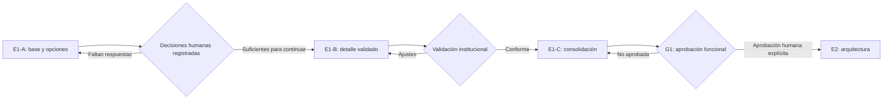

# E1 — Plan y estado del diseño funcional

## Control del documento

| Campo | Valor |
| --- | --- |
| Entrega | E1-B — Especificación funcional institucional |
| Estado | `IN PROGRESS / READY FOR CLOSURE REVIEW` |
| Compuerta vigente | E1 autorizada; G1 `NO APROBADA` |
| Base revisada | `main` en `8a7f12bb1bf1f7ca09ff29363ad040c693cc143d` |
| Naturaleza | Documentación funcional; no autoriza implementación |
| Registro principal | `docs/e1/07-institutional-validation-baseline.md`, `docs/e1/08-pilot-operational-rules.md`, `docs/e1/09-pilot-configuration-matrix.md` |
| Aprobación consolidada | `2026-08-06T22:09:00-04:00` por Nicolás Sena |

## Clasificación de la información

- **Hecho confirmado:** contenido respaldado por `SRC-001` a `SRC-005` o por el estado verificable del repositorio.
- **Decisión aprobada:** D-001 a D-024 y el cierre G0, sin modificar su significado.
- **Propuesta:** recomendación histórica de esta entrega antes de la aprobación consolidada.
- **Decisión aprobada de producto:** posición funcional fijada por Nicolás Sena el 2026-08-06T22:09:00-04:00.
- **Supuesto de trabajo:** interpretación reversible usada para completar el análisis.
- **Pregunta abierta:** asunto sin resolución o con detalle pendiente.
- **Validación institucional registrada:** C-009, C-011, C-013 y C-014 tienen posición institucional/funcional confirmada; sus detalles operativos o legales pendientes conservan sus estados.

Ninguna recomendación de E1-A equivale a aprobación institucional, funcional, legal o arquitectónica.

## Objetivo de E1

Convertir la fundación aprobada en comportamientos funcionales verificables: actores, recorridos, casos de uso, reglas, excepciones, permisos conceptuales y decisiones del piloto. E1 debe terminar con evidencia suficiente para que personas autorizadas aprueben o devuelvan el comportamiento en G1, sin seleccionar tecnología ni implementar.

## División propuesta de E1

| Entrega | Propósito | Resultado esperado | Dependencia humana |
| --- | --- | --- | --- |
| E1-A | Establecer actores, journeys, casos de uso y paquete de preguntas | Base funcional trazable y guía de validación | Revisar recomendaciones y asignar responsables |
| E1-B | Incorporar decisiones institucionales al detalle funcional | Catálogos, reglas, excepciones, estados visibles y permisos refinados | Resoluciones registradas sobre el workbook E1-A |
| E1-C | Consolidar y verificar la especificación funcional | Criterios de aceptación, backlog priorizado y evidencia para G1 | Aprobación del comportamiento completo |

La división es **PROPOSED**. No crea compuertas nuevas ni permite avanzar por silencio.

## Alcance de E1-B

- Incorporar las respuestas institucionales de C-009, C-011, C-013 y C-014 a actores, journeys, casos de uso, reglas y permisos.
- Modelar configuración versionada de actividades, intentos, excepciones, reprogramaciones, repeticiones y cierres.
- Modelar requisitos documentales configurables, equivalencias, exenciones y origen físico excepcional.
- Separar captura y acceso de PIE/NEE/salud, excluir ingreso familiar del formulario MVP y registrar las dependencias legales pendientes.
- Formalizar postulación asistida y diferenciar Administrador Institucional Máximo de Superadministrador Global.
- Mantener trazabilidad a preguntas, contradicciones, decisiones, requisitos, journeys, casos de uso y evidencia.
- Registrar responsables confirmados y separar funciones de Admisión, Secretaría, Dirección y Administrador Institucional Máximo.
- Consolidar cupos, plazos, citas, actividades, decisión, espera, comunicaciones, documentos, reportes y exportaciones del piloto.

## Fuera de alcance

- Cerrar E1 o aprobar G1.
- Aprobar o modificar ADR-0001.
- Código, scaffolding, dependencias, endpoints, DTO, SQL, modelos físicos o componentes visuales.
- Selección de stack, identidad, correo, archivos, antivirus, colas, despliegue o topología multiempresa.
- Integración ejecutable con EduPay o definición de API.
- Conclusiones legales, uso de datos reales o políticas institucionales inventadas.
- Resolver Q-201 a Q-210 o Q-301 a Q-309; sólo se registran dependencias.

## Fuentes utilizadas

- `AGENTS.md` y `README.md`.
- `docs/00-vision-scope.md` a `docs/11-pilot-colegio-conquistadores-2027.md`.
- `docs/approvals/G0-foundation-closure-2026-08-06.md`.
- `docs/decisions/ADR-0000-decision-process.md`.
- `docs/decisions/ADR-0001-stack-alignment-with-edupay.md`.
- `SRC-001` a `SRC-005`, sólo mediante las extracciones autorizadas del repositorio.

## Estado heredado

| Elemento | Estado | Clasificación |
| --- | --- | --- |
| G0 | `APPROVED / CLOSED` | Decisión aprobada; no se reabre |
| E1 | `AUTORIZADA` para diseño funcional | Decisión aprobada |
| E1-A | `CLOSED / PRODUCT DECISIONS RECORDED` | Acta histórica; no cierra G1 |
| E1-B | `IN PROGRESS / READY FOR CLOSURE REVIEW` | No se identifica una decisión funcional bloqueante; requiere revisión humana de cierre |
| E1-C | `NO INICIADA` | Consolidación y evidencia para G1 aún no autorizadas |
| G1 | `NO APROBADA` | Hecho confirmado |
| ADR-0001 | `PROPOSED` | Propuesta arquitectónica fuera de alcance |
| Datos reales | No autorizados | Límite aprobado |
| Implementación | No autorizada | Límite aprobado |

## Decisiones aprobadas heredadas

- D-001 a D-010: semántica, snapshot, versionado, autorización, soporte, archivos, integración desacoplada, espera con confirmación humana, accesibilidad y ADR.
- D-011 a D-024: alcance del piloto, grupo familiar, citas, evaluación, separación Admisión/Dirección, correo, formulario controlado, propiedad de pagos y handoff.

Esta entrega referencia esas decisiones; no las reemplaza, renumera ni amplía.

## Preguntas que deben resolverse

| Grupo | IDs | Resultado requerido antes de G1 |
| --- | --- | --- |
| Oferta, formulario y familia | Q-101 a Q-108 | Decisiones de producto aprobadas; detalle/validación institucional pendiente |
| Documentos | Q-120 a Q-124 | C-011 validada; plazo de corrección definido para piloto; catálogo concreto, personalidad y detalles restantes pendientes |
| Actividades | Q-140 a Q-145 | C-009 validada; modalidad, reprogramaciones, tolerancia y resultados simples definidos; ejecutores, suplencias, duración y pauta avanzada pendientes |
| Decisión, cupos y espera | Q-160 a Q-167 | Recomendación, decisión, cupos, plazo y promoción definidos para piloto; prioridades concretas y autoridades de reapertura pendientes |
| Comunicaciones y reportes | Q-180 a Q-184 | Citas, oferta, reportes y exportaciones definidos funcionalmente; plantillas finales, recordatorio y SLA adicionales pendientes |
| Handoff | Q-310 | Secuencia funcional `FUNCTIONALLY_RESOLVED`; contrato Q-301 a Q-309 posterior y fuera de G1 |

El borde funcional de integración ya está definido: Admisión es dueña del proceso; EduPay es dominio separado; el handoff ocurre después de aceptación; no se comparten tablas; el contrato futuro debe ser idempotente; y los estados técnicos no equivalen a matrícula. Q-201/Q-202, C-013 legal y Q-301 a Q-309 siguen abiertos en sus compuertas posteriores, pero no son bloqueantes de cierre funcional E1-B/G1.

## Criterios de salida de E1-B

E1-B está documentalmente en progreso mientras:

1. actores y responsabilidades están identificados;
2. journeys principales, variantes y excepciones están documentados;
3. casos de uso tienen trazabilidad a FR, preguntas y riesgos;
4. todas las preguntas objetivo aparecen en el workbook;
5. cada pregunta abierta contiene opciones y recomendación concreta;
6. existe una guía utilizable para validación institucional;
7. ninguna propuesta se presenta como aprobación;
8. G1 y ADR-0001 conservan sus estados;
9. no se introduce código, arquitectura ni datos reales.

La validación institucional y la consolidación operativa permiten solicitar revisión humana de cierre de E1-B; no autorizan cerrar G1 automáticamente.

## Clasificación de pendientes

- **Bloqueantes de cierre E1-B:** ninguno identificado en esta revisión. El comportamiento funcional y sus excepciones están definidos; la etapa queda `READY FOR CLOSURE REVIEW`.
- **`PILOT_CONFIGURATION_PENDING`:** nombres de suplentes; personas concretas de entrevista/evaluación; duración exacta; valores concretos de cupos; catálogo de personalidad por curso; prioridades especiales; textos finales de email; anticipación del recordatorio; SLA numéricos; nombres finales de plantillas.
- **`PRE_PILOT_LEGAL_PENDING`:** C-013 legal, responsable legal/normativo, retención/eliminación y conservación/devolución física. Es condición antes de datos reales/piloto productivo, no para el cierre funcional de E1-B/G1.
- **`FUTURE_INTEGRATION_PENDING`:** Q-301 a Q-309 y contrato EduPay. Se resuelven en E7/G7, no en E1-B ni como requisito de G1.
- **`OPEN_SECURITY_AND_OPERATION_QUESTIONS`:** Q-201/Q-202 y demás Q-203 a Q-210 permanecen abiertas; no se resuelven ni se declaran trabajo obligatorio de E1-B.

E1-B está documentalmente en progreso y queda lista para revisión de cierre. Las respuestas institucionales se incorporan como `INSTITUTIONALLY_VALIDATED`; los detalles definidos sólo para el piloto se marcan como `DEFINED_FOR_PILOT`; la configuración previa al piloto como `PILOT_CONFIGURATION_PENDING`; la legalidad como `PRE_PILOT_LEGAL_PENDING`; y la integración futura como `FUTURE_INTEGRATION_PENDING`.

## Supuestos de trabajo usados

- Los roles son capacidades y una misma persona puede acumular varios, sujeto a conflictos y mínimo privilegio.
- El piloto mantiene confirmación humana para promoción de lista de espera por D-008.
- Los estados familiares propuestos son proyecciones y requieren validación de contenido.
- Las referencias a automatización describen comportamiento tentativo, no tecnología.

## Siguiente compuerta humana

La siguiente acción humana es revisar el cierre de E1-B y, sólo después de autorización, preparar E1-C. C-013 requiere responsable legal/normativo antes de datos reales/piloto productivo. E1-B no está cerrada; G1 sigue `NO APROBADA`; E1-C sigue no iniciada y E2/G2 no están autorizadas.
