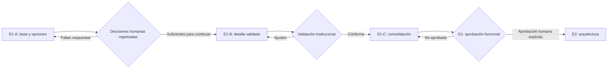

# E1 — Plan y estado del diseño funcional

## Control del documento

| Campo | Valor |
| --- | --- |
| Entrega | E1-A — Base funcional y paquete de decisiones |
| Estado | `IN_PROGRESS` |
| Compuerta vigente | E1 autorizada; G1 `NO APROBADA` |
| Base revisada | `main` en `162851c7add2c44cca8840835298e437047b334f` |
| Naturaleza | Documentación funcional; no autoriza implementación |

## Clasificación de la información

- **Hecho confirmado:** contenido respaldado por `SRC-001` a `SRC-005` o por el estado verificable del repositorio.
- **Decisión aprobada:** D-001 a D-024 y el cierre G0, sin modificar su significado.
- **Propuesta:** recomendación de esta entrega pendiente de decisión humana.
- **Supuesto de trabajo:** interpretación reversible usada para completar el análisis.
- **Pregunta abierta:** asunto sin resolución o con detalle pendiente.
- **Validación institucional pendiente:** respuesta que debe confirmar Colegio Conquistadores mediante su representante y los responsables operativos.

Ninguna recomendación de E1-A equivale a aprobación institucional, funcional, legal o arquitectónica.

## Objetivo de E1

Convertir la fundación aprobada en comportamientos funcionales verificables: actores, recorridos, casos de uso, reglas, excepciones, permisos conceptuales y decisiones del piloto. E1 debe terminar con evidencia suficiente para que personas autorizadas aprueben o devuelvan el comportamiento en G1, sin seleccionar tecnología ni implementar.

## División propuesta de E1

| Entrega | Propósito | Resultado esperado | Dependencia humana |
| --- | --- | --- | --- |
| E1-A | Establecer actores, journeys, casos de uso y paquete de preguntas | Base funcional trazable y guía de validación | Revisar recomendaciones y asignar responsables |
| E1-B | Incorporar decisiones institucionales al detalle funcional | Catálogos, reglas, excepciones, estados visibles y permisos refinados | Resoluciones registradas sobre el workbook E1-A |
| E1-C | Consolidar y verificar la especificación funcional | Criterios de aceptación, backlog priorizado y evidencia para G1 | Aprobación del comportamiento completo |

La división es **PROPOSED**. No crea compuertas nuevas ni permite avanzar por silencio.

## Alcance de E1-A

- Identificar actores, responsabilidades, límites, delegaciones y separaciones de funciones.
- Documentar recorridos principales, alternativos y excepcionales de familias y personal.
- Crear casos de uso funcionales con autorización conceptual y aislamiento por tenant.
- Preparar opciones y recomendaciones para Q-101 a Q-108, Q-120 a Q-124, Q-140 a Q-145, Q-160 a Q-167, Q-180 a Q-184 y Q-310.
- Relacionar preguntas, contradicciones, decisiones, requisitos, journeys, casos de uso y evidencia.
- Preparar una reunión de validación con Colegio Conquistadores.

## Fuera de alcance

- Cerrar E1 o aprobar G1.
- Aprobar o modificar ADR-0001.
- Código, scaffolding, dependencias, endpoints, DTO, SQL, modelos físicos o componentes visuales.
- Selección de stack, identidad, correo, archivos, antivirus, colas, despliegue o topología multiempresa.
- Integración ejecutable con EduPay o definición de API.
- Conclusiones legales, uso de datos reales o políticas institucionales inventadas.
- Resolver Q-201 a Q-210 o Q-301 a Q-309; sólo se registran dependencias.

## Fuentes utilizadas

- `AGENTS.md` y `README.md`.
- `docs/00-vision-scope.md` a `docs/11-pilot-colegio-conquistadores-2027.md`.
- `docs/approvals/G0-foundation-closure-2026-08-06.md`.
- `docs/decisions/ADR-0000-decision-process.md`.
- `docs/decisions/ADR-0001-stack-alignment-with-edupay.md`.
- `SRC-001` a `SRC-005`, sólo mediante las extracciones autorizadas del repositorio.

## Estado heredado

| Elemento | Estado | Clasificación |
| --- | --- | --- |
| G0 | `APPROVED / CLOSED` | Decisión aprobada; no se reabre |
| E1 | `AUTORIZADA` para diseño funcional | Decisión aprobada |
| E1-A | `IN_PROGRESS` | Hecho administrativo de esta rama |
| G1 | `NO APROBADA` | Hecho confirmado |
| ADR-0001 | `PROPOSED` | Propuesta arquitectónica fuera de alcance |
| Datos reales | No autorizados | Límite aprobado |
| Implementación | No autorizada | Límite aprobado |

## Decisiones aprobadas heredadas

- D-001 a D-010: semántica, snapshot, versionado, autorización, soporte, archivos, integración desacoplada, espera con confirmación humana, accesibilidad y ADR.
- D-011 a D-024: alcance del piloto, grupo familiar, citas, evaluación, separación Admisión/Dirección, correo, formulario controlado, propiedad de pagos y handoff.

Esta entrega referencia esas decisiones; no las reemplaza, renumera ni amplía.

## Preguntas que deben resolverse

| Grupo | IDs | Resultado requerido antes de G1 |
| --- | --- | --- |
| Oferta, formulario y familia | Q-101 a Q-108 | Reglas del piloto y responsables aprobados |
| Documentos | Q-120 a Q-124 | Catálogo, revisión, corrección y manejo funcional aprobados |
| Actividades | Q-140 a Q-145 | Aplicabilidad, agenda, excepciones, pauta y corrección aprobadas |
| Decisión, cupos y espera | Q-160 a Q-167 | Separación, capacidad, reservas, espera y reaperturas aprobadas |
| Comunicaciones y reportes | Q-180 a Q-184 | Canal heredado y reglas operativas aprobadas |
| Handoff | Q-310 | Momento funcional aprobado; contrato queda para etapa posterior |

También requieren cierre o hito: C-009, C-011 y C-014 antes de G1; la justificación funcional de C-013 antes de G1. Q-201/Q-202 y Q-301 a Q-309 siguen pendientes en sus compuertas.

## Criterios de salida de E1-A

E1-A está documentalmente terminada cuando:

1. actores y responsabilidades están identificados;
2. journeys principales, variantes y excepciones están documentados;
3. casos de uso tienen trazabilidad a FR, preguntas y riesgos;
4. todas las preguntas objetivo aparecen en el workbook;
5. cada pregunta abierta contiene opciones y recomendación concreta;
6. existe una guía utilizable para validación institucional;
7. ninguna propuesta se presenta como aprobación;
8. G1 y ADR-0001 conservan sus estados;
9. no se introduce código, arquitectura ni datos reales.

Cumplir estos criterios permite solicitar revisión de E1-A; no autoriza iniciar E1-B automáticamente.

## Bloqueos de E1-B

- Resoluciones institucionales para C-009, C-011, C-013 y C-014.
- Definición de campos y documentos por curso, periodo y condición.
- Autoridades y delegaciones operativas, incluida separación recomendación/decisión.
- Reglas de citas, inasistencia, cupos, reservas, lista de espera, vencimiento y reapertura.
- Proyección familiar, plantillas, reportes y plazos operacionales.
- Decisión sobre aceptación de vacante y Q-310.

E1-B puede preparar estructura sólo después de que las decisiones necesarias estén registradas como `APPROVED`, `MODIFIED`, `REJECTED` o `PENDING` por la autoridad correspondiente; los pendientes bloqueantes permanecen visibles.

## Supuestos de trabajo usados

- Los roles son capacidades y una misma persona puede acumular varios, sujeto a conflictos y mínimo privilegio.
- El piloto mantiene confirmación humana para promoción de lista de espera por D-008.
- Los estados familiares propuestos son proyecciones y requieren validación de contenido.
- Las referencias a automatización describen comportamiento tentativo, no tecnología.

## Siguiente compuerta humana

La siguiente acción es revisar `04-functional-decision-workbook.md` y ejecutar la guía `06-institutional-validation-guide.md`. Nicolás Sena debe consolidar decisiones de producto; Arturo Javier Galleguillos Trigo y los responsables de Admisión/Dirección deben validar reglas institucionales. El responsable legal/normativo continúa pendiente para los hitos previos a datos reales. Sólo una aprobación humana explícita del paquete necesario habilitará E1-B; G1 seguirá `NO APROBADA` hasta completar E1.
