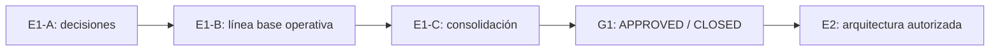

# E1 — Plan y estado del diseño funcional

## Control del documento

| Campo | Valor |
| --- | --- |
| Entrega | E1 — Diseño funcional |
| Estado | `CLOSED / FUNCTIONAL SPECIFICATION APPROVED` |
| E1-A | `CLOSED / PRODUCT DECISIONS RECORDED` |
| E1-B | `CLOSED / OPERATIONAL BASELINE APPROVED` |
| E1-C | `CLOSED / FUNCTIONAL SPECIFICATION APPROVED` |
| G1 | `APPROVED / CLOSED` |
| Commit funcional aprobado | `e233927659b0709d37de8c4b66b55439a854e0e1` |
| PR | `#4 — E1-C: Consolidate functional specification for G1` |
| Aprobación G1 | `2026-08-08T06:20:00-04:00` por Nicolás Sena |
| Acta G1 | `docs/approvals/G1-functional-approval-2026-08-08.md` |
| E2 | `AUTHORIZED TO START` después de la fusión del PR #4 |
| G2 | `NO APROBADA` |
| ADR-0001 | `PROPOSED` |
| Implementación | No autorizada |
| Datos reales | No autorizados |
| Integración técnica EduPay | No autorizada |

## Objetivo cumplido de E1

E1 convirtió la fundación aprobada en comportamiento funcional verificable sin seleccionar arquitectura ni implementar. La evidencia consolidada define actores, recorridos, reglas, excepciones, permisos funcionales, criterios de aceptación, escenarios end-to-end, backlog MVP, diferidos y límites del piloto.

## División y cierre de E1

| Entrega | Propósito | Estado |
| --- | --- | --- |
| E1-A | Actores, journeys, casos de uso y decisiones de producto | `CLOSED / PRODUCT DECISIONS RECORDED` |
| E1-B | Validación institucional y línea base operativa | `CLOSED / OPERATIONAL BASELINE APPROVED` |
| E1-C | Especificación canónica, AC, E2E, backlog y paquete G1 | `CLOSED / FUNCTIONAL SPECIFICATION APPROVED` |

## Evidencia funcional aprobada

- `docs/e1/11-functional-specification.md` — especificación funcional canónica.
- `docs/e1/12-acceptance-criteria.md` — 58 criterios de aceptación.
- `docs/e1/13-end-to-end-scenarios.md` — 22 escenarios end-to-end.
- `docs/e1/14-mvp-backlog.md` — 22 P0, 6 P1 y 5 P2.
- `docs/e1/15-deferred-and-out-of-scope.md` — diferidos y fuera de alcance.
- `docs/e1/16-g1-readiness-checklist.md` — `PASS_WITH_DEFERRED`, sin bloqueantes funcionales materiales.
- `docs/e1/05-g1-traceability-matrix.md` — trazabilidad FR/NFR ↔ Q/D/C ↔ journeys ↔ UC ↔ AC ↔ E2E ↔ backlog.
- `docs/approvals/E1-A-functional-decisions-2026-08-06.md`.
- `docs/approvals/E1-B-functional-closure-2026-08-08.md`.
- `docs/approvals/G1-functional-approval-2026-08-08.md`.

## Decisiones funcionales cerradas relevantes

- Admisión recomienda y Dirección decide.
- Secretaría no recomienda, decide ni promueve lista de espera por defecto.
- `APROBADO`, `LISTA_DE_ESPERA`, `RECHAZADO` y `DEVUELTO_A_REVISION` tienen semántica separada.
- Lista de espera no expone posición y su promoción es manual por roles autorizados.
- Oferta y aceptación son distintas de matrícula.
- La aceptación familiar expresa precede al handoff a EduPay.
- Q-310 está `APPROVED_PRODUCT / FUNCTIONALLY_RESOLVED`.
- Admisión y EduPay son dominios separados y no comparten tablas.
- El portal es la fuente oficial y email el único canal automático del MVP.
- Aislamiento tenant, denegación por defecto, mínimo privilegio y elevación explícita del Superadministrador Global son requisitos funcionales aprobados.

## Diferidos aceptados

Los diferidos siguientes no reabren G1 y deben resolverse en sus hitos:

- **`PILOT_CONFIGURATION_PENDING`:** suplentes, ejecutores concretos, duraciones, cupos, catálogos, prioridades, textos, recordatorios, calendario y SLA.
- **`PRE_PILOT_LEGAL_PENDING`:** C-013, responsable legal/normativo, retención/eliminación, derechos y documentación física antes de datos reales/piloto productivo.
- **`FUTURE_INTEGRATION_PENDING`:** Q-301 a Q-309 y contrato técnico EduPay para E7/G7.
- **`OPEN_SECURITY_AND_OPERATION_QUESTIONS`:** Q-201 a Q-210 para E2 y compuertas posteriores según corresponda.

## Límites posteriores a G1

La aprobación G1 no autoriza:

- código, scaffolding o dependencias;
- datos reales;
- integración técnica EduPay;
- schemas, endpoints, Prisma, colas o deployment de producción;
- aprobar `ADR-0001` por inferencia.

E2 puede diseñar y decidir arquitectura dentro de su alcance. G2 debe aprobar las decisiones técnicas antes de continuar a las siguientes etapas del roadmap.

## Siguiente etapa

Después de fusionar el PR #4, iniciar E2 — Arquitectura. E2 debe producir arquitectura lógica/de despliegue propuesta, evaluación y resolución de ADR, modelo lógico de datos, estrategia concreta de tenancy, identidad/autorización, archivos, auditoría/observabilidad, recuperación, seguridad, costos y evidencia suficiente para solicitar G2.
