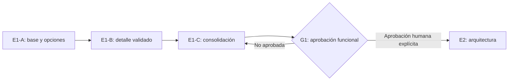

# E1 — Plan y estado del diseño funcional

## Control del documento

| Campo | Valor |
| --- | --- |
| Entrega | E1 — Diseño funcional |
| Estado | E1-A `CLOSED`; E1-B `CLOSED / OPERATIONAL BASELINE APPROVED`; E1-C `IN PROGRESS / READY FOR G1 REVIEW` |
| Compuerta vigente | E1 autorizada; G1 `NO APROBADA` |
| Base revisada | E1-B fusionada a `main` en `168d383489dfd9d5d7a1f48a8a9e25ea330fff13` |
| Naturaleza | Documentación funcional; no autoriza implementación |
| Registro principal E1-B | `docs/e1/07-institutional-validation-baseline.md`, `docs/e1/08-pilot-operational-rules.md`, `docs/e1/09-pilot-configuration-matrix.md` |
| Acta de cierre E1-B | `docs/approvals/E1-B-functional-closure-2026-08-08.md` |
| Plan E1-C | `docs/e1/10-e1c-consolidation-plan.md` |
| Aprobación de cierre E1-B / inicio E1-C | `2026-08-08T05:45:00-04:00` por Nicolás Sena |

## Clasificación de la información

- **Hecho confirmado:** contenido respaldado por `SRC-001` a `SRC-005` o por el estado verificable del repositorio.
- **Decisión aprobada:** D-001 a D-024 y los cierres formales registrados, sin modificar su significado.
- **Decisión aprobada de producto:** posición funcional fijada por Nicolás Sena.
- **Supuesto de trabajo:** interpretación reversible usada para completar el análisis.
- **Pregunta abierta:** asunto sin resolución o con detalle pendiente.
- **Validación institucional registrada:** C-009, C-011, C-013 y C-014 tienen posición institucional/funcional confirmada; sus detalles operativos o legales pendientes conservan sus estados.

## Objetivo de E1

Convertir la fundación aprobada en comportamientos funcionales verificables: actores, recorridos, casos de uso, reglas, excepciones, permisos conceptuales y decisiones del piloto. E1 debe terminar con evidencia suficiente para que personas autorizadas aprueben o devuelvan el comportamiento en G1, sin seleccionar tecnología ni implementar.

## División de E1

| Entrega | Propósito | Estado |
| --- | --- | --- |
| E1-A | Establecer actores, journeys, casos de uso y paquete de preguntas | `CLOSED / PRODUCT DECISIONS RECORDED` |
| E1-B | Incorporar decisiones institucionales al detalle funcional | `CLOSED / OPERATIONAL BASELINE APPROVED` |
| E1-C | Consolidar y verificar la especificación funcional, criterios de aceptación, backlog y evidencia para G1 | `IN PROGRESS / READY FOR G1 REVIEW` |

La división no crea compuertas nuevas. G1 sólo puede aprobarse mediante decisión humana explícita.

## Alcance cerrado de E1-B

E1-B consolidó:

- respuestas institucionales de C-009, C-011, C-013 y C-014;
- configuración versionada de actividades, intentos, excepciones, reprogramaciones, repeticiones y cierres;
- requisitos documentales configurables, equivalencias, exenciones y origen físico excepcional;
- minimización y acceso de PIE/NEE/salud, excluyendo ingreso familiar del formulario MVP;
- postulación asistida;
- diferenciación entre Administrador Institucional Máximo y Superadministrador Global;
- responsables confirmados y separación Admisión/Secretaría/Dirección;
- cupos, reservas, ofertas, lista de espera, plazos, citas y actividades;
- recomendación de Admisión y decisión de Dirección;
- comunicaciones, dashboard, reportes y exportaciones;
- borde funcional con EduPay, con Q-310 funcionalmente resuelta.

## Fuera de alcance de E1-B

- Aprobar G1.
- Aprobar o modificar ADR-0001.
- Código, scaffolding, dependencias, endpoints, DTO, SQL, modelos físicos o componentes visuales.
- Selección de stack, identidad, correo, archivos, antivirus, colas, despliegue o topología multiempresa.
- Integración ejecutable con EduPay o definición de API.
- Conclusiones legales o uso de datos reales.
- Resolver Q-201 a Q-210 o Q-301 a Q-309.

## Estado actual

| Elemento | Estado | Clasificación |
| --- | --- | --- |
| G0 | `APPROVED / CLOSED` | Decisión aprobada; no se reabre |
| E1 | `AUTORIZADA` para diseño funcional | Decisión aprobada |
| E1-A | `CLOSED / PRODUCT DECISIONS RECORDED` | Acta histórica |
| E1-B | `CLOSED / OPERATIONAL BASELINE APPROVED` | Aprobación humana explícita registrada; PR #3 fusionado |
| E1-C | `IN PROGRESS / READY FOR G1 REVIEW` | Consolidación, 58 AC, 22 E2E, backlog, diferidos y checklist preparados en `docs/e1c-g1-consolidation` |
| G1 | `NO APROBADA` | Requiere E1-C y aprobación humana explícita |
| ADR-0001 | `PROPOSED` | Propuesta arquitectónica fuera de alcance |
| Datos reales | No autorizados | Límite aprobado |
| Implementación | No autorizada | Límite aprobado |

## Preguntas y dependencias conservadas

- Q-101 a Q-184 tienen posición funcional registrada; los valores específicos aún no definidos se tratan como configuración previa al piloto cuando corresponda.
- Q-310 está `APPROVED_PRODUCT / FUNCTIONALLY_RESOLVED`: la aceptación familiar expresa precede al handoff.
- Q-301 a Q-309 permanecen `FUTURE_INTEGRATION_PENDING` y se resolverán en E7/G7.
- Q-201 a Q-210 permanecen abiertas para etapas de arquitectura/seguridad/operación cuando corresponda.
- C-013 conserva `LEGAL_VALIDATION_PENDING` antes de datos reales/piloto productivo.

## Clasificación de pendientes posterior a E1-B

- **`PILOT_CONFIGURATION_PENDING`:** nombres de suplentes; personas concretas de entrevista/evaluación; duración exacta; valores concretos de cupos; catálogo de personalidad por curso; prioridades especiales; textos finales de email; anticipación del recordatorio; SLA numéricos; nombres finales de plantillas.
- **`PRE_PILOT_LEGAL_PENDING`:** C-013 legal, responsable legal/normativo, retención/eliminación y conservación/devolución física.
- **`FUTURE_INTEGRATION_PENDING`:** Q-301 a Q-309 y contrato EduPay.
- **`OPEN_SECURITY_AND_OPERATION_QUESTIONS`:** Q-201 a Q-210 según sus compuertas posteriores.

Ninguno de estos elementos reabre E1-B. Sí deben permanecer trazados en la etapa que corresponda.

## Resultado documental de E1-C

E1-C consolidó:

- especificación funcional canónica;
- 58 criterios de aceptación verificables;
- 22 escenarios felices, alternos, excepciones y controles de acceso;
- backlog de 22 P0, 6 P1 y 5 P2;
- diferidos y fuera de alcance clasificados;
- trazabilidad P0 completa, checklist G1 y borrador de paquete de decisión.

E1-C no autoriza arquitectura, código, stack, API, integración ejecutable ni datos reales.

## Siguiente compuerta humana

El siguiente paso es la revisión humana del paquete E1-C. Hasta una aprobación explícita, G1 continúa `NO APROBADA`, E2/G2 no están autorizadas y `ADR-0001` permanece `PROPOSED`.
