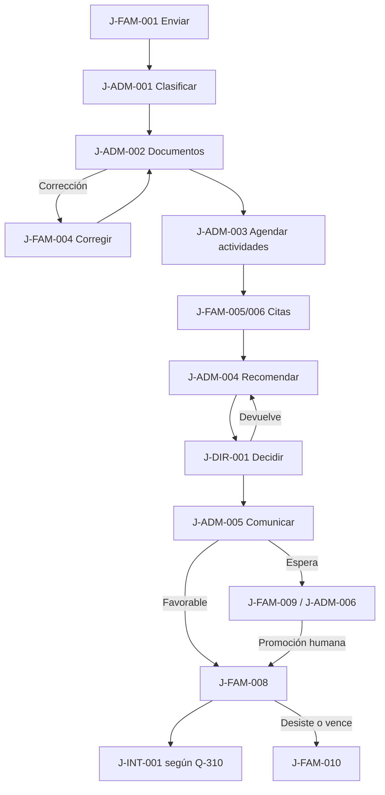

# User journeys funcionales

## Estado y convenciones

Todos los journeys están `PROPOSED` y requieren validación. Describen experiencia y operación, no pantallas ni implementación. Los estados familiares son proyecciones seguras; no exponen estado interno literal. Eventos y notificaciones son tentativos y deben conservar tenant, actor, instante y correlación sin payload sensible.

Reglas comunes: autorización resuelta por identidad, relación, tenant, alcance y propósito; snapshots al enviar; historial antes que sobreescritura; correo como único canal inicial aprobado por D-017; ningún identificador del cliente concede acceso.

## Decisiones de producto aplicadas

La aprobación consolidada de E1-A y la validación institucional E1-B fijan para estos journeys: un adulto responsable con cuenta en el MVP; portal como fuente oficial; postulación asistida auditada; captura progresiva y mínima; reserva junto a la oferta; aceptación expresa antes del handoff a EduPay; entrevista y evaluación obligatorias para todos los cursos del piloto mediante configuración versionada; informe de personalidad configurable; ingreso familiar fuera del formulario MVP.

## Reglas institucionales incorporadas en E1-B

- Las actividades tienen configuración versionada por tenant, proceso/año, oferta, curso/nivel y tipo de actividad. Una excepción requiere actor autorizado, motivo y auditoría; eximir o cerrar no equivale a completar. Si no puede completarse, se registra y se reprograma; los intentos conservan secuencia, fecha, responsable, estado, motivo, resultado/conclusión y relación con el intento anterior.
- Los requisitos documentales pueden exigir el último informe de personalidad vigente/disponible o un equivalente del establecimiento anterior. Una exención autorizada registra requisito, actor, motivo, fecha, alcance y auditoría.
- PIE/NEE se capturan progresivamente sólo para apoyos justificados; salud/tratamientos sólo por necesidad funcional concreta; no se captura ingreso familiar en el formulario de admisión MVP.
- Una postulación asistida se realiza en el portal con el apoderado responsable presente y conserva operador, rol, tenant, fecha/hora, origen, autorización/consentimiento y acciones. La documentación física excepcional se digitaliza al requisito correspondiente con origen conceptual `PHYSICAL_DOCUMENT`.
- El Administrador Institucional Máximo puede operar todas las categorías de su tenant cuando corresponda y con auditoría. El Superadministrador Global requiere elevación explícita para contenido de tenant; `SELF-ELEVATION` es explícita y auditable en el MVP.

## Journeys de familia

### J-FAM-001 — Familia crea cuenta, registra un hijo y envía una postulación

- **Objetivo:** completar por primera vez una postulación válida y recibir acuse.
- **Actor principal:** apoderado postulante. **Secundarios:** estudiante, otros adultos declarados, sistema de correo.
- **Disparador:** convocatoria publicada. **Precondiciones:** oferta vigente; canal verificable; formulario/requisitos publicados.
- **Recorrido principal:** 1) el adulto responsable crea y verifica cuenta; 2) declara información relacionada sin crear cuentas colaborativas; 3) registra estudiante; 4) elige oferta; 5) completa formulario por pasos; 6) aporta documentos/consentimientos aplicables; 7) revisa resumen; 8) envía; 9) recibe acuse.
- **Variantes:** reutiliza perfil existente; madre/padre/titular/financiero quedan relacionados; requisito condicional no aplica; colaboración queda fuera del MVP.
- **Excepciones:** cuenta ya existente sin revelación indebida; oferta cerrada; duplicado según Q-102; archivo no seguro; validación pendiente; envío concurrente.
- **Puntos de decisión:** oferta/duplicado permitido; campos/requisitos aplicables; facultad para enviar; confirmación final.
- **Datos:** identidad, relación, estudiante, oferta, respuestas, documentos y consentimientos; snapshot institucional al enviar.
- **No mostrar:** existencia de cuentas ajenas; otros postulantes/cupos no autorizados; notas, pautas o reglas internas.
- **Eventos auditables:** `AccountVerified`, `StudentProfileRegistered`, `ApplicationDraftCreated`, `DocumentUploaded`, `ApplicationSubmitted`.
- **Notificaciones:** verificación, guardado relevante, acuse o acción segura ante fallo.
- **Estado visible:** “Borrador” y luego “Postulación recibida”.
- **Resultado:** postulación inmutable en recepción, sin garantía de vacante.
- **Preguntas:** Q-101 a Q-108, Q-120, Q-123, Q-124.

### J-FAM-002 — Familia administra postulaciones para varios hijos

- **Objetivo:** distinguir estudiantes, ofertas, tareas y plazos sin mezclar información.
- **Actor principal:** apoderado postulante. **Secundarios:** estudiantes y adultos autorizados.
- **Disparador:** existe más de un estudiante o postulación. **Precondiciones:** relaciones autorizadas y sesión vigente.
- **Recorrido principal:** 1) consulta resumen familiar; 2) selecciona un hijo; 3) ve postulaciones propias y próximos pasos; 4) inicia o continúa una; 5) vuelve al resumen; 6) atiende acciones por caso.
- **Variantes:** hermanos postulan a cursos/instituciones distintos; un hijo tiene varias ofertas según política; otros adultos sólo constan como información relacionada en el MVP.
- **Excepciones:** relación revocada; postulación ya enviada; conflicto de edición; tenant u oferta no accesible.
- **Puntos de decisión:** Q-101/Q-102; quién puede actuar; prioridad de tareas y vencimientos.
- **Datos:** perfiles familiares globales y snapshots separados por postulación/tenant.
- **No mostrar:** datos de instituciones no vinculadas, otros grupos familiares, información cruzada entre casos.
- **Eventos auditables:** selección no requiere auditoría sensible; altas/cambios, accesos restringidos, envíos y respuestas sí.
- **Notificaciones:** resumen por acción, evitando incluir datos sensibles de hermanos.
- **Estado visible:** tarjeta o resumen conceptual por hijo/postulación, con estado y próximo paso.
- **Resultado:** gestión separada y trazable de todos los casos autorizados.
- **Preguntas:** Q-101, Q-102, Q-105, Q-182.

### J-FAM-003 — Familia guarda un formulario incompleto y continúa posteriormente

- **Objetivo:** evitar pérdida de trabajo sin crear un envío prematuro.
- **Actor principal:** apoderado postulante. **Secundarios:** ningún actor institucional por defecto.
- **Disparador:** pausa voluntaria, pérdida de red o cierre de sesión. **Precondiciones:** borrador autorizado y oferta aún utilizable.
- **Recorrido principal:** 1) completa un paso; 2) guarda explícitamente; 3) recibe confirmación; 4) sale; 5) vuelve y se autentica; 6) abre el mismo borrador; 7) revisa cambios/pendientes; 8) continúa.
- **Variantes:** guardado automático si se aprueba; edición desde otro dispositivo; cambio de perfil no modifica snapshot enviado.
- **Excepciones:** conflicto de versiones; sesión expirada; ventana cerrada; formulario reemplazado; archivo aún en cuarentena.
- **Puntos de decisión:** política de autoguardado, vencimiento y tratamiento de nueva versión publicada.
- **Datos:** respuestas parciales, versión de formulario y marcas de guardado.
- **No mostrar:** respuestas en logs/mensajes; existencia de borradores de otra persona.
- **Eventos auditables:** `ApplicationDraftCreated`, `DraftSaved`, conflicto/resolución y expiración por regla.
- **Notificaciones:** confirmación local comprensible; eventual aviso de vencimiento según política.
- **Estado visible:** “Borrador — faltan datos”, con última actualización segura.
- **Resultado:** borrador recuperable o expirado mediante regla versionada.
- **Preguntas:** Q-102, Q-105, Q-181, Q-184.

### J-FAM-004 — Familia recibe una observación documental y corrige antecedentes

- **Objetivo:** entender qué falta y aportar una versión corregida.
- **Actor principal:** apoderado postulante. **Secundarios:** revisor documental, Admisión, correo.
- **Disparador:** requisito observado/rechazado con acción comunicable. **Precondiciones:** postulación enviada; revisión autorizada; plazo definido.
- **Recorrido principal:** 1) revisor registra observación segura; 2) sistema comunica; 3) familia abre el caso; 4) ve requisito, motivo comunicable y plazo; 5) reemplaza/aporta archivo; 6) envía respuesta; 7) revisión vuelve a cola.
- **Variantes:** corrección de respuesta sin archivo; exención aprobada; múltiples requisitos independientes.
- **Excepciones:** plazo vencido; formato inválido; archivo con contraseña/malware; máximo de correcciones; observación anulada.
- **Puntos de decisión:** Q-121 a Q-124; permitir corrección/reapertura; escalar al personal.
- **Datos:** requisito, versiones de archivo, observación comunicable, autor y plazo.
- **No mostrar:** nota interna, identidad innecesaria del revisor, resultados de escaneo detallados o archivos anteriores no autorizados.
- **Eventos auditables:** `DocumentRejected`, `ApplicationActionRequested`, `DocumentUploaded`, `ApplicantResponseSubmitted`.
- **Notificaciones:** solicitud, recordatorio aprobado, recepción y eventual vencimiento.
- **Estado visible:** “Necesitamos información” y luego “Corrección recibida”.
- **Resultado:** nueva versión preservada y revisión reabierta, sin borrar la anterior.
- **Preguntas:** Q-120 a Q-124, Q-181, Q-184.

### J-FAM-005 — Familia recibe una entrevista asignada

- **Objetivo:** conocer fecha, modalidad y acción requerida.
- **Actor principal:** apoderado postulante. **Secundarios:** Admisión, entrevistador, correo.
- **Disparador:** colegio asigna horario por D-014. **Precondiciones:** actividad aplicable, persona/agenda autorizada y datos suficientes.
- **Recorrido principal:** 1) Admisión consulta la configuración versionada; 2) asigna cita; 3) sistema registra zona horaria y responsable; 4) comunica datos mínimos; 5) familia consulta; 6) confirma si la regla lo exige; 7) asiste; 8) personal registra asistencia, conclusión e intento separadas.
- **Variantes:** confirmación sólo informativa; modalidad presencial/remota/híbrida; recordatorio.
- **Excepciones:** correo falla; conflicto de agenda; cancelación institucional; familia no confirma o no asiste; la actividad no puede completarse y se reprograma; una autoridad registra exención o cierre excepcional con motivo y auditoría.
- **Puntos de decisión:** confirmación, modalidad, tolerancia, recordatorios, repetición, exención, cierre y efectos de inasistencia.
- **Datos:** identidad mínima, fecha/hora/zona, ubicación o enlace, contacto y estado de cita.
- **No mostrar:** agenda de terceros, pauta, notas, conclusión o entrevistador innecesario.
- **Eventos auditables:** `GuardianInterviewScheduled`, confirmación, asistencia, `GuardianInterviewCompleted`.
- **Notificaciones:** asignación, cambio, recordatorio y resultado operativo, nunca conclusión interna.
- **Estado visible:** “Próximo paso: entrevista” con acción/plazo.
- **Resultado:** cita confirmada/registrada y actividad concluida o excepción pendiente.
- **Preguntas:** Q-141 a Q-144, Q-180, Q-181, Q-184.

### J-FAM-006 — Familia solicita o recibe reprogramación

- **Objetivo:** cambiar una cita sin perder historia ni alterar silenciosamente el proceso.
- **Actor principal:** apoderado postulante o Admisión según origen. **Secundarios:** entrevistador/evaluador, correo.
- **Disparador:** impedimento familiar o institucional. **Precondiciones:** cita vigente; política permite solicitud/cambio.
- **Recorrido principal:** 1) actor registra solicitud/motivo mínimo; 2) Admisión evalúa si corresponde; 3) asigna nuevo horario; 4) sistema conserva cita anterior; 5) comunica; 6) familia confirma si aplica.
- **Variantes:** reprogramación institucional directa; rechazo de solicitud con alternativa; cambio de modalidad; repetición con relación al intento anterior.
- **Excepciones:** límite de reprogramaciones; ventana cerrada; no hay horarios; inasistencia ya registrada; conflicto de agenda.
- **Puntos de decisión:** quién aprueba, cantidad, tolerancia, evidencia y efecto sobre continuidad.
- **Datos:** cita anterior/nueva, origen, motivo codificado, actor y marcas temporales.
- **No mostrar:** motivos sensibles en correo o agenda compartida; disponibilidad de otras familias.
- **Eventos auditables:** solicitud, aprobación/rechazo, `GuardianInterviewRescheduled` o equivalente de evaluación, intento repetido, exención y cierre.
- **Notificaciones:** recepción de solicitud, confirmación/rechazo y nueva cita.
- **Estado visible:** “Cambio solicitado” o “Cita reprogramada”.
- **Resultado:** nueva cita vigente o excepción escalada, con historia intacta.
- **Preguntas:** Q-142, Q-143, Q-181, Q-184.

### J-FAM-007 — Familia consulta el estado y próximos pasos

- **Objetivo:** comprender situación, tareas y plazos sin contactar innecesariamente al colegio.
- **Actor principal:** apoderado postulante. **Secundarios:** Admisión y correo indirectamente.
- **Disparador:** ingreso al portal o enlace no sensible. **Precondiciones:** autenticación y relación vigente.
- **Recorrido principal:** 1) selecciona postulación; 2) sistema autoriza; 3) proyecta estado familiar; 4) muestra acciones/plazos y comunicaciones apropiadas; 5) permite actuar cuando corresponda.
- **Variantes:** varios hijos; acción documental, cita, oferta o espera; historial resumido.
- **Excepciones:** sesión expirada; acceso revocado; estado técnico transitorio; dato interno sin traducción aprobada.
- **Puntos de decisión:** mapeo de estados, historial visible, posición de espera y mensajes de fallo.
- **Datos:** hitos, acciones y comunicaciones minimizadas.
- **No mostrar:** responsables, notas, recomendación, puntajes, posición no aprobada, datos de terceros y errores técnicos.
- **Eventos auditables:** accesos a datos restringidos según política; acciones realizadas desde la vista.
- **Notificaciones:** sólo cuando cambia un próximo paso o por recordatorio aprobado.
- **Estado visible:** lenguaje de `docs/02-admission-workflow.md`, sujeto a validación.
- **Resultado:** familia entiende qué hacer, cuándo y por qué.
- **Preguntas:** Q-165, Q-181, Q-182, Q-184.

### J-FAM-008 — Familia recibe resultado favorable

- **Objetivo:** conocer una decisión autorizada y completar la acción posterior correcta.
- **Actor principal:** apoderado postulante. **Secundarios:** Dirección, Admisión, comunicaciones, cupos, EduPay futuro.
- **Disparador:** decisión favorable de Dirección y acción de comunicación autorizada. **Precondiciones:** decisión final registrada; política de cupo/oferta aplicable.
- **Recorrido principal:** 1) Dirección decide; 2) se reserva y emite oferta; 3) Admisión autoriza comunicación; 4) familia recibe resultado y condiciones; 5) el adulto responsable acepta expresamente; 6) se inicia handoff; 7) EduPay continúa su propio ciclo.
- **Variantes:** favorable con oferta inmediata; favorable con paso de aceptación; acción externa de formalización.
- **Excepciones:** cupo ya no disponible, comunicación fallida, oferta expirada, respuesta duplicada, divergencia de handoff.
- **Puntos de decisión:** reserva, vigencia, aceptación explícita, Q-310 y efecto de no formalizar.
- **Datos:** decisión comunicable, oferta, plazo, contacto y referencias mínimas de integración futura.
- **No mostrar:** fundamento interno, recomendación, notas, situación de terceros o payload técnico.
- **Eventos auditables:** `AdmissionDecisionRecorded`, `SeatReserved`, `AdmissionOfferIssued/Accepted`, comunicación y handoff.
- **Notificaciones:** resultado, recordatorios de plazo y confirmación de respuesta/derivación.
- **Estado visible:** “Resultado favorable” y próximo paso; integración como “Preparando matrícula”.
- **Resultado:** oferta vigente respondida o derivación iniciada según regla aprobada.
- **Preguntas:** Q-160 a Q-166, Q-181, Q-182, Q-184, Q-310.

### J-FAM-009 — Familia queda en lista de espera

- **Objetivo:** comprender que existe elegibilidad sin vacante garantizada.
- **Actor principal:** apoderado postulante. **Secundarios:** Dirección, Admisión, responsable de cupos.
- **Disparador:** decisión/regla de capacidad lleva a espera. **Precondiciones:** política versionada y decisión autorizada.
- **Recorrido principal:** 1) se registra ingreso y criterio; 2) se comunica condición y vigencia; 3) familia consulta estado; 4) responsable revisa ante cupo; 5) promoción requiere confirmación humana por D-008; 6) se emite oferta o cierra.
- **Variantes:** cambios de política quedan para evolución; prioridades/desempates aprobados; familia desiste. En el MVP no se muestra posición numérica exacta.
- **Excepciones:** empate, ajuste de cupo, cierre de lista, comunicación fallida, promoción concurrente.
- **Puntos de decisión:** orden, visibilidad, promoción, plazo y respuesta.
- **Datos:** entrada, política, razón/orden interno, cupo y comunicaciones.
- **No mostrar:** datos de terceros, posición si no está aprobada, criterios sensibles o probabilidad de admisión.
- **Eventos auditables:** `ApplicationWaitlisted`, cambios de orden justificados, promoción, cierre o desistimiento.
- **Notificaciones:** ingreso, cambio accionable, oferta/promoción o cierre.
- **Estado visible:** “En lista de espera” con explicación aprobada, no promesa.
- **Resultado:** espera vigente, promoción controlada o cierre trazable.
- **Preguntas:** Q-164 a Q-166, Q-181, Q-182, Q-184.

### J-FAM-010 — Familia desiste o no formaliza dentro del plazo

- **Objetivo:** cerrar correctamente y liberar capacidad cuando corresponda.
- **Actor principal:** apoderado postulante o regla de expiración. **Secundarios:** Admisión, cupos, comunicaciones, EduPay si handoff iniciado.
- **Disparador:** desistimiento explícito o vencimiento de regla publicada. **Precondiciones:** postulación no terminal; autoridad o reloj válido.
- **Recorrido principal:** 1) familia solicita desistir o vence plazo; 2) sistema explica efectos/solicita confirmación; 3) registra actor o regla; 4) libera reserva si aplica; 5) comunica cierre; 6) no inicia handoff si se rechaza/desiste/vence; 7) coordina sólo una consecuencia futura con EduPay por contrato.
- **Variantes:** desistimiento de borrador, espera u oferta; excepción institucional antes del vencimiento; reapertura extraordinaria.
- **Excepciones:** acción concurrente con aceptación/pago; actor sin facultad; reloj o regla incorrecta; integración en curso.
- **Puntos de decisión:** plazos, excepción, reapertura, compensación y quién autoriza.
- **Datos:** estado, plazo, confirmación, motivo codificado, reserva e integración mínima.
- **No mostrar:** deliberación, terceros ni detalles técnicos de compensación.
- **Eventos auditables:** `ApplicationWithdrawn`, `ApplicationExpired`, `SeatReservationReleased`, excepción/reapertura.
- **Notificaciones:** advertencia aprobada, confirmación de cierre y próximos pasos si existe excepción.
- **Estado visible:** “Postulación desistida” o “Plazo vencido”.
- **Resultado:** cierre trazable; no se presume eliminación de datos.
- **Preguntas:** Q-163, Q-167, Q-181, Q-184, Q-308 diferida.

## Journeys institucionales

### J-ADM-001 — Admisión recibe y clasifica postulaciones por curso

- **Objetivo:** formar una cola operativa correcta y aislada.
- **Actor principal:** encargado de admisión. **Secundarios:** sistema, revisores, cupos.
- **Disparador/precondiciones:** `ApplicationSubmitted`; membresía/alcance vigentes y oferta versionada.
- **Recorrido principal:** validar recepción; clasificar por tenant/sede/año/curso; crear tareas; identificar acciones bloqueantes; asignar; mostrar conteos autorizados.
- **Variantes:** reasignación, prioridad por regla aprobada, múltiples cursos. **Excepciones:** duplicado, oferta cerrada, tenant inconsistente, caso sin responsable.
- **Decisiones:** política de duplicado, asignación y SLA. **Datos:** snapshot y metadatos mínimos; sensibles sólo al abrir tarea autorizada.
- **No mostrar:** otros tenants, conteos filtrables o datos sensibles en tablero.
- **Auditoría/notificación:** recepción, asignaciones y cambios; acuse familiar ya emitido.
- **Estado familiar:** “Postulación recibida/en revisión”. **Resultado:** caso en cola y trazable.
- **Preguntas:** Q-101 a Q-103, Q-184.

### J-ADM-002 — Admisión revisa documentos

- **Objetivo:** determinar cumplimiento por requisito sin borrar versiones.
- **Actor principal:** revisor documental. **Secundarios:** Admisión, familia.
- **Disparador/precondiciones:** archivo seguro listo; tarea asignada y propósito válido.
- **Recorrido principal:** abrir requisito; autorizar archivo; comprobar origen y condición; comparar vigencia/equivalencia; aceptar/observar/rechazar o solicitar exención; registrar motivo; generar acción si corresponde; cerrar tarea.
- **Variantes:** varios archivos por requisito, requisito condicional, informe de personalidad vigente/equivalente, documentación física digitalizada con origen `PHYSICAL_DOCUMENT`, exención por autoridad distinta. **Excepciones:** cuarentena, contraseña, archivo ilegible, vencido o ajeno al tenant.
- **Decisiones:** Q-120 a Q-124. **Datos:** archivo y metadatos `RESTRICTED`; salud/NEE `HIGHLY_RESTRICTED` sólo si aplica.
- **No mostrar:** nota interna o dictamen ajeno a la familia.
- **Auditoría/notificación:** acceso/descarga, dictamen, exención y observación; comunicar sólo motivo accionable.
- **Estado familiar:** “En revisión” o “Necesitamos información”. **Resultado:** requisito resuelto o acción pendiente.
- **Preguntas:** Q-120 a Q-124.

### J-ADM-003 — Admisión agenda entrevista y evaluación

- **Objetivo:** asignar ambas actividades requeridas del piloto sin solapamientos.
- **Actor principal:** encargado de admisión. **Secundarios:** entrevistador, evaluador, familia, comunicaciones.
- **Disparador/precondiciones:** configuración versionada de la actividad; D-014 y D-015; recursos autorizados.
- **Recorrido principal:** verificar aplicabilidad y obligatoriedad; seleccionar personal/horario/modalidad; crear citas separadas; revisar conflicto; publicar asignación; comunicar; seguir confirmación.
- **Variantes:** citas el mismo día, reprogramación, repetición, excepción aprobada, exención o cierre autorizado. **Excepciones:** sin disponibilidad, datos de contacto fallidos, actividad no completable.
- **Decisiones:** Q-140 a Q-143 y Q-184. **Datos:** identidad mínima, agenda y apoyos estrictamente necesarios.
- **No mostrar:** agenda de terceros, pauta o datos sensibles innecesarios.
- **Auditoría/notificación:** asignación, cambio, cancelación, excepción, repetición, exención y cierre; correos de cita.
- **Estado familiar:** “Próximo paso: entrevista/evaluación”. **Resultado:** actividades agendadas o excepción escalada.
- **Preguntas:** Q-140 a Q-143, Q-181, Q-184.

### J-ADM-004 — Admisión consolida antecedentes y emite recomendación

- **Objetivo:** entregar a Dirección una recomendación completa, separada de la decisión.
- **Actor principal:** encargado de admisión. **Secundarios:** revisores, entrevistador, evaluador, cupos.
- **Disparador/precondiciones:** requisitos y actividades completas/eximidas; rol de recomendador; pauta aprobada.
- **Recorrido principal:** verificar completitud; consultar sólo antecedentes permitidos; redactar fundamento; revisar conflictos/cupos; guardar versión; enviar a Dirección; cerrar versión contra edición.
- **Variantes:** devuelve tareas antes de enviar; reemplaza recomendación devuelta. **Excepciones:** dato pendiente, conflicto de rol, acceso sensible no autorizado, regla de cupo incierta.
- **Decisiones:** criterios/fundamentos Q-160 y visibilidad Q-144. **Datos:** resumen, conclusiones y recomendación `HIGHLY_RESTRICTED`.
- **No mostrar:** recomendación a familia, puntajes o notas no autorizadas.
- **Auditoría/notificación:** borrador, envío, reemplazo; notificación interna a Dirección.
- **Estado familiar:** “Estamos revisando el resultado”. **Resultado:** recomendación versionada pendiente de decisión.
- **Preguntas:** Q-144, Q-145, Q-160, Q-161, Q-162.

### J-DIR-001 — Dirección revisa, aprueba, rechaza o devuelve

- **Objetivo:** tomar decisión final autorizada o solicitar revisión sin borrar historia.
- **Actor principal:** Dirección. **Secundarios:** Admisión y cupos.
- **Disparador/precondiciones:** recomendación enviada; aprobador distinto y vigente; antecedentes consolidados.
- **Recorrido principal:** revisar resumen permitido; verificar cupo/política; elegir aprobar, rechazar o devolver; registrar justificación; confirmar; separar comunicación posterior.
- **Variantes:** devolución y nueva versión; aprobador suplente; favorable a espera por capacidad. **Excepciones:** conflicto de interés, recomendación desactualizada, cupo concurrente, falta de fundamento.
- **Decisiones:** pauta, doble control, efecto de capacidad y reapertura. **Datos:** recomendación, evidencia necesaria y decisión `HIGHLY_RESTRICTED`.
- **No mostrar:** deliberación no comunicable, datos de terceros, decisión antes de confirmación.
- **Auditoría/notificación:** acceso, devolución, decisión; aviso interno a Admisión, no resultado automático.
- **Estado familiar:** permanece “Estamos revisando el resultado” hasta comunicación. **Resultado:** decisión final o revisión reabierta.
- **Preguntas:** Q-160 a Q-167.

### J-ADM-005 — Admisión comunica el resultado autorizado

- **Objetivo:** informar un resultado coherente y accionable sólo después de la decisión.
- **Actor principal:** encargado de admisión/encargado de comunicaciones según RACI. **Secundarios:** Dirección, familia, correo, cupos.
- **Disparador/precondiciones:** decisión final y plantilla/audiencia autorizadas; cupo/oferta coherentes.
- **Recorrido principal:** seleccionar plantilla; validar variables mínimas; aprobar envío; registrar intención; enviar; registrar estado técnico; proyectar resultado y próximo paso.
- **Variantes:** favorable, espera o rechazo; reenvío controlado. **Excepciones:** plantilla desactualizada, correo inválido/fallo, cambio concurrente de cupo.
- **Decisiones:** remitente, horario, escalamiento, texto e historial. **Datos:** contacto y contenido mínimo.
- **No mostrar:** notas, recomendación, motivos sensibles, datos de terceros o error técnico.
- **Auditoría/notificación:** preparación/aprobación/envío/entrega/fallo; el mensaje es la notificación.
- **Estado familiar:** resultado aprobado y próximos pasos. **Resultado:** comunicación trazable, sin confundir envío con entrega.
- **Preguntas:** Q-165, Q-180 a Q-184.

### J-ADM-006 — Admisión administra cupos y lista de espera

- **Objetivo:** evitar sobreoferta y promover de forma reproducible.
- **Actor principal:** responsable de cupos. **Secundarios:** Admisión, Dirección, familia.
- **Disparador/precondiciones:** capacidad aprobada; política versionada; decisión relevante.
- **Recorrido principal:** registrar capacidad/ajustes; consultar disponibilidad; ordenar espera por política; seleccionar candidato; confirmar humanamente D-008; crear reserva junto a la emisión de oferta; comunicar; liberar por vencimiento/rechazo/desistimiento; auditar.
- **Variantes:** cupo agregado/retirado, empate, oferta expirada, desistimiento. **Excepciones:** concurrencia, criterio no definido, orden alterado, reserva huérfana.
- **Decisiones:** Q-162 a Q-167. **Datos:** capacidad interna y postulación mínima.
- **No mostrar:** lista completa, datos de otras familias, posición no aprobada.
- **Auditoría/notificación:** ajustes, reservas, orden/promoción/liberación; mensajes sólo a afectados.
- **Estado familiar:** espera, oferta o cierre. **Resultado:** invariantes de capacidad mantenidas conceptualmente.
- **Preguntas:** Q-162 a Q-167, Q-184.

### J-OPS-001 — Personal crea una postulación asistida, si se aprueba C-014

- **Objetivo:** reducir barreras sin ocultar autoría ni crear un canal informal.
- **Actor principal:** operador asistido. **Secundarios:** familia, administrador, Admisión.
- **Disparador/precondiciones:** opción B de Q-107 aprobada; operador autorizado; identidad y consentimiento/autorización verificados.
- **Recorrido principal:** explicar alcance; registrar tenant, operador, rol, origen asistido, fecha/hora, adulto presente y autorización/consentimiento; usar el mismo formulario versionado; transcribir datos aportados; permitir revisión del adulto responsable; cargar antecedentes físicos sólo al requisito correspondiente; adjuntar evidencia; enviar sólo con el adulto presente y autorización aplicable; entregar acuse/control.
- **Variantes:** familia toma control antes de enviar; asistencia presencial/remota; sólo apoyo de digitación. **Excepciones:** falta de facultad, conflicto, documento inseguro, operador intenta revisar su caso.
- **Decisiones:** nivel de asistencia, evidencia, envío y control posterior. **Datos:** los mismos del caso más registro de operador/origen.
- **No mostrar:** casos ajenos ni credenciales de familia; no registrar secretos.
- **Auditoría/notificación:** creación asistida, cada cambio relevante, entrega de control y envío.
- **Estado familiar:** “Borrador asistido” o “Postulación recibida”, con autoría clara.
- **Resultado:** caso trazable o derivación a canal de apoyo, sin correo, planilla, papel o documento suelto como expediente paralelo. El papel físico, si se acepta excepcionalmente, queda representado por el documento digital oficial.
- **Preguntas:** Q-105 a Q-107/C-014.

### J-INT-001 — Admisión deriva un caso favorable a EduPay

- **Objetivo:** iniciar un handoff controlado en el momento funcional aprobado.
- **Actor principal:** Admisión. **Secundarios:** familia, Dirección, EduPay, soporte de integración.
- **Disparador/precondiciones:** decisión favorable; Q-310 cumplida; referencia de tenant/oferta válida; contrato futuro aprobado.
- **Recorrido principal:** verificar aceptación expresa; preparar mínimo funcional; registrar intención/correlación; entregar a borde futuro; consultar estado; recibir confirmación; proyectar sin confundir entrega con matrícula.
- **Variantes:** tras decisión, aceptación o formalización según Q-310; vinculación existente. **Excepciones:** conflicto de identidad, rechazo, timeout, duplicado, desistimiento durante proceso.
- **Decisiones:** Q-310 en E1; Q-301 a Q-309 quedan para integración. **Datos:** identidad/relación académica mínimas; nunca salud, NEE, documentos o notas.
- **No mostrar:** payload, referencias técnicas, reintentos o errores internos.
- **Auditoría/notificación:** solicitud, entrega, acuse, fallo, reintento, reconciliación y confirmación.
- **Estado familiar:** “Preparando matrícula”; sólo `ENROLLED` con confirmación contractual futura.
- **Resultado:** handoff iniciado/confirmado/atención requerida, sin tablas compartidas.
- **Preguntas:** Q-310; dependencias Q-301 a Q-309.

### J-ADM-007 — Administrador configura y publica formulario y requisitos

- **Objetivo:** publicar una configuración institucional coherente, segura y versionada.
- **Actor principal:** administrador institucional. **Secundarios:** Admisión, revisores, Dirección.
- **Disparador/precondiciones:** ciclo/oferta en preparación; permisos separados de edición/publicación; decisiones funcionales registradas.
- **Recorrido principal:** crear versión borrador; configurar secciones/campos/propósito/sensibilidad; añadir requisitos por curso/periodo/condición; configurar actividades por tenant/proceso/oferta/curso/tipo; validar reglas; previsualizar conceptualmente; solicitar revisión; publicar; conservar versión inmutable.
- **Variantes:** nueva versión para próxima convocatoria; archivar; distintos cursos. **Excepciones:** campo sensible sin propósito, regla inválida, publicación no autorizada, dependencia circular o requisito contradictorio.
- **Decisiones:** Q-104, Q-108, Q-120 y C-011/C-013. **Datos:** configuración `INTERNAL`; metadatos de sensibilidad, no respuestas reales.
- **No mostrar:** datos de postulaciones durante configuración; código/HTML ejecutable.
- **Auditoría/notificación:** creación, revisión, publicación/archivo y diferencias de versión; aviso interno.
- **Estado familiar:** sólo ve versión publicada vigente. **Resultado:** formulario/requisitos versionados; publicaciones previas no cambian.
- **Preguntas:** Q-104, Q-108, Q-120, Q-121, C-009, C-011, C-013.

## Relación general entre journeys

## Validaciones institucionales pendientes

- Confirmar que los recorridos reflejan la práctica real y no omiten responsabilidades.
- Definir plazos, excepciones, textos, responsables y suplencias.
- Resolver los puntos de decisión del workbook antes de convertir estos journeys en comportamiento aprobado.
