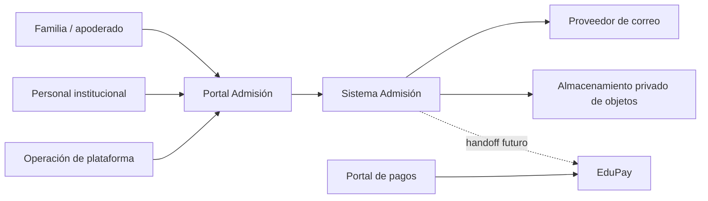
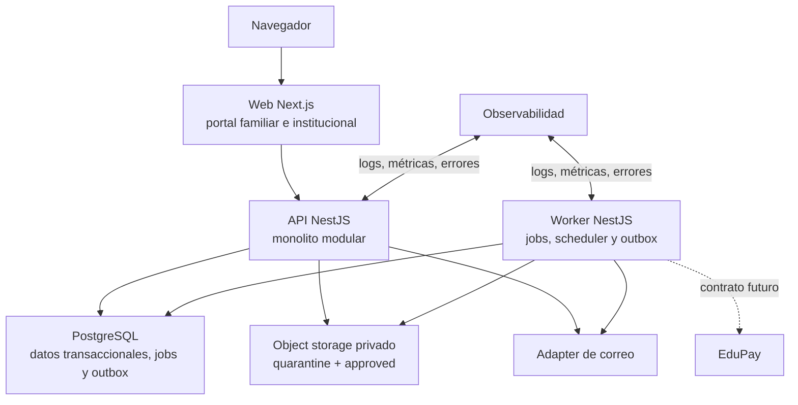

# Arquitectura lógica propuesta

## Estado y alcance

| Campo | Valor |
| --- | --- |
| Etapa | E2 — Arquitectura |
| Estado | `PROPOSED / RECOMMENDED_FOR_G2` |
| Estilo recomendado | Monolito modular con procesos web, API y worker separados |
| G2 | `NO APROBADA` |
| Implementación | No autorizada |

Esta propuesta traduce la especificación funcional aprobada en límites técnicos. No crea código, infraestructura ni contrato ejecutable con EduPay.

## System Context

Admisión es dueño de postulación, documentos, actividades, recomendación, disposición, cupos, espera, oferta y aceptación. EduPay es dueño de asociación académica, obligaciones, pago y matrícula. No comparten tablas ni almacenamiento.

## Containers lógicos

- **Web:** presentación, navegación y composición; no decide autorización ni invariantes.
- **API:** punto de entrada de negocio y seguridad; resuelve identidad, tenant efectivo, propósito y autorización.
- **Worker:** ejecuta tareas durables usando los mismos módulos de aplicación, sin convertirse en dominio independiente.
- **PostgreSQL:** fuente transaccional de Admisión, incluida coordinación de jobs y outbox propuesta.
- **Object storage:** bytes privados; PostgreSQL conserva metadata y ownership.
- **Servicios externos:** correo y, en E7/G7, EduPay mediante adapters explícitos.

## Estilo: monolito modular vs microservicios

| Criterio | Monolito modular | Microservicios |
| --- | --- | --- |
| Consistencia de cupos/decisiones | Transacciones locales y simples | Coordinación distribuida y compensaciones |
| Aislamiento tenant | Política uniforme en una frontera | Debe propagarse y probarse en cada servicio |
| Equipo y velocidad | Menor sobrecarga operativa | Mayor autonomía sólo con equipos independientes |
| Jobs y escalado | Worker separable por proceso | Escalado independiente por servicio |
| Observabilidad | Correlación más simple | Trazas distribuidas obligatorias |
| Despliegue/costo | Menos artefactos y operación | Más runtimes, redes, secretos y disponibilidad |
| Evolución | Módulos pueden extraerse con evidencia | Extracción prematura endurece contratos |

**Recomendación:** monolito modular. Los requisitos no justifican microservicios: no existen equipos autónomos por dominio, escalas verificadas ni necesidad de despliegues independientes. Web, API y worker pueden escalar como procesos separados sin dividir ownership ni introducir consistencia distribuida.

## Módulos y ownership

| Módulo/contexto | Ownership | Dependencias permitidas principales |
| --- | --- | --- |
| Identity | `PlatformUser`, credenciales, sesiones y verificación | Audit; notificación de identidad |
| Tenancy | `Tenant`, `Institution`, `Campus`, memberships y tenant context | Identity, Audit |
| Institutional Configuration | procesos, años, cursos, ofertas y configuración versionada | Tenancy, Audit |
| Family | `FamilyAccount`, relaciones y facultades | Identity, Audit |
| Students | estudiante y relación con guardianes | Family, Audit |
| Admissions Applications | postulación y snapshots | Offerings, Family, Students, Forms, Audit |
| Dynamic Forms | definiciones y versiones publicadas | Tenancy, Classification, Audit |
| Documents | requisitos, versiones, assets y revisiones | Applications, Files adapter, Authorization, Audit |
| Activities / Scheduling | definiciones, citas, intentos y resultados | Applications, Communications, Audit |
| Admissions Review | recomendación versionada | Applications, Documents, Activities, Audit |
| Direction Decisions | disposición versionada y separación de funciones | Review, Authorization, Audit |
| Capacity / Reservations | cupos y reservas transaccionales | Offerings, Decisions, Audit |
| Waitlist | entradas, prioridad snapshot y promoción | Decisions, Capacity, Offers, Audit |
| Offers / Acceptance | ofertas, expiración y aceptación | Capacity, Waitlist, Communications, Audit |
| Communications | mensajes, intentos y adapters | Outbox/Jobs, Audit |
| Reporting | proyecciones y exportaciones autorizadas | APIs de lectura de módulos; Audit |
| Audit | eventos append-only conceptuales | Identity/Tenancy context; sin dependencia de negocio |
| Platform Administration / Support Elevation | operaciones globales y elevación temporal | Identity, Tenancy, Authorization, Audit |
| EduPay Integration Boundary | handoff y estado técnico futuro | Offers/Acceptance, Outbox, Audit |

## Reglas de dependencia

### Permitidas

- Los módulos exponen casos de uso y contratos internos explícitos, no sus tablas.
- Reporting consume puertos de lectura/proyecciones autorizadas, nunca archivos o datos sensibles por defecto.
- Audit recibe hechos minimizados de todos los módulos y no altera decisiones de negocio.
- Communications y el borde EduPay reciben mensajes mediante outbox después del commit de negocio.
- Worker invoca casos de uso del mismo monolito con identidad de sistema, tenant y propósito explícitos.

### Prohibidas

- Web accediendo directamente a PostgreSQL u object storage.
- Un módulo leyendo o escribiendo tablas privadas de otro módulo como mecanismo ordinario.
- Identity o Tenancy dependiendo de Admissions Applications.
- Reporting eludiendo autorización o tenant context.
- Communications cambiando disposición, oferta o aceptación por el resultado de email.
- EduPay Integration Boundary escribiendo tablas de EduPay o interpretando estado técnico como matrícula.
- Cualquier módulo confiando en `tenantId`, rol, sensibilidad o ownership enviados por el cliente.

## Flujo de request

1. Reverse proxy termina TLS y aplica límites básicos.
2. Web/API valida origen, sesión y protección CSRF cuando corresponda.
3. Identity resuelve usuario y sesión vigente.
4. Tenancy deriva tenant efectivo desde membresía, ruta autorizada y recurso; el cliente no es autoridad.
5. Authorization evalúa permiso, scope, sensibilidad, propósito y separación de funciones.
6. El caso de uso valida comando y carga agregados dentro del tenant.
7. La transacción aplica invariantes, persiste cambios, auditoría y outbox cuando corresponda.
8. La respuesta expone una proyección minimizada; errores no revelan existencia cross-tenant.

## Sincronía y asincronía

| Operación | Modelo recomendado | Razón |
| --- | --- | --- |
| Crear/enviar postulación | Síncrono transaccional | Confirmación inmediata y durable |
| Revisar documento, recomendar, decidir | Síncrono transaccional | Invariante y auditoría en un commit |
| Reservar, ofrecer, aceptar, promover | Síncrono transaccional con locks/constraints | Evitar sobreoferta y carreras |
| Enviar email | Asíncrono vía outbox/job | Fallo externo no revierte negocio |
| Recordatorios y expiraciones | Scheduler + job durable | Tiempo y reintento controlados |
| Malware scan | Asíncrono; archivo en cuarentena | Nunca aprobar bytes antes del escaneo |
| Reportes grandes | Asíncrono según umbral | Evitar degradar requests |
| Handoff EduPay | Asíncrono futuro, idempotente | Dominio externo y contrato pendiente |

## Fronteras de seguridad

- **Internet → Web/API:** TLS, cookies seguras, CSRF, rate limiting, validación y headers.
- **API/Worker → PostgreSQL:** roles mínimos, conexiones cifradas, tenant context y RLS propuesta.
- **API/Worker → object storage:** credenciales de servicio separadas; objetos privados y claves aleatorias.
- **API/Worker → proveedores:** adapters, timeouts, idempotencia, payload mínimo y secretos fuera del repositorio.
- **Plataforma → tenant:** sin lectura implícita; `SupportElevation` explícita, temporal y auditada.
- **Admisión → EduPay:** frontera futura versionada; nunca tablas, credenciales o base compartida.

## Evolución

Un módulo sólo se considerará candidato a servicio independiente con evidencia de escala, aislamiento operacional, ownership de equipo o ciclo de despliegue distinto. La extracción debe conservar contratos, tenant context, auditoría e idempotencia; no está aprobada en E2.
