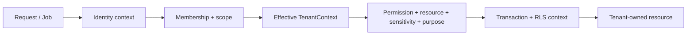
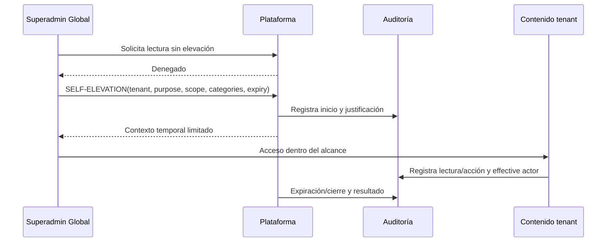

# Arquitectura de multitenancy, identidad y autorización

## Estado

| Decisión | Estado |
| --- | --- |
| Shared database/shared schema con `tenantId` | `PROPOSED / RECOMMENDED_FOR_G2` |
| PostgreSQL RLS como defensa adicional | `PROPOSED / RECOMMENDED_FOR_G2`, sujeto a validación Prisma/pooling |
| Identidad global + memberships tenant | `PROPOSED / RECOMMENDED_FOR_G2` |
| Sesión opaca server-side con cookie HttpOnly | `PROPOSED / RECOMMENDED_FOR_G2`, elección humana registrada |

## Comparación de tenancy

| Criterio | Database-per-tenant | Schema-per-tenant | Shared DB/schema + tenantId | Híbrido futuro |
| --- | --- | --- | --- | --- |
| Aislamiento físico | Alto | Medio-alto | Lógico, requiere capas | Variable |
| Costo MVP | Alto | Medio | Bajo/moderado | Alto al inicio |
| Migraciones | Por base | Por schema | Una evolución coordinada | Varias estrategias |
| Queries/reporting | Difícil transversal | Complejo | Simple con autorización | Adaptadores adicionales |
| Backups/restore tenant | Aislable | Parcial | Requiere tooling lógico | Puede mejorar por segmento |
| Onboarding | Aprovisionamiento de base | Aprovisionamiento schema | Registro/configuración | Según tier/riesgo |
| Riesgo de fuga por query | Menor | Medio | Alto si sólo aplicación | Según modalidad |
| Operación a escala inicial | Costosa | Compleja | Eficiente | No justificada sin evidencia |

## Recomendación MVP

Usar **PostgreSQL compartido, schema compartido y `tenantId` obligatorio** para datos institucionales. La escala inicial, reporting y velocidad favorecen esta opción. El riesgo de fuga exige defensa en profundidad, no un filtro voluntario.

Una estrategia híbrida puede reservarse para tenants con requisitos regulatorios o escala demostrada. No se diseña database-per-tenant preventivamente.

## Defensa en profundidad

1. `tenantId` no nulo en raíces y registros tenant-owned relevantes.
2. Tenant efectivo derivado server-side desde sesión, membership, ruta autorizada y recurso.
3. Body, query, header o identificador del cliente nunca son autoridad de tenant.
4. Casos de uso y repositories exigen `TenantContext`; no existe acceso institucional sin contexto.
5. Autorización compara tenant del recurso con tenant efectivo antes de exponer existencia.
6. Índices y unicidad compuestos por tenant.
7. Relaciones institucionales validan mismo tenant mediante constraints o verificación transaccional equivalente.
8. RLS propuesta como segunda barrera para tablas tenant-owned.
9. Roles de base separados: migración/operación excepcional vs aplicación con menor privilegio.
10. Tests negativos cross-tenant obligatorios en API, jobs, archivos, caché, reporting y exportaciones.

## PostgreSQL Row Level Security

### Beneficios

- Reduce el impacto de olvidar un filtro en una consulta.
- Protege lecturas/escrituras directas de la aplicación dentro de la misma base.
- Hace verificable la política de tenant en DB integration tests.

### Complejidad

- La conexión pooled debe recibir tenant context transaccional y limpiarlo con garantías.
- Jobs de plataforma/reporting requieren políticas y roles explícitos, no bypass general.
- Prisma 7 debe validarse con transacciones y contexto RLS antes de adoptar el patrón.
- Migraciones, soporte y operaciones administrativas necesitan un rol separado y auditado.

### Recomendación

Adoptar RLS desde el primer incremento persistente para tablas tenant-owned, con contexto transaction-scoped. La aplicación sigue aplicando tenant-aware repositories y autorización de recurso; RLS no reemplaza RBAC, scopes ni purpose.

Antes de G4 debe existir una prueba técnica sintética que demuestre:

- request y job con tenant correcto;
- ausencia de contexto = deny;
- intento cross-tenant = deny;
- pooling sin fuga de contexto;
- transacciones Prisma compatibles;
- rol de migración separado del rol de aplicación.

Si esa prueba falla, G4 debe bloquear implementación hasta aprobar una alternativa con defensa equivalente; no se desactiva RLS silenciosamente.

## Contexto efectivo

`TenantContext` conceptual contiene tenant efectivo, actor, effective actor, membership, scopes, purpose, support elevation si existe y correlation ID. No es un DTO confiado del cliente.

## Identidad común vs separada

### Opciones

- Identidades separadas para familia, personal y plataforma: aislamiento conceptual, pero duplica credenciales y recuperación.
- Identidad común `PlatformUser` con perfiles/memberships: un ciclo de seguridad, capacidades separadas por relación.

**Recomendación:** identidad global común. Una cuenta no obtiene acceso institucional sin membership ni acceso familiar sin relación/facultad. Los perfiles y autorizaciones permanecen separados.

## Sesiones

### Decisión MVP

La sesión web MVP es **server-side opaque session**:

- el navegador recibe sólo una cookie `HttpOnly`, `Secure` en HTTPS y con política `SameSite` apropiada;
- la cookie contiene un identificador opaco de alta entropía, sin información de negocio, permisos ni tenant autoritativo;
- el servidor persiste preferentemente sólo un hash/verificador del identificador y lo vincula a `PlatformUser`, memberships y metadata mínima de seguridad;
- la sesión expira por inactividad y por límite absoluto;
- soporta creación, logout, revocación inmediata, revocación de todas las sesiones y rotación del identificador después de login, cambios sensibles o elevación;
- recuperación o cambio de credenciales invalida las sesiones aplicables;
- cada operación resuelve sesión, identidad, membership, tenant efectivo, permiso, recurso, scope, sensitivity, purpose y separation of duties server-side.

La sesión identifica; **no autoriza por sí misma**. El tenant enviado por el cliente nunca es autoridad.

Passport puede utilizarse como adapter o estrategia de autenticación; no define el modelo de sesión ni reemplaza autorización, CSRF, rate limiting o auditoría.

### Protección CSRF

Las acciones mutantes mantienen protección explícita mediante combinación compatible con la topología final de `SameSite`, comprobaciones `Origin/Referer` cuando correspondan y CSRF token cuando sea necesario. `HttpOnly` no elimina CSRF.

### Evolución futura

JWT no queda prohibido como tecnología global. Podrá evaluarse para clientes API externos, mobile, service-to-service o integraciones futuras si una etapa posterior lo justifica. No es el modelo de sesión web del MVP.

## Cuenta y recuperación

- Verificación de email con token de un uso, expiración y respuesta no enumerable.
- Reset de contraseña con token de un uso, revocación de sesiones y mensaje uniforme.
- Rate limiting por identidad tentativa, IP/riesgo y propósito.
- Lockout adaptativo o retraso progresivo; evitar bloqueo fácil por atacante.
- Password hashing con algoritmo/parámetros vigentes al implementar; no se selecciona en esta entrega.
- MFA como capacidad arquitectónica para personal sensible y plataforma; política exacta queda Q-204.

## Autorización

Decisión = `permission` + `tenant/resource ownership` + `scope` + `sensitivity` + `purpose` + `separation of duties` + contexto de elevación.

| Dimensión | Ejemplo | Regla |
| --- | --- | --- |
| Permission | `application.recommend` | Capacidad explícita asignada, deny by default |
| Scope | campus, proceso, curso, caso | El recurso debe caer dentro del alcance |
| Sensitivity | restricted/highly restricted | Requiere permiso específico, no acceso general al caso |
| Purpose | admisión, actividad, soporte | Debe ser compatible y auditable |
| Separation | recommender vs decision maker | Misma persona no decide caso recomendado; Secretaría no recomienda/decide/promueve |
| Ownership | familia propia | Relación/facultad vigente, no sólo identificador |

Los checks ocurren server-side en cada caso de uso y lectura; ocultar un botón no es autorización.

## Superadministrador Global y elevación

`SELF-ELEVATION` MVP exige acción explícita. El registro mínimo incluye actor, tenant, motivo, purpose, scopes, categorías, inicio, expiración, ticket/correlación cuando exista y resultado. La sesión ordinaria no se transforma permanentemente; el contexto elevado es distinguible y expira aunque el usuario siga autenticado.

## Jobs, reporting y caché

- Todo job tenant-owned conserva `tenantId`, purpose y actor de sistema/effective initiator.
- Jobs globales enumeran tenants autorizadamente y procesan uno por contexto; no ejecutan queries sin filtro transversal.
- Cache keys e índices de búsqueda incluyen tenant; los resultados vuelven a autorizarse.
- Reporting cross-tenant sólo para métricas de plataforma minimizadas sin contenido personal; lectura institucional requiere elevación.

## Validaciones obligatorias

- AC-050/051: acceso cross-tenant y postulación ajena denegados sin revelar existencia.
- AC-023/028: Secretaría no recomienda/decide y recomendador no decide el mismo caso.
- AC-052: datos sensibles requieren permiso específico.
- AC-053/054: Superadmin sin elevación denegado; elevación limitada/auditada.
- Matriz negativa por rol, scope, sensibilidad, purpose, tenant y estado del recurso.

## Pendientes

Q-201/Q-202 requieren responsable legal; Q-204 define política MFA; Q-205 define soporte/notificación. Son pendientes de política, no autorización para debilitar los controles propuestos. La elección humana de sesión server-side quedó registrada como HD-04; G2 aún debe aprobar formalmente E2-D-007.
