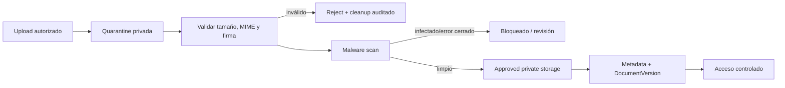

# Arquitectura de archivos privados y seguridad

## Decisión propuesta

| Campo | Valor |
| --- | --- |
| Almacenamiento | Object storage privado con API S3-compatible |
| Proveedor | Diferido; debe evaluarse por residencia, seguridad, costo y operación |
| Estado | `PROPOSED / RECOMMENDED_FOR_G2` |
| Archivos locales productivos | No recomendados |

## Comparación

| Criterio | Filesystem local | S3/S3-compatible | Proveedor administrado especializado |
| --- | --- | --- | --- |
| Escala/durabilidad | Ligada al host | Alta y desacoplada | Alta según servicio |
| Multi-instancia | Difícil | Nativa | Nativa |
| URLs temporales | Implementación propia | Capacidad estándar | Normalmente disponible |
| Backup | Acoplado al servidor | Versionado/replicación posible | Administrado, con lock-in |
| Cuarentena | Directorios y permisos | Prefijos/buckets/policies | Flujo propio del proveedor |
| Costos iniciales | Bajos, operación alta | Variables y previsibles | Potencialmente mayores |
| Portabilidad | Media | Alta entre compatibles, con matices | Menor |
| cPanel | Posible pero frágil | Consumible por API | Consumible por API |

**Recomendación:** object storage S3-compatible privado. Permite separar bytes del runtime, usar claves aleatorias, soportar web/API/worker y cambiar proveedor mediante adapter. No se selecciona proveedor comercial antes de resolver Q-203 y costos.

## Pipeline

## Upload

1. API autoriza tenant, application, requisito, actor, propósito y límites antes de emitir upload o aceptar streaming.
2. Se genera object key aleatoria sin nombre, RUT, tenant legible ni dato personal.
3. El objeto llega a cuarentena privada, nunca al espacio aprobado.
4. Metadata inicial conserva tamaño esperado, nombre de presentación sanitizado, hash cuando esté disponible, uploader y correlation ID.
5. Un job valida tamaño real, firma/magic bytes, MIME permitido y estructura básica segura.
6. Malware scan determina limpio, infectado, no escaneable o error. Fail closed: ningún error promueve el archivo.
7. Sólo un resultado limpio mueve/copia lógicamente a almacenamiento aprobado y crea versión revisable.

## Cuarentena y antivirus

- Cuarentena y approved usan policies separadas; web y usuarios no leen cuarentena.
- Scanner recibe sólo el objeto requerido y corre con red/permisos mínimos.
- ClamAV en worker aislado es alternativa portable; servicio administrado es alternativa si residencia/costo lo justifican.
- Firmas de malware deben actualizarse y su antigüedad ser observable.
- Un archivo infectado se bloquea, registra evento seguro y se elimina según política; no se devuelve el contenido.
- Archivos no escaneables o dañados quedan bloqueados con mensaje familiar accionable y tarea operacional si corresponde.

## Documentos protegidos con contraseña

Un documento cifrado/password-protected no puede inspeccionarse ni escanearse de forma confiable. Recomendación MVP: rechazarlo con instrucción para cargar una copia sin contraseña. No solicitar ni almacenar contraseñas de documentos.

## Acceso y descarga

- Bucket/namespace nunca público.
- Autorización se evalúa en cada solicitud sobre tenant, recurso, versión, permiso, sensibilidad y purpose.
- Opción preferida: URL firmada de vida breve y propósito de lectura, emitida después de autorización; streaming por API para categorías que requieran control/auditoría más estricto.
- URL firmada no contiene datos sensibles, no se registra en logs y no sustituye autorización.
- La versión reemplazada no se entrega por enlaces anteriores; expiración corta limita replay.
- Lectura/descarga altamente restringida genera `AuditEvent` con actor/effective actor, tenant, resource, purpose y resultado.

## Metadata y versionado

PostgreSQL conserva ownership, object key opaca, hash, tamaño, MIME detectado, nombre de presentación sanitizado, estado de scan, engine/signature version, origen, uploader, timestamps y relación de versión. Object storage no es fuente de autorización.

- Cada reemplazo crea `DocumentVersion` nueva; no sobrescribe bytes.
- Hash ayuda a integridad/detección, no se usa para deduplicar entre tenants ni revelar coincidencias.
- Metadata altamente sensible no aparece en URLs, métricas o nombres de objeto.

## Límites y abuso

- Límites por archivo, requisito, postulación, tenant, identidad y ventana temporal.
- Rate limiting y cuotas evitan agotamiento de storage/scanner.
- Tipos permitidos se configuran por requisito dentro de catálogo seguro; contenido ejecutable/macros se rechaza por defecto.
- Descompresión/preview, si se agrega, ocurre aislada con límites de CPU, memoria y expansión.
- SSRF se mitiga no aceptando URLs arbitrarias para importar documentos en MVP.

## Cleanup y ciclo de vida

- Uploads incompletos y cuarentena huérfana se limpian mediante jobs idempotentes después de una ventana propuesta.
- Cleanup verifica metadata/estado antes de borrar; no usa listados amplios como única autoridad.
- Eliminación lógica y física dependen de Q-202/C-013; hasta definición legal no se inventan plazos.
- Excepciones y legal hold deben impedir cleanup cuando se aprueben políticas.

## Backups y recuperación

- Versionado/retención del object storage conforme a política futura.
- Inventario periódico reconcilia metadata con objetos sin exponer nombres.
- Backups incluyen metadata y objetos; restauración prueba coherencia entre ambos.
- Las credenciales de storage se separan por ambiente y función; backup no comparte credenciales de aplicación.
- Restauración tenant-selective es deseable, pero la estrategia exacta depende del proveedor y Q-202/Q-203.

## Auditoría mínima

Eventos: upload iniciado/completado/rechazado, scan limpio/infectado/error, promoción a approved, lectura, descarga, reemplazo, exención, cleanup y eliminación autorizada. No guardar bytes, URLs firmadas, secretos ni contenido del documento en logs/auditoría.

## Riesgos y validación

- **Proveedor/residencia:** Q-203; decisión humana antes de datos reales.
- **Engine AV:** comparar ClamAV aislado vs servicio administrado; validar EICAR/control equivalente en E4.
- **Signed URL leakage:** expiración breve, redacción de logs y reautorización para emisión.
- **Costos:** medir volumen/picos Q-207 y tamaños reales con datos sintéticos.
- **Backups:** restore test bloqueante antes del piloto.
