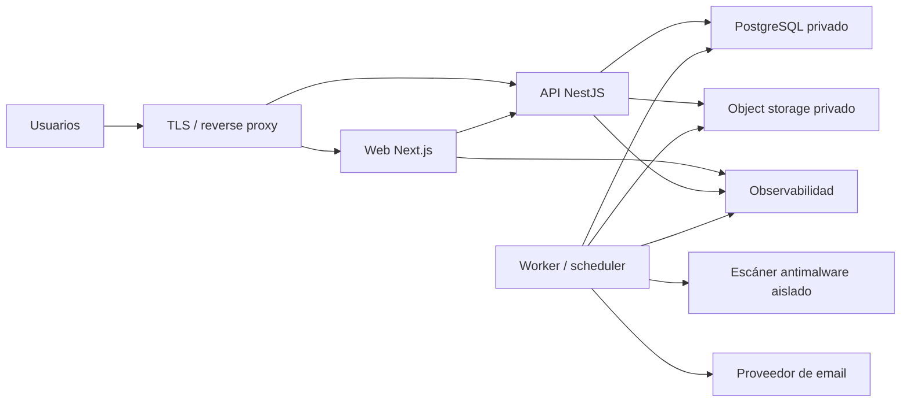

# Deployment y ambientes

**Estado:** `PROPOSED / RECOMMENDED_FOR_G2`

**Decisión comercial/proveedor:** pendiente de aprobación humana.

## Requisitos del runtime

La arquitectura debe soportar de forma operable:

- Next.js App Router con renderizado de servidor;
- API NestJS;
- worker persistente y scheduler;
- PostgreSQL;
- almacenamiento privado de objetos;
- cuarentena y escaneo antimalware;
- TLS, secretos, backups y observabilidad;
- despliegue coordinado, rollback y ambiente staging.

## Alternativas

| Alternativa | Fortalezas | Riesgos / límites | Ajuste |
|---|---|---|---|
| A. cPanel / Passenger | Entorno conocido y costo posiblemente existente | Ciclo de vida de workers, SSR, antivirus, cron, observabilidad y rollback dependen del hosting | Bajo-medio |
| B. VPS Linux + contenedores + reverse proxy | Control del runtime, procesos persistentes y portabilidad | Operación, parchado, backups y monitoreo recaen en el equipo | Alto si existe capacidad operativa |
| C. Plataforma administrada | Menor carga de runtime, despliegue y escalado | Costo, límites, dependencia del proveedor y revisión de datos | Alto si cumple workers/AV/red privada |
| D. Híbrido | Permite runtime controlado con datos/objetos administrados | Más proveedores e integración operacional | Alto y recomendado como línea base |

## Recomendación

Adoptar como base un **runtime Linux containerizado en VPS o servicio equivalente**, con reverse proxy y procesos separados para web, API y worker. Preferir PostgreSQL administrado y object storage S3-compatible administrado cuando presupuesto, residencia y condiciones contractuales lo permitan.

Esta alternativa híbrida desacopla la aplicación del hosting histórico y reduce el riesgo de operar base de datos y archivos sin soporte, pero conserva portabilidad. La selección de proveedor y presupuesto permanece pendiente.

cPanel/Passenger no se descarta como dato histórico ni para una validación limitada. Antes de considerarlo para producción tendría que demostrar supervisión persistente de worker, cron exclusivo, SSR soportado, antivirus aislado, secretos, observabilidad, backups y rollback. Sin esa evidencia no satisface la línea base recomendada.

## Topología conceptual

No representa recursos aprovisionados ni una selección de proveedor.

## Ambientes

| Ambiente | Propósito | Datos | Controles mínimos |
|---|---|---|---|
| Development | Desarrollo local y pruebas rápidas | Sólo sintéticos | Dependencias aisladas, secretos locales no versionados |
| Staging | Validación integrada y operativa | Sólo sintéticos hasta autorización expresa | Topología cercana a producción, accesos restringidos, backups de ensayo |
| Production | Piloto autorizado | Sin datos reales hasta superar compuertas legal y operativa | Separación de red, TLS, backups, monitoreo, auditoría y acceso mínimo |

No se copian bases productivas a development o staging. Si en el futuro se autoriza una réplica, requerirá anonimización validada y decisión específica.

## Red y exposición

- Sólo reverse proxy/web/API necesarios quedan expuestos públicamente.
- PostgreSQL, escáner, endpoints internos y administración permanecen en red privada o allowlist estricta.
- Object storage usa buckets privados y acceso controlado.
- El worker no expone rutas de negocio públicas.
- Acceso administrativo usa identidad individual, mínimo privilegio y auditoría.

## Secretos y configuración

- Secretos fuera del repositorio y de imágenes.
- Valores diferentes por ambiente.
- Rotación y revocación documentadas.
- Ningún secreto en logs, URLs, archivos de ejemplo o variables entregadas al navegador.
- Configuración institucional versionada en el producto no se confunde con secretos de infraestructura.

## Despliegue y rollback

Se propone:

1. construir artefactos inmutables y trazables a commit;
2. ejecutar validaciones y migraciones compatibles antes del cambio de tráfico;
3. desplegar procesos con health/readiness;
4. mantener versión anterior disponible durante la ventana de verificación;
5. revertir aplicación sin revertir destructivamente datos;
6. usar migraciones expand/contract cuando haya compatibilidad entre versiones.

La estrategia exacta de blue/green o rolling depende del proveedor. Para el piloto basta downtime mínimo programado y rollback ensayado; “zero downtime” no se promete sin validación.

## PostgreSQL y archivos

- PostgreSQL 15 o versión compatible aprobada, con cifrado en tránsito, backups y restore probado.
- Object storage privado con versionado, lifecycle y recuperación coordinada.
- El antivirus procesa cuarentena sin montar el repositorio ni compartir credenciales amplias.
- Base y objetos deben inventariarse para restauración coherente.

## Observabilidad y operación

Cada ambiente tiene logs, métricas y errores separados. Producción requiere alertas para:

- indisponibilidad y errores sostenidos;
- worker detenido o jobs envejecidos;
- fallos de backups;
- saturación de base;
- escaneo detenido;
- email degradado;
- eventos de seguridad críticos.

## Costos y decisión pendiente

Antes de G2 debe aprobarse el patrón de deployment. Proveedor, región y presupuesto pueden cerrarse después de G2, pero antes de aprovisionar infraestructura deberán compararse al menos:

- costo fijo y variable;
- soporte y recuperación;
- residencia/transferencia de datos;
- operación 24/7 requerida;
- límites de workers, red, almacenamiento y antivirus;
- costo de salida y portabilidad.

## Límites

Este documento no autoriza infraestructura, dominios, cuentas cloud, secretos, deployment ejecutable ni datos reales.
