# E3 — Arquitectura de información

## Control

| Campo | Valor |
| --- | --- |
| Estado | `RECOMMENDED_FOR_G3` |
| Audiencias | Familia, personal institucional y administración mínima |
| Alcance | Navegación y jerarquía conceptual P0; no rutas técnicas |
| Datos | Sintéticos únicamente |
| Trazabilidad | BL-001..BL-022; AC-001..AC-058; E2E-001..E2E-022 |

Este documento traduce la especificación funcional aprobada en una estructura navegable. No agrega entidades, permisos ni capacidades fuera del [backlog P0](../e1/14-mvp-backlog.md#p0--recorrido-mínimo-completo).

## Clasificación de la información

- **Hechos confirmados:** las tres audiencias, el portal familiar como fuente oficial, los 22 P0 y la separación Admisión/EduPay provienen de E1 y G2.
- **Decisiones aprobadas:** aislamiento por tenant, mínimo privilegio, separación Secretaría–Admisión–Dirección y sesión opaca server-side provienen de G1/G2.
- **Supuestos de trabajo UX:** los nombres de navegación y la agrupación visual se proponen para G3; no son contratos técnicos.
- **Preguntas abiertas:** copy final, branding, paleta, orden exacto de algunas opciones configurables y política MFA quedan fuera de esta decisión UX.

## Principios de jerarquía

1. La audiencia ve sólo tareas y recursos autorizados para su tenant, scope, propósito y sensibilidad.
2. Familia parte de la próxima acción; personal parte de la bandeja operacional; administración parte de configuración.
3. Una postulación tiene un contexto único visible: institución, sede, proceso/año, curso/nivel y estudiante.
4. El estado de negocio se muestra separado del estado técnico de una comunicación, carga o escaneo.
5. El expediente no es una página infinita: usa header persistente, stepper y secciones/tabs con jerarquía.
6. Los nombres de acciones críticas son explícitos: `Solicitar cambio`, `Observar documento`, `Emitir recomendación`, `Registrar decisión`, `Aceptar oferta`.
7. Familia nunca navega hacia resultados internos, puntajes, recomendación, comentarios internos, posición de espera, cupos exactos ni identidad de revisores.
8. EduPay sólo aparece como próximo paso conceptual después de una aceptación expresa; no se presenta como parte del expediente de Admisión.

## Familia

### Navegación global

- **Inicio:** resumen de postulaciones, próxima acción y alertas accionables.
- **Estudiantes:** alta y selección de hijos autorizados.
- **Postulaciones:** listado de borradores, enviadas, en revisión, espera, resultado, oferta y desistidas.
- **Actividades/citas:** próximas y anteriores, con solicitud de cambio.
- **Perfil/contacto:** datos reutilizables, canales y recuperación de acceso.
- **Ayuda/sesión:** recuperación, cerrar sesión y soporte no sensible.

### Navegación contextual de una postulación

1. Resumen y estado.
2. Formulario y resumen previo al envío.
3. Documentos y correcciones.
4. Actividades/citas.
5. Resultado comunicable.
6. Lista de espera, si aplica.
7. Oferta, aceptación/rechazo o vencimiento, si aplica.
8. Retiro voluntario, siempre con confirmación explícita mientras el caso lo permita.

La familia no recibe una sección para navegar deliberaciones. Los elementos internos se proyectan como estado comunicable o próximo paso cuando corresponda.

## Personal institucional

### Navegación global

- **Dashboard:** Nuevas, Por revisar, Correcciones venciendo, Citas próximas, Esperando decisión, Ofertas por vencer y Lista de espera.
- **Postulaciones:** bandeja/listado filtrable dentro del scope.
- **Expedientes:** apertura del workspace de caso.
- **Documentos:** pendientes, observados, en revisión y carga asistida.
- **Actividades:** agenda, citas, solicitudes de cambio e intentos.
- **Revisión:** expediente para revisión documental y consolidación.
- **Dirección:** casos esperando disposición, visibles sólo para la capacidad autorizada.
- **Cupos:** capacidad, reservas y ajustes auditados, sólo para roles autorizados.
- **Lista de espera:** orden interno y promoción manual, sólo para roles autorizados.
- **Ofertas:** emisión, vencimiento, reapertura excepcional y aceptación.
- **Comunicaciones:** mensajes preparados, confirmación, envío y fallos.
- **Reportes:** catálogo y exportaciones minimizadas según permiso.
- **Configuración permitida:** institución, proceso, oferta, formularios/requisitos, permisos y operación según rol.

### Menú por rol

| Rol | Navegación visible | Límites no negociables |
| --- | --- | --- |
| Secretaría | Dashboard, postulaciones asistidas, documentos/carga, actividades | No recomendación, decisión, cupos, promoción de espera ni exportación masiva por defecto |
| Admisión | Dashboard, bandeja, expediente, documentos, actividades, revisión, recomendación, cupos, espera, ofertas, comunicaciones y reportes autorizados | No decide el caso que recomendó; sensibilidad sólo con permiso y propósito |
| Entrevistador/Evaluador | Actividades asignadas y datos mínimos para ejecutar la actividad | No decide; resultados y comentarios son internos y sólo para propósito autorizado |
| Dirección | Casos esperando decisión, expediente resumido, antecedentes permitidos y decisión | No altera silenciosamente evidencia; no decide un caso que recomendó |
| Administrador Institucional Máximo | Configuración mínima, operación, permisos, cupos, espera, reportes y expediente restringido según propósito | Sólo su tenant; toda lectura sensible y exportación se autoriza y audita |
| Superadmin sin elevación | Operación de plataforma sin contenido tenant | No se muestra contenido, conteos ni recursos institucionales |
| Superadmin con elevación | Contexto tenant temporal y scope/category explícitos | Indicador persistente, propósito, motivo, duración, alcance, categorías y auditoría; salida visible |

## Administración mínima P0

La administración no es un panel exhaustivo de plataforma. Sólo contiene las superficies necesarias para validar el recorrido configurable y los permisos:

- **Institución:** identidad operacional, sedes y estado.
- **Proceso:** año, proceso, curso/nivel, publicación y vigencia.
- **Oferta:** sede, curso/nivel, formulario/requisitos asociados y categoría pública.
- **Formularios/requisitos:** builder controlado, sensibilidad, condiciones, draft, preview y publish/version.
- **Permisos:** memberships, roles, scopes y separación de funciones.
- **Configuración operacional:** actividades, plazos configurables, comunicaciones y reglas de oferta.

No se incluyen facturación, planes, usuarios de plataforma, observabilidad ni administración global exhaustiva.

## Sitemap conceptual

```mermaid
flowchart TB
    Root["Admisión"]
    Root --> Family["Familia"]
    Root --> Staff["Personal institucional"]
    Root --> Admin["Administración mínima"]

    Family --> FAccess["Acceso / recuperación"]
    Family --> FHome["Inicio"]
    Family --> FStudents["Estudiantes"]
    Family --> FApplications["Postulaciones"]
    Family --> FActivities["Actividades / citas"]
    Family --> FProfile["Perfil / contacto"]
    FApplications --> FNew["Nueva postulación"]
    FNew --> FProcess["Proceso / oferta"]
    FNew --> FForm["Formulario"]
    FNew --> FDocs["Documentos"]
    FNew --> FSubmit["Resumen y envío"]
    FApplications --> FCase["Expediente / status"]
    FCase --> FResult["Resultado"]
    FCase --> FWait["Lista de espera"]
    FCase --> FOffer["Oferta / aceptación"]

    Staff --> SLogin["Login / sesión"]
    Staff --> SDash["Dashboard"]
    Staff --> SWork["Postulaciones / expediente"]
    SWork --> SDocs["Documentos"]
    SWork --> SActivities["Actividades"]
    SWork --> SReview["Revisión / recomendación"]
    Staff --> SDirection["Dirección"]
    Staff --> SCapacity["Cupos / waitlist / ofertas"]
    Staff --> SComms["Comunicaciones"]
    Staff --> SReports["Reportes"]
    Staff --> SConfig["Configuración permitida"]

    Admin --> AInstitution["Institución"]
    Admin --> AProcess["Proceso / oferta"]
    Admin --> AForms["Formularios / requisitos"]
    Admin --> APerms["Permisos"]
    Admin --> AOps["Configuración operacional"]
```

## Cobertura P0 de la arquitectura

| P0 | Punto de navegación que lo hace encontrable |
| --- | --- |
| BL-001, BL-019, BL-020 | Contexto de tenant, permiso, auditoría y menú por rol |
| BL-002, BL-003, BL-004, BL-005 | Familia: Estudiantes → Postulaciones → Nueva postulación |
| BL-006, BL-007 | Postulación → Documentos; Personal → Documentos/carga asistida |
| BL-008, BL-009 | Actividades/citas; agenda y detalle de actividad |
| BL-010, BL-011 | Revisión → Recomendación; Dirección → Casos esperando decisión |
| BL-012, BL-013, BL-014 | Cupos, Lista de espera y Ofertas |
| BL-015, BL-016 | Inicio/dashboard, comunicaciones y expediente/status |
| BL-017, BL-018 | Dashboard, Reportes y exportaciones autorizadas |
| BL-021 | Administración mínima: institución, proceso, oferta, formularios/requisitos, permisos y operación |
| BL-022 | Oferta aceptada → próximo paso de handoff conceptual, sin integración ejecutable |

## Decisión para G3

Se recomienda aprobar esta arquitectura de información como base del prototipo. Las etiquetas pueden recibir copy editorial posterior sin cambiar jerarquía, permisos ni recorrido P0.
