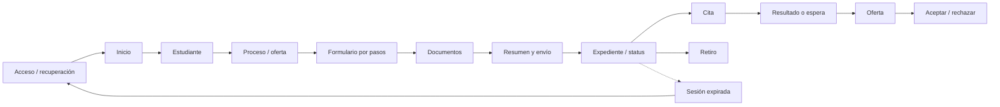
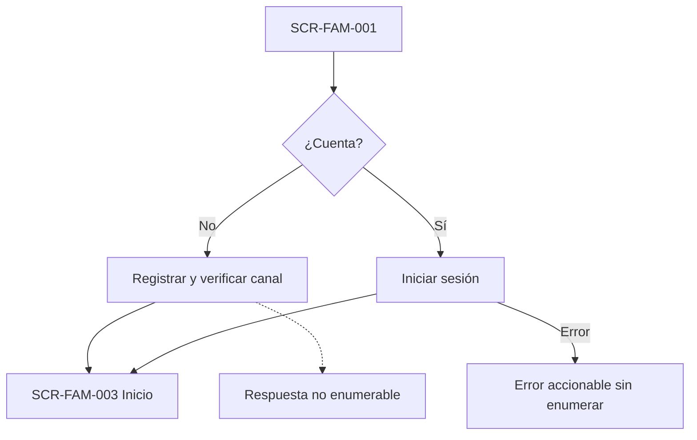
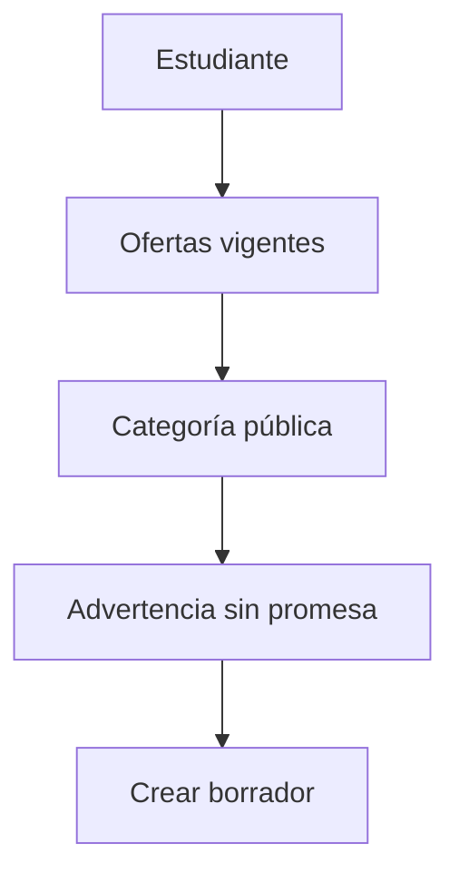
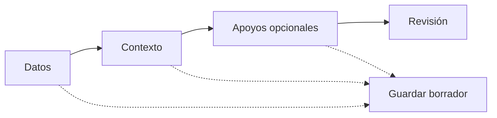

# E3 — Wireflows críticos de Familia

## Alcance y reglas de proyección

Estos wireflows describen el recorrido P0 de un adulto responsable con datos sintéticos. La familia ve estados operacionales y comunicables, nunca puntajes, resultados internos, recomendaciones, comentarios internos, posición numérica de espera, cupos exactos ni identidad de revisores. El portal es la fuente oficial; el correo sólo notifica.

**Trazabilidad:** BL-002..BL-016, BL-022; AC-001..AC-006, AC-007..AC-021, AC-032, AC-036..AC-043, AC-051, AC-055..AC-058; E2E-001..E2E-018.

## Flujo maestro



## 1. Registro y login



- Solicitar sólo la información mínima para la cuenta de adulto responsable.
- El sistema no confirma si un correo, estudiante o postulación de terceros existe.
- Éxito: sesión activa y dashboard propio.
- Fallo: validación y rate limit con instrucciones; no se revela identidad de terceros.
- AC: AC-001, AC-002, AC-051. E2E: E2E-018.

## 2. Seleccionar estudiante

1. Inicio muestra estudiantes autorizados y el estado de cada postulación.
2. `Agregar estudiante` abre un formulario breve; `Seleccionar` fija el contexto.
3. Coincidencias potenciales se resuelven con mensaje uniforme y revisión autorizada; no fusionan ni enumeran.
4. Éxito: estudiante sintético seleccionado y disponible para iniciar postulación.

**Wireframe:**

```text
+--------------------------------------------------+
| Mis estudiantes                                  |
| [Estudiante sintético A]  [Ver postulación]      |
| [Agregar estudiante]                              |
|                                                   |
| Próxima acción: Completar documentos              |
+--------------------------------------------------+
```

- AC: AC-002, AC-003, AC-051. E2E: E2E-001, E2E-014.

## 3. Seleccionar proceso y oferta

1. Familia elige institución y luego una convocatoria vigente.
2. La tarjeta muestra sede, proceso/año, curso/nivel y sólo una categoría: `Postulaciones abiertas`, `Cupos limitados`, `Lista de espera` o `Proceso cerrado`.
3. Si está abierta sin cupo inmediato, aparece la advertencia inequívoca: postular no garantiza vacante.
4. `Continuar` crea el contexto de borrador; no crea reserva.



- AC: AC-004..AC-006. E2E: E2E-001, E2E-011.

## 4. Formulario por pasos

1. Se muestra el progreso por secciones, no todos los campos en una sola vista.
2. Cada paso indica propósito, campos requeridos y condiciones activas.
3. `Guardar borrador` confirma que el trabajo quedó guardado; `Continuar` valida sólo el paso actual.
4. PIE/NEE es opcional y progresivo. Salud sólo aparece si existe una finalidad funcional concreta y con mínimo detalle.
5. El formulario usa la versión publicada asociada a la postulación.



- AC: AC-007..AC-009. E2E: E2E-001.

## 5. Cargar documentos

1. La pantalla lista requisitos aplicables, obligatoriedad, vigencia, instrucciones y estado.
2. La familia selecciona un archivo desde el dispositivo y ve `EN_REVISION`/`ESCANEANDO` como estado técnico separado.
3. El archivo permanece en cuarentena hasta superar el escaneo; la familia puede continuar con otros requisitos cuando sea posible.
4. Un documento aceptado muestra `ACEPTADO`; uno observado muestra una acción clara para corregir.
5. Reemplazar crea una nueva versión; la anterior no desaparece.

```text
+--------------------------------------------------+
| Documentos de la postulación                      |
| Identidad del estudiante       Aceptado           |
| Antecedente requerido          Observado          |
|   Motivo: falta página final                       |
|   Plazo: fecha configurable   [Corregir]         |
| Otro requisito                 Escaneando         |
| [Guardar y continuar]                              |
+--------------------------------------------------+
```

- AC: AC-010..AC-013, AC-015. E2E: E2E-002..E2E-004.

## 6. Envío de postulación

1. El resumen muestra estudiante, oferta, secciones completas, documentos y advertencias pendientes.
2. El adulto confirma los datos y la acción de envío.
3. Éxito: se genera la postulación oficial y el portal muestra número/identificador no sensible, estado y próxima acción.
4. Error de red: no se afirma envío; se ofrece reintentar y se conserva el borrador si existe.
5. Asistencia: Secretaría o Admisión puede operar el mismo flujo con el adulto presente y autorización registrada; esa condición no agrega permisos.

- AC: AC-007, AC-014, AC-016. E2E: E2E-001, E2E-004.

## 7. Corrección documental

1. Inicio, expediente y correo enlazan al requisito afectado sin revelar notas internas.
2. La familia ve motivo accionable, instrucciones, plazo inicial configurable de 3 días hábiles y estado `OBSERVADO`.
3. `Corregir` permite aportar nueva versión o equivalente si está configurado.
4. Confirmar cambia la proyección a `CARGADO`/`EN_REVISION`; no promete aceptación.
5. Si el plazo vence, la pantalla informa revisión pendiente; no dice rechazo automático.

- AC: AC-010..AC-013, AC-041. E2E: E2E-002..E2E-003.

## 8. Cita

1. La familia entra desde el dashboard o el expediente.
2. Ve tipo de actividad, fecha, hora, lugar, estado y preparación; no ve resultado interno ni identidad de evaluador/revisor.
3. La cita programada se distingue de `REALIZADA`, `REPROGRAMADA`, `INASISTENCIA` y `NO_COMPLETADA`.
4. Primera inasistencia no se presenta como cierre.

- AC: AC-017, AC-019, AC-021. E2E: E2E-005..E2E-008.

## 9. Solicitar reprogramación

1. `Solicitar cambio` abre un motivo requerido y muestra la cita actual.
2. La familia no elige una franja ni confirma directamente una nueva hora.
3. Éxito: solicitud `PENDIENTE` y luego nueva cita comunicada por portal/correo.
4. La cita anterior queda en historia segura; el mensaje no promete disponibilidad.

- AC: AC-018, AC-043. E2E: E2E-005.

## 10. Seguimiento del expediente

1. La vista muestra etapa operacional, estado comunicable y próxima acción.
2. El stepper distingue postulación, documentos, entrevista, evaluación, revisión, dirección, oferta/espera y aceptación.
3. Se pueden abrir documentos, actividades y comunicaciones permitidas.
4. No se muestran recomendación, puntajes, resultados internos, comentarios, posición de espera o cupos exactos.

- AC: AC-021, AC-032, AC-036, AC-046. E2E: E2E-001, E2E-011.

## 11. Resultado

1. La familia recibe sólo una disposición comunicada y un mensaje autorizado.
2. `APROBADO` conduce a oferta/reserva según corresponda; `LISTA_DE_ESPERA` conduce a estado general de espera; `RECHAZADO` conduce a resultado comunicado; `DEVUELTO_A_REVISION` no se muestra como resultado final.
3. Un fallo de correo no cambia el estado del portal; el portal sigue siendo fuente oficial.

- AC: AC-025..AC-028, AC-040..AC-042. E2E: E2E-009..E2E-010, E2E-017.

## 12. Lista de espera

1. La tarjeta muestra `Lista de espera`, fecha de actualización y próximos pasos.
2. Puede indicar que la institución contactará si existe disponibilidad, sin prometerla.
3. Nunca muestra posición numérica, prioridad, orden interno, cupos exactos ni probabilidad.
4. Si se libera una vacante y Admisión promueve, el estado cambia a oferta; la familia ve la oferta, no la operación interna.

- AC: AC-026, AC-032, AC-033. E2E: E2E-011..E2E-013.

## 13. Oferta

1. La oferta muestra estado, origen normal/espera, institución, sede, curso/nivel, fecha/hora exacta de vencimiento y tiempo restante.
2. El tiempo restante se acompaña de fecha absoluta para no depender sólo de un contador.
3. La pantalla explica que aceptar registra una aceptación expresa y no equivale por sí sola a matrícula o pago.
4. La oferta expirada queda visible como historia y ofrece sólo próximos pasos autorizados.

- AC: AC-036..AC-039, AC-055..AC-057. E2E: E2E-012..E2E-016.

## 14. Aceptación o rechazo

1. `Aceptar oferta` abre confirmación con oferta, vencimiento, consecuencias y botón inequívoco.
2. `Rechazar oferta` explica que la decisión puede liberar la oportunidad/reserva conforme a la configuración y solicita confirmación.
3. Éxito: estado `ACEPTADA` o `RECHAZADA`, actor e instante en historia; aceptación habilita el borde funcional de handoff, no matrícula presumida (`AC-056`).
4. Una oferta vencida no puede aceptarse; se informa sin afirmar que el caso dejó de existir.

- AC: AC-036..AC-039, AC-058. E2E: E2E-001, E2E-012..E2E-016.

## 15. Vencimiento

1. Antes del vencimiento se muestra `Oferta por vencer` en dashboard y detalle.
2. Al vencer sin respuesta, la pantalla muestra `Oferta vencida`, fecha histórica y siguiente estado permitido.
3. No se ofrece aceptación tardía automática ni se oculta la oferta.
4. Reapertura excepcional, si corresponde, aparece sólo después de una nueva acción autorizada de personal.

- AC: AC-035..AC-039. E2E: E2E-013, E2E-015, E2E-016.

## 16. Retiro

1. Desde una postulación/oferta activa, `Desistir` abre un diálogo de consecuencias.
2. La confirmación registra la facultad del adulto y libera la reserva aplicable sin borrar historia.
3. Resultado: estado cerrado/desistido, sin handoff; el portal comunica el efecto.
4. Cancelar conserva el caso activo.

- AC: AC-002, AC-058. E2E: E2E-014.

## 17. Sesión expirada

1. Una acción o navegación detecta sesión expirada.
2. Se muestra diálogo de bloqueo de acción, sin repetir datos sensibles ni enumerar recursos.
3. `Volver a iniciar sesión` lleva al login; el borrador durable se recupera sólo tras reautorizar.
4. No se reintenta silenciosamente una mutación crítica.

- AC: AC-001, AC-002, AC-051. E2E: E2E-018.

## 18. Recuperación de acceso

1. Desde login, la persona solicita recuperación con respuesta uniforme.
2. El correo de recuperación usa token de un uso y expiración.
3. Al cambiar credencial, las sesiones aplicables se revocan y el usuario vuelve a autenticarse.
4. Token expirado, enlace usado o fallo de email se informan de forma accionable sin revelar si la cuenta existe.

- AC: AC-001. E2E: E2E-017.

## Wireframe familiar consolidado

```text
+--------------------------------------------------+
| Admisión                         [Perfil] [Salir] |
| Inicio | Estudiantes | Postulaciones | Citas     |
+--------------------------------------------------+
| Hola, adulto sintético                            |
| Próxima acción: corregir documento       [Abrir] |
|                                                   |
| Estudiante A — Postulación 2027                  |
| [Postulación] [Documentos] [Citas] [Estado]      |
|                                                   |
| Estado: En revisión                               |
| Próximo paso: cargar corrección                  |
|                                                   |
| Ayuda segura / Contacto                           |
+--------------------------------------------------+
```

El prototipo no intenta resolver branding, logo, paleta ni marketing; valida la secuencia, el contenido y las decisiones críticas.
