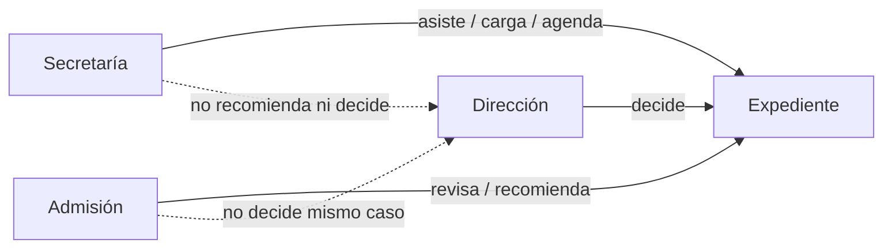
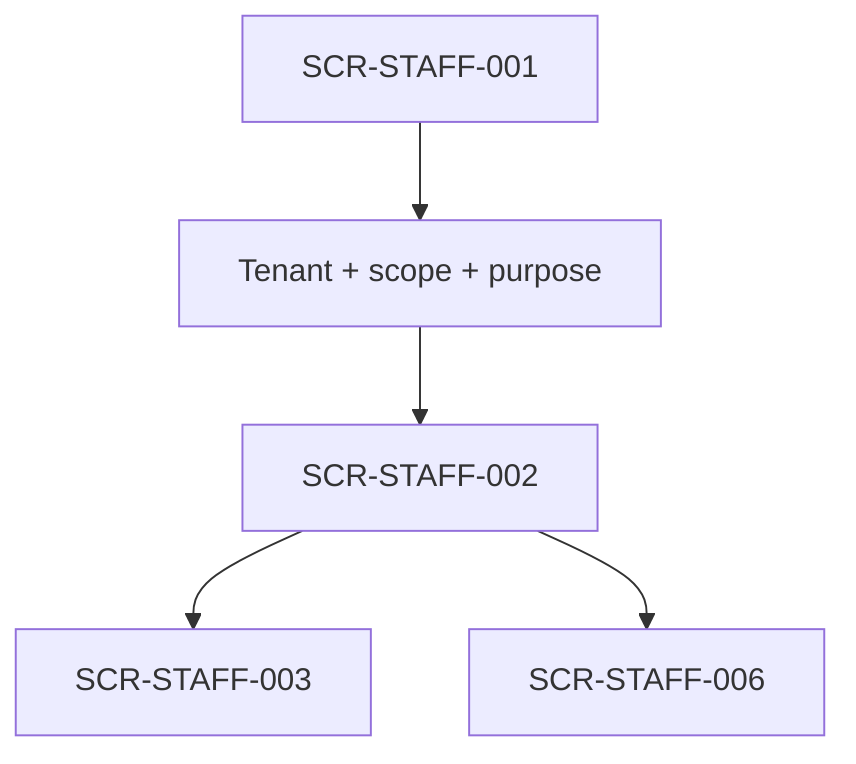
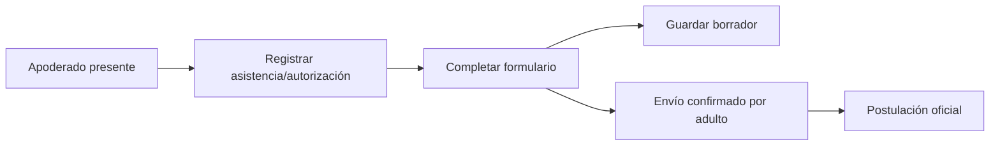
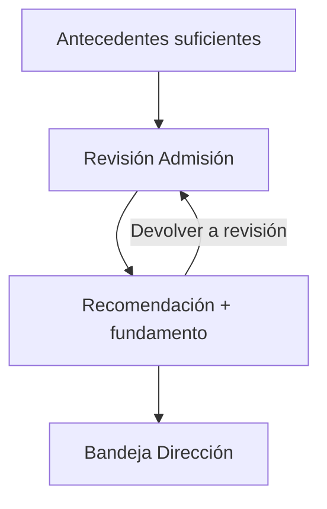
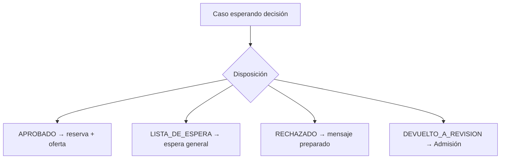

# E3 — Wireflows críticos de Personal

## Reglas operativas

El personal opera sólo dentro de tenant, scope, sensibilidad, propósito y capacidad autorizados. Ocultar una acción no sustituye la autorización. Se conserva la separación:

**Trazabilidad:** BL-001, BL-006..BL-022; AC-010..AC-057; E2E-001..E2E-022.

## Entrada común: login, contexto y dashboard

1. Personal inicia sesión con sesión web opaca server-side.
2. El sistema resuelve membership, rol, scope, purpose y separaciones server-side.
3. Dashboard muestra sólo conteos y casos autorizados: Nuevas, Por revisar, Correcciones venciendo, Citas próximas, Esperando decisión, Ofertas por vencer y Lista de espera.
4. Si no hay permisos, se muestra una superficie vacía/denegada sin revelar existencia.

## Secretaría

### S1 — Dashboard y bandeja operativa

- Ver tareas de asistencia, documentos recibidos y citas próximas dentro del scope.
- Abrir una postulación sólo para prestar apoyo.
- No aparecen botones de recomendación, decisión, cupos, promoción de espera ni exportación masiva.
- Un conteo vacío dice “No hay tareas en este alcance” sin afirmar que no existan casos en otro alcance.

### S2 — Postulación asistida

1. Secretaría selecciona `Nueva postulación asistida`.
2. Confirma que el apoderado está presente y registra la autorización requerida.
3. Completa el formulario en el portal según las respuestas del adulto; no inventa respuestas.
4. Guarda borrador o solicita al adulto confirmar envío.
5. El registro conserva tenant, operador, rol, fecha/hora, origen asistido, adulto presente y acciones.
6. La asistencia no eleva la capacidad para revisar, recomendar o decidir.

AC: AC-014..AC-016. E2E: E2E-004.

### S3 — Carga/digitalización

1. Secretaría abre el requisito correcto desde el expediente.
2. Captura origen `PHYSICAL_DOCUMENT` cuando corresponda y carga el archivo.
3. El archivo entra en cuarentena/escaneo; la interfaz no lo presenta como validado.
4. Secretaría puede marcar recepción, pero no ejecutar aceptación, observación o exención definitiva.
5. Error de escaneo crea feedback técnico y próxima acción; no cambia la decisión del caso.

AC: AC-011, AC-015, AC-016. E2E: E2E-004.

### S4 — Agenda

1. Secretaría consulta actividades autorizadas y solicitudes de cambio.
2. Programa o reprograma según disponibilidad institucional; la familia no elige directamente horario.
3. Conserva cita anterior, motivo, actor y nueva cita.
4. Registra contacto manual cuando corresponda.
5. No puede cerrar por contador de inasistencias ni decidir admisión.

AC: AC-017..AC-020, AC-043. E2E: E2E-005..E2E-008. La segunda inasistencia injustificada exige cierre manual con motivo por Admisión o Dirección (`E2E-007`).

## Admisión

### A1 — Inbox y priorización

1. Admisión abre `Postulaciones` desde dashboard.
2. Filtra por etapa, estado, corrección, cita, documentación, decisión u oferta dentro de su scope.
3. El listado muestra sólo el mínimo necesario: estudiante, curso/año, identificador, estado y próxima acción.
4. Abrir un caso carga el workspace; un caso ajeno da una respuesta uniforme y no revela existencia.

AC: AC-044..AC-046, AC-050. E2E: E2E-018.

### A2 — Expediente y revisión documental

1. Admisión abre `Documentos` dentro del workspace.
2. Revisa versión exacta, estado de escaneo, requisito, vigencia y archivo autorizado.
3. Puede aceptar, observar o exentar sólo cuando la capacidad y la configuración lo permiten.
4. Observación exige motivo accionable y crea plazo; exención exige autoridad/motivo.
5. Versiones previas permanecen en historial; no se sobrescriben.

AC: AC-010..AC-013, AC-052. E2E: E2E-002..E2E-003, E2E-019.

### A3 — Correcciones

1. Selecciona requisito y opción `Observar`.
2. Escribe motivo mínimo y claro, plazo/configuración visible y comunicación preparada.
3. Confirma la observación; el caso vuelve a estado operativo de corrección.
4. Si el plazo vence, el caso aparece como pendiente de revisión humana, no como rechazo automático.

AC: AC-012, AC-040..AC-042. E2E: E2E-002, E2E-017.

### A4 — Actividades

1. Admisión programa o reprograma actividades cuando la capacidad lo permite.
2. Registra primera inasistencia sin cerrar; decide el próximo paso.
3. Puede iniciar repetición de evaluación autorizada conservando el intento anterior.
4. La familia recibe sólo estado operacional y próxima acción.

AC: AC-017..AC-021. E2E: E2E-005..E2E-008.

### A5 — Recomendación

1. Abre expediente con antecedentes suficientes.
2. Revisa documentos, actividades y datos permitidos.
3. Selecciona una única acción interna: `RECOMENDAR_ADMISION`, `NO_RECOMENDAR_ADMISION` o `DEVOLVER_A_REVISION`.
4. Ingresa fundamento obligatorio y confirma.
5. La recomendación queda versionada y enviada a Dirección; nunca se comunica a familia como decisión.
6. Si Admisión intentó decidir el mismo caso, la acción es denegada por separación de funciones.

AC: AC-022..AC-024, AC-028. E2E: E2E-001, E2E-009.

### A6 — Cupos y reservas

1. Admisión consulta capacidad exacta sólo en pantalla interna.
2. Ajusta cupo con motivo y confirmación si posee permiso.
3. Reserva sólo mediante la operación vinculada a una disposición/promoción autorizada.
4. La interfaz informa conflicto de concurrencia si otro actor consumió la unidad.
5. Capacidad de Admisión permanece separada de capacidad académica, matrícula y EduPay.

AC: AC-029..AC-031. E2E: E2E-001, E2E-012. Ajustar cupo conserva valor anterior/nuevo, actor, instante y motivo (`AC-030`).

### A7 — Lista de espera

1. Admisión abre la lista interna ordenada.
2. Ve estado de admisibilidad, orden interno y reglas/snapshot autorizados; esta información nunca se proyecta a familia.
3. Al liberarse una vacante, selecciona `Promover/ofrecer` manualmente.
4. Confirma reserva, origen waitlist, oferta y vencimiento configurable.
5. La acción no requiere nueva decisión de Dirección si la admisibilidad ya existe.
6. Secretaría y procesos automáticos reciben denegación; no se crea oferta.

AC: AC-032..AC-035. E2E: E2E-011..E2E-013.

### A8 — Ofertas

1. Admisión ve ofertas activas, por vencer, expiradas y aceptadas.
2. Emite o gestiona una oferta derivada de `APROBADO` o promoción autorizada.
3. Puede solicitar reapertura excepcional con motivo y auditoría; nunca borra la expiración previa.
4. El detalle muestra estado, origen, reserva, fecha/hora de expiración y comunicaciones.

AC: AC-036..AC-039. E2E: E2E-012..E2E-016.

### A9 — Comunicaciones

1. Admisión revisa mensaje `PREPARED` y confirma antes del envío.
2. El historial separa `SENT`, `DELIVERED` con evidencia y `FAILED`.
3. Un fallo de email crea tarea interna y no cambia disposición, oferta o aceptación.
4. El portal sigue siendo la fuente oficial; llamada manual se registra como contacto.

AC: AC-040..AC-043. E2E: E2E-010, E2E-017.

### A10 — Reportes

1. Selecciona reporte y columnas mínimas.
2. Declara propósito, tenant, scope y filtros.
3. Confirma antes de generar/descargar.
4. Los archivos sensibles y categorías altamente restringidas no se adjuntan por defecto.
5. La descarga queda auditada; Secretaría recibe denegación en exportación masiva.

AC: AC-047..AC-049. E2E: E2E-021..E2E-022. Secretaría recibe denegación y no se genera archivo en exportación masiva (`AC-048`).

## Dirección

### D1 — Casos esperando decisión

1. Dirección abre su bandeja y ve sólo casos con capacidad de decisión.
2. Cada fila muestra estudiante, curso/año, estado, recomendación como antecedente interno permitido, próxima acción y alertas relevantes.
3. La bandeja no permite editar la recomendación ni actuar como Admisión.

AC: AC-025..AC-028, AC-046. E2E: E2E-009..E2E-011.

### D2 — Expediente resumido y antecedentes permitidos

1. Header identifica estudiante, curso/año, postulación, estado y próxima acción.
2. Dirección navega por resumen, datos, documentos, actividades, revisión y decisión según permisos.
3. PIE/NEE, salud, comentarios y otros antecedentes sensibles aparecen sólo con permiso, propósito y necesidad; un acceso general no los habilita.
4. La recomendación es antecedente interno versionado, no una orden.

AC: AC-052. E2E: E2E-019.

### D3 — Registrar decisión

1. Dirección selecciona `APROBADO`, `LISTA_DE_ESPERA`, `RECHAZADO` o `DEVUELTO_A_REVISION`.
2. Cada opción explica su efecto antes de confirmar.
3. `RECHAZADO` exige fundamento; `DEVUELTO_A_REVISION` exige motivo y no es decisión definitiva.
4. `APROBADO` crea reserva/oferta/comunicación preparada; `LISTA_DE_ESPERA` no crea oferta ni plazo.
5. Si la persona recomendó el caso, la acción es denegada y no se crea disposición válida.

AC: AC-025..AC-028. E2E: E2E-009..E2E-011.

### D4 — Confirmación y auditoría

1. La confirmación muestra disposición, impacto, fundamento/motivo y rol decisor.
2. El sistema registra actor, tenant, instante, versión de antecedentes y relación con decisión previa.
3. La pantalla no ofrece acciones de comunicación directa a familia que salten el flujo `PREPARED` → confirmación de Admisión → envío.

AC: AC-027, AC-028, AC-040. E2E: E2E-009..E2E-010.

## Estados transversales del personal

- `Forbidden`: “No tienes permiso para realizar esta acción” sin revelar el recurso.
- `Not found`: “No encontramos ese caso o ya no está disponible” sin enumeración.
- `Conflict`: “El caso cambió mientras lo revisabas; actualiza antes de continuar”.
- `Pending`: tarea creada/acción en curso, sin convertirla en éxito de negocio.
- `Email failed`: tarea operativa visible; disposición y oferta conservan su estado.
- `Session expired`: reautenticación requerida; no se reintenta una mutación automáticamente.
