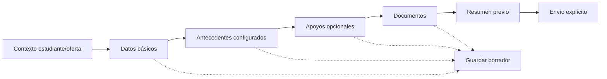

# E3 — Patrones de formularios

## Principios

- Progresivo, versionado y orientado a una decisión clara.
- El formulario muestra sólo preguntas aprobadas para el propósito; no pide historia clínica general ni ingreso familiar en Admisión MVP.
- Guardar borrador no equivale a enviar.
- Validar no equivale a aceptar documentos ni a aprobar postulación.
- La versión publicada queda asociada a la snapshot y no cambia postulaciones históricas.
- Todo ejemplo usa identidades, documentos y valores sintéticos.

**Trazabilidad:** BL-004, BL-005, BL-006, BL-007, BL-021; AC-007..AC-016; E2E-001..E2E-004.

## Formulario familiar por pasos



### Comportamiento

1. El encabezado muestra estudiante, proceso/año, curso/nivel y progreso.
2. Cada paso valida sólo lo necesario para avanzar; se puede volver atrás sin perder datos válidos.
3. `Guardar borrador` confirma timestamp/estado de borrador y permite salir.
4. La navegación directa a un paso futuro no omite validaciones ni permisos.
5. La familia puede revisar el resumen antes de enviar y corregir una sección.
6. El envío requiere confirmación y responde con estado durable o error explícito.

## Guardado de borrador

- Autosave, si se implementa después, es una decisión técnica y no se asume como única protección.
- El botón explícito `Guardar y salir` siempre está disponible.
- `Guardado` se muestra con hora relativa comprensible y, cuando sea relevante, absoluta.
- Network error indica que la última edición podría no estar guardada y no afirma éxito.
- Sesión expirada no reenvía ni descarta silenciosamente; tras login se recupera el borrador autorizado.
- Cambiar el perfil reutilizable no modifica snapshot ya enviada.

## Validación

| Tipo | Comportamiento |
| --- | --- |
| Required | Indica qué falta, junto al campo y en resumen |
| Formato | Da ejemplo sintético y corrección esperada; no revela reglas internas |
| Condición | Explica por qué aparece/desaparece; conserva historial de respuesta según versión |
| Duplicidad | Mensaje uniforme y revisión autorizada; no enumera otra cuenta/caso |
| Business rule | Explica el bloqueo y próxima acción sin convertirlo en error técnico |
| Network | Permite consultar/reintentar de forma segura; no duplica envío |
| Sensibilidad | Muestra propósito y mínimo necesario antes de capturar |

## Campos condicionales

- Condiciones usan sólo operadores y opciones de catálogo controlado.
- Un cambio que activa una sección no borra respuestas sin advertir.
- Campos no aplicables quedan identificados para la snapshot de versión, no se “corrigen” manualmente.
- PIE/NEE aparece como opcional/progresivo y con propósito de apoyo/adecuación; sin finalidad concreta no se exige historia clínica ni el bloque sensible (`AC-008`).
- Salud/tratamiento sólo aparece si la institución configuró una finalidad funcional concreta.

## Secciones sensibles

- Encabezado explica propósito, quién puede revisar y que la captura es mínima; el copy legal final es posterior.
- No se solicita historia clínica general.
- La sección no aparece por defecto a roles sin permiso y propósito.
- La familia puede corregir sus propios datos; personal accede con autorización y auditoría.
- Errores no repiten valores sensibles.

## Archivos

1. Requisito → label del archivo → formatos/condiciones configuradas → selección.
2. Confirmación de nombre seguro y metadata mínima; no se usa nombre para autorización.
3. Estado técnico `CARGANDO`/`ESCANEANDO` y estado de negocio `EN_REVISION` se distinguen.
4. Después del escaneo, revisión autorizada produce `ACEPTADO`, `OBSERVADO`, `EXENTO` o reemplazo.
5. Reemplazo genera nueva versión y conserva la anterior.
6. Secretaría puede cargar/recibir; no puede dictaminar por haber cargado.

## Resumen previo al envío

Debe mostrar:

- estudiante y oferta seleccionados;
- secciones completadas y faltantes;
- documentos requeridos, estado y correcciones pendientes;
- advertencia “postular no garantiza vacante” cuando corresponda;
- datos sensibles sólo en su contexto autorizado;
- declaración de envío y efectos operativos.

No debe mostrar ni insinuar recomendación, puntajes, decisión interna, posición de espera o cupo exacto.

## Confirmación de envío

- Confirmación en diálogo accesible: qué se enviará, qué queda pendiente y qué sucede después.
- Éxito: número/identificador operacional, estado `ENVIADA`/equivalente y próxima acción.
- Error: no cambia la pantalla a éxito; conserva borrador y ofrece reintento seguro.
- Postulación asistida exige adulto presente y registra autorización; el operador no gana revisión/decisión.

## Corrección posterior

- Documento observado se muestra en su requisito, con motivo, instrucciones y plazo.
- Corrección carga nueva versión; la versión observada queda relacionada.
- Al enviar, el estado vuelve a `CARGADO`/`EN_REVISION` y se informa que requiere revisión.
- Vencimiento no rechaza automáticamente; personal ve tarea de revisión humana.

## Builder administrativo mínimo

### Vista conceptual

```text
+--------------------------------------------------+
| Formulario Admisión 2027 · Versión draft          |
| Secciones: Datos | Documentos | Apoyos            |
|                                                   |
| Sección: Apoyos                                   |
| [Campo] Necesita adecuación?                      |
| Tipo: selección  Required: no  Sensibilidad: NEE  |
| Condición: respuesta = Sí                         |
| [Preview] [Guardar draft] [Publicar versión]      |
+--------------------------------------------------+
```

### Capacidades mínimas

- crear/ordenar sección;
- agregar campo de tipo permitido;
- definir `required`;
- seleccionar tipo, sensibilidad, propósito y condición;
- preview de familia;
- guardar `draft`;
- publicar/versionar con confirmación;
- indicar que una publicación no altera snapshots históricas.

No se diseña drag-and-drop avanzado, código arbitrario, HTML activo, JavaScript, validación programable ni un CMS de plataforma.

## Estados del builder

- `DRAFT`: editable por el rol autorizado, no aplicable a nuevas postulaciones.
- `PREVIEW`: proyección sintética, no publicada.
- `PUBLISH_PENDING`: revisión de cambios y advertencia de versionado.
- `PUBLISHED`: inmutable para postulaciones que ya lo usan.
- `ARCHIVED`: no disponible para nuevas postulaciones según configuración.
- contenido activo/no permitido: rechazo con motivo seguro.

## Decisión para G3

Se recomienda aprobar formulario progresivo + snapshot/versionado + builder controlado mínimo. La selección de tipos, textos y campos concretos permanece como configuración institucional posterior.
