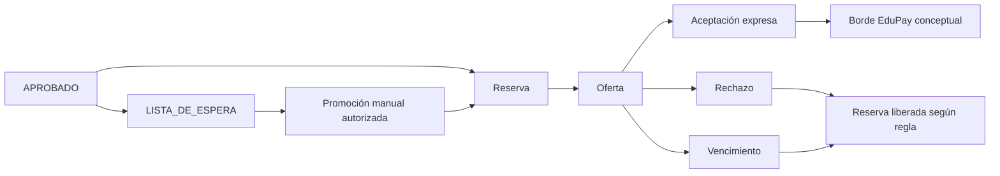

# E3 — UX de cupos, lista de espera y oferta

## Principio de exposición

La familia ve disponibilidad categórica, no número exacto por defecto:

- `Postulaciones abiertas`;
- `Cupos limitados`;
- `Lista de espera`;
- `Proceso cerrado`.

`AdmissionCapacity` es operacional interno y distinto de capacidad académica, matrícula y obligaciones de EduPay. La posición y prioridad de waitlist son internas.

**Trazabilidad:** BL-003, BL-012..BL-014, BL-016, BL-022; AC-004..AC-006, AC-025..AC-039, AC-055..AC-058; E2E-001, E2E-011..E2E-016.

## Flujo de negocio



## Familia: disponibilidad

### Tarjeta de oferta

```text
+--------------------------------------------------+
| 7º básico · Admisión 2027 · Sede principal        |
| Estado: Cupos limitados                           |
| Postular no garantiza vacante                     |
| [Ver proceso]                                     |
+--------------------------------------------------+
```

- `Postulaciones abiertas` permite iniciar postulación.
- `Cupos limitados` comunica presión de disponibilidad sin cantidad.
- `Lista de espera` permite comprender que no hay oferta inmediata.
- `Proceso cerrado` bloquea nueva postulación y explica próximo paso permitido.

## Familia: lista de espera

```text
+--------------------------------------------------+
| Estado de postulación: Lista de espera            |
| Última actualización: [fecha/hora]                |
|                                                   |
| Te informaremos si cambia la disponibilidad.      |
| La institución administra el orden internamente.  |
| [Ver seguimiento] [Contacto]                     |
+--------------------------------------------------+
```

Debe incluir mensaje general, fecha de actualización y próximos pasos. No incluye posición numérica, prioridad, regla interna, cantidad de cupos ni probabilidad de admisión.

## Familia: oferta

```text
+--------------------------------------------------+
| Oferta vigente                                    |
| Origen: proceso de admisión                      |
| Vence: 14 de agosto de 2026, 18:00 (zona local)  |
| Tiempo restante: [contador + fecha absoluta]      |
|                                                   |
| Aceptar registra tu decisión y no equivale a      |
| matrícula o pago confirmado.                     |
| [Aceptar oferta] [Rechazar oferta]                |
+--------------------------------------------------+
```

### Reglas de aceptación/rechazo

- `Aceptar`: exige oferta vigente, confirmación expresa, versión de términos, actor e instante; habilita el handoff funcional posterior, no matrícula presumida.
- `Rechazar`: requiere confirmación y muestra consecuencias según la configuración; conserva historia y libera la reserva cuando corresponda.
- `Desistir`: se distingue de rechazar una oferta y de retirar una postulación; conserva historia y libera reserva aplicable.
- Oferta vencida: no acepta; muestra estado histórico y próximos pasos autorizados.
- Reapertura: sólo personal autorizado, excepcional, con motivo, nuevo plazo y auditoría; no borra expiración anterior.

## Personal: cupos y reservas

La vista interna sí puede mostrar:

- capacidad configurada exacta;
- reservado, disponible y estados de consumo;
- cambios con valor anterior/nuevo, actor, instante y motivo;
- conflicto de concurrencia y resultado transaccional;
- separación respecto de matrícula/EduPay.

Sólo Responsable de Admisión y Administrador Institucional Máximo pueden modificar cupos según permiso. Secretaría no modifica cupos.

## Personal: waitlist

- La lista interna puede mostrar orden, admisibilidad, prioridad snapshot, desempate y estado, según permiso y propósito.
- La promoción es manual; no automática.
- `Promover/ofrecer vacante` crea reserva y oferta por el plazo inicial/configurable aprobado.
- Si Dirección ya determinó admisibilidad, no requiere nueva decisión.
- Secretaría y procesos automáticos reciben denegación.
- Promover no debe mostrar a familia la posición previa ni la regla interna.

## Personal: ofertas y expiraciones

| Vista | Información | Acción |
| --- | --- | --- |
| Activa | origen, reserva, familia/caso autorizado, vencimiento, comunicación | Ver/gestionar |
| Por vencer | fecha/hora absoluta, tiempo restante, tarea | Recordar/confirmar comunicación |
| Expirada | fecha histórica, origen, liberación, historial | Reapertura excepcional si autorizada |
| Aceptada | actor, instante, versión, próximo handoff conceptual | Preparar siguiente paso |
| Fallida técnicamente | negocio intacto, comunicación fallida, tarea | Resolver email; no alterar oferta |

## Confirmaciones obligatorias

- Ajustar cupo: valor anterior/nuevo, motivo y consecuencia operacional.
- Promover: caso, origen waitlist, reserva, vencimiento y condición de oferta.
- Aceptar: oferta, vencimiento, términos y distinción de matrícula/pago.
- Rechazar/desistir: consecuencias, reserva y preservación de historia.
- Reabrir: excepcionalidad, motivo, nuevo plazo y auditoría.

## Riesgos UX controlados

- **Falsa promesa:** categorías y advertencia explícita evitan presentar una postulación como vacante.
- **Confusión waitlist/oferta:** estados y acciones distintas; sólo promoción crea oferta.
- **Vencimiento ambiguo:** fecha/hora absoluta más tiempo restante; zona horaria institucional se presenta de forma comprensible.
- **Sobreoferta:** la UX refleja conflictos y no promete reserva hasta confirmación de negocio.
- **Handoff prematuro:** aceptación expresa precede el borde EduPay; ningún estado técnico equivale a matrícula.
