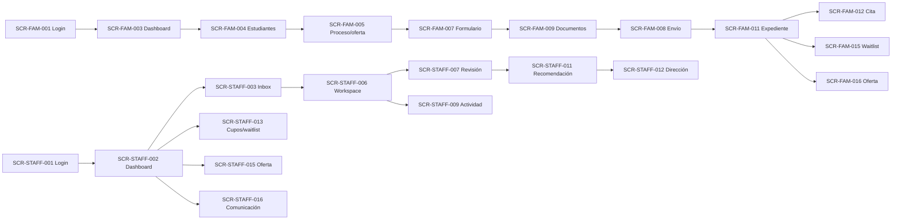

# E3 — Prototype board consolidado

## Objetivo y límites

Este board es una representación navegable conceptual del MVP para revisar estructura antes de E4. Usa cajas ASCII/Markdown de baja fidelidad, enlaces entre pantallas por ID `SCR` y datos sintéticos. No es HTML, CSS, React, código ni scaffolding.

**Reglas visibles:** Familia mobile first; Personal desktop first/tablet funcional; no datos internos a Familia; Secretaría no recomienda/decide; recomendador no decide; Superadmin no ve contenido sin elevación.

## Mapa de navegación



## Familia — pantallas principales

### FAM-01 Acceso / recuperación — `SCR-FAM-001`, `SCR-FAM-002`

```text
+--------------------------------------------------+
| Admisión                                          |
| Correo [________________]                         |
| Contraseña [_____________]                        |
| [Iniciar sesión]   [Registrarme]                 |
| [Recuperar acceso]                                |
+--------------------------------------------------+
```

Resultado: sesión propia o mensaje uniforme; recuperación usa token de un uso y revoca sesiones aplicables.

### FAM-02 Inicio — `SCR-FAM-003`

```text
+--------------------------------------------------+
| Inicio                            [Perfil] [Salir]|
| Estudiantes | Postulaciones | Citas               |
| Próxima acción: corregir documento       [Abrir] |
| Estudiante sintético A · En revisión             |
| Disponibilidad del proceso: Cupos limitados      |
+--------------------------------------------------+
```

La disponibilidad del proceso es una categoría informativa y no implica que exista una oferta de admisión emitida. No hay recomendaciones, puntajes, posición ni cupos exactos.

### FAM-03 Nueva postulación — `SCR-FAM-004..006`

```text
+--------------------------------------------------+
| Nueva postulación                                 |
| 1 Selecciona estudiante                           |
| 2 Institución / proceso / curso                   |
| Estado público: Postulaciones abiertas            |
| Postular no garantiza vacante                     |
| [Continuar]                                       |
+--------------------------------------------------+
```

### FAM-04 Formulario — `SCR-FAM-007`, `SCR-FAM-008`

```text
+--------------------------------------------------+
| Postulación · Paso 2 de 4       [Guardado]        |
| Datos ━━━ Contexto ━━━ Apoyos ━━━ Resumen         |
| Campo requerido [________________]                |
| [Atrás] [Guardar y salir] [Continuar]             |
+--------------------------------------------------+
```

### FAM-05 Documentos — `SCR-FAM-009`, `SCR-FAM-010`

```text
+--------------------------------------------------+
| Documentos                                        |
| Requisito A                         Aceptado       |
| Requisito B                         Observado      |
| Motivo: falta página final          [Corregir]    |
| Requisito C                         Escaneando    |
| [Enviar corrección]                                |
+--------------------------------------------------+
```

### FAM-06 Expediente/status — `SCR-FAM-011`, `SCR-FAM-014`

```text
+--------------------------------------------------+
| Estudiante A · Postulación 2027                   |
| Postulación > Documentos > Actividad > Resultado  |
| Estado: En revisión                               |
| Próxima acción: cargar corrección                 |
| [Documentos] [Cita] [Estado] [Contacto]           |
+--------------------------------------------------+
```

### FAM-07 Cita — `SCR-FAM-012`, `SCR-FAM-013`

```text
+--------------------------------------------------+
| Entrevista                                        |
| Fecha/hora: [fecha/hora local]                    |
| Lugar: [sede sintética]                           |
| Estado: Programada                                |
| [Solicitar cambio]                                |
+--------------------------------------------------+
```

La familia informa motivo; personal asigna nueva hora.

### FAM-08 Waitlist — `SCR-FAM-015`

```text
+--------------------------------------------------+
| Lista de espera                                   |
| Actualizado: [fecha/hora]                         |
| Te informaremos si cambia la disponibilidad.      |
| Próximo paso: mantener contacto actualizado       |
+--------------------------------------------------+
```

Sin posición, prioridad, cupos o probabilidad.

### FAM-09 Oferta — `SCR-FAM-016`, `SCR-FAM-017`

```text
+--------------------------------------------------+
| Oferta vigente · vence [fecha/hora]               |
| Tiempo restante: [contador]                       |
| Aceptar no equivale a matrícula o pago.           |
| [Aceptar oferta] [Rechazar oferta]                |
| [Desistir] sólo si corresponde                     |
+--------------------------------------------------+
```

### FAM-10 Sesión expirada — `SCR-FAM-018`

```text
+--------------------------------------------------+
| Tu sesión terminó por seguridad                   |
| [Iniciar sesión] [Volver al inicio]               |
+--------------------------------------------------+
```

## Personal — pantallas principales

### STAFF-01 Login/dashboard — `SCR-STAFF-001`, `SCR-STAFF-002`

```text
+--------------------------------------------------------------------------------+
| Admisión institucional · tenant sintético                 [Perfil] [Salir]     |
| Dashboard | Postulaciones | Documentos | Actividades | Dirección | Reportes    |
+--------------------------------------------------------------------------------+
| Nuevas | Por revisar | Correcciones | Citas | Esperando decisión | Ofertas     |
| [Abrir bandeja] [Abrir tarea] [Ver actividad]                                  |
+--------------------------------------------------------------------------------+
```

Los módulos visibles se reducen según rol.

### STAFF-02 Inbox — `SCR-STAFF-003`

```text
+--------------------------------------------------------------------------------+
| Postulaciones · scope autorizado                                               |
| Filtros: [estado] [curso] [próxima acción]                   [Aplicar]          |
| Estudiante sintético | Curso/año | Estado | Próxima acción | Abrir             |
| A                     | 7º/2027  | Revisar docs | Observar | [Abrir]           |
+--------------------------------------------------------------------------------+
```

### STAFF-03 Asistencia/carga — `SCR-STAFF-004`, `SCR-STAFF-005`

```text
+--------------------------------------------------------------------------------+
| Postulación asistida · Adulto presente: Sí · autorización registrada          |
| Estudiante | Oferta | Paso del formulario                                      |
| [Guardar borrador] [Solicitar confirmación de envío]                          |
| Documento: [requisito] [Cargar] Estado técnico: Escaneando                    |
| Secretaría: recepción/carga; validación definitiva: no disponible             |
+--------------------------------------------------------------------------------+
```

### STAFF-04 Workspace — `SCR-STAFF-006`

```text
+--------------------------------------------------------------------------------+
| Estudiante A · 7º/2027 · APP-000123 · En revisión · Próxima: revisar docs     |
| Postulación > Documentos > Entrevista > Evaluación > Revisión > Dirección     |
| > Oferta/Espera > Aceptación                                                   |
| Resumen | Datos | Documentos | Actividades | Revisión | Decisión | Historia    |
+--------------------------------------------------------------------------------+
```

### STAFF-05 Revisión documental — `SCR-STAFF-007`, `SCR-STAFF-008`

```text
+--------------------------------------------------------------------------------+
| Requisito B · versión 2 · Escaneo aprobado · EN_REVISION                       |
| [Vista autorizada del archivo]                                                 |
| [Aceptar] [Observar] [Exentar si autorizado]                                   |
| Motivo [________________________________________] [Confirmar]                   |
+--------------------------------------------------------------------------------+
```

### STAFF-06 Actividad — `SCR-STAFF-009`, `SCR-STAFF-010`

```text
+--------------------------------------------------------------------------------+
| Entrevista · fecha/hora · lugar · Estado PROGRAMADA                            |
| Solicitud de cambio: [pendiente] [Asignar nueva hora]                          |
| Intento 1: INASISTENCIA   Intento 2: —                                        |
| [Registrar estado] [Iniciar repetición autorizada]                             |
+--------------------------------------------------------------------------------+
```

### STAFF-07 Recomendación — `SCR-STAFF-011`

```text
+--------------------------------------------------------------------------------+
| Revisión de Admisión · antecedentes suficientes                                |
| Opción: ( ) Recomendar admisión ( ) No recomendar ( ) Devolver a revisión     |
| Fundamento obligatorio [___________________________________________________]  |
| [Guardar borrador] [Confirmar recomendación]                                   |
| Nota: esta pantalla no registra decisión de Dirección                          |
+--------------------------------------------------------------------------------+
```

### STAFF-08 Dirección — `SCR-STAFF-012`

```text
+--------------------------------------------------------------------------------+
| Casos esperando decisión                                                        |
| Estudiante A · recomendación interna visible como antecedente                   |
| Disposición: [APROBADO] [LISTA_DE_ESPERA] [RECHAZADO] [DEVUELTO_A_REVISION]   |
| Fundamento/motivo según opción [___________________________________________]   |
| [Revisar impacto] [Confirmar disposición]                                      |
+--------------------------------------------------------------------------------+
```

### STAFF-09 Capacidad/waitlist — `SCR-STAFF-013`, `SCR-STAFF-014`

```text
+--------------------------------------------------------------------------------+
| Cupos internos · curso/año                                                      |
| Configurado: [exacto interno] · Reservado: [exacto] · Disponible: [exacto]    |
| Lista ordenada interna · [Promover/ofrecer vacante]                            |
| Motivo [________________________] [Confirmar]                                  |
+--------------------------------------------------------------------------------+
```

### STAFF-10 Oferta — `SCR-STAFF-015`

```text
+--------------------------------------------------------------------------------+
| Oferta · origen: waitlist · estado: por vencer                                  |
| Vence: [fecha/hora] · Reserva: [estado]                                        |
| [Confirmar comunicación] [Reabrir excepcionalmente] [Ver historia]             |
+--------------------------------------------------------------------------------+
```

### STAFF-11 Comunicación — `SCR-STAFF-016`

```text
+--------------------------------------------------------------------------------+
| Comunicación de resultado                                                        |
| PREPARED → [Confirmar envío] → SENT → DELIVERED / FAILED                       |
| Si falla: tarea interna; disposición y oferta no cambian                       |
| [Ver portal oficial] [Gestionar tarea]                                         |
+--------------------------------------------------------------------------------+
```

### STAFF-12 Reportes/permisos — `SCR-STAFF-017`, `SCR-STAFF-018`

```text
+--------------------------------------------------------------------------------+
| Reporte: postulaciones por estado                                               |
| Propósito [________________] Columnas [mínimas] Scope [actual]                 |
| [Generar y auditar descarga]                                                    |
| Permisos: rol · scope · propósito · sensibilidad · separación                  |
+--------------------------------------------------------------------------------+
```

## Administración mínima

```text
+--------------------------------------------------------------------------------+
| Administración institucional                                                     |
| Institución | Proceso/oferta | Formularios/requisitos | Permisos | Operación   |
| Draft · Preview · Publicar versión · Historial                                  |
| Sin panel exhaustivo de plataforma, billing o infraestructura                   |
+--------------------------------------------------------------------------------+
```

Pantallas: `SCR-ADM-001` institución, `SCR-ADM-002` proceso/oferta, `SCR-ADM-003` builder, `SCR-ADM-004` permisos, `SCR-ADM-005` operación y `SCR-ADM-006` elevación.

## Recorridos de validación que este board soporta

- Familia: iniciar, corregir, encontrar cita, solicitar cambio, entender waitlist y aceptar oferta.
- Secretaría: asistir, cargar documento y reprogramar.
- Admisión: identificar pendiente, observar, recomendar, promover waitlist y detectar oferta por vencer.
- Dirección: aprobar, devolver y rechazar.
- Seguridad: caso ajeno, Secretaría intentando decidir y Superadmin sin elevación.