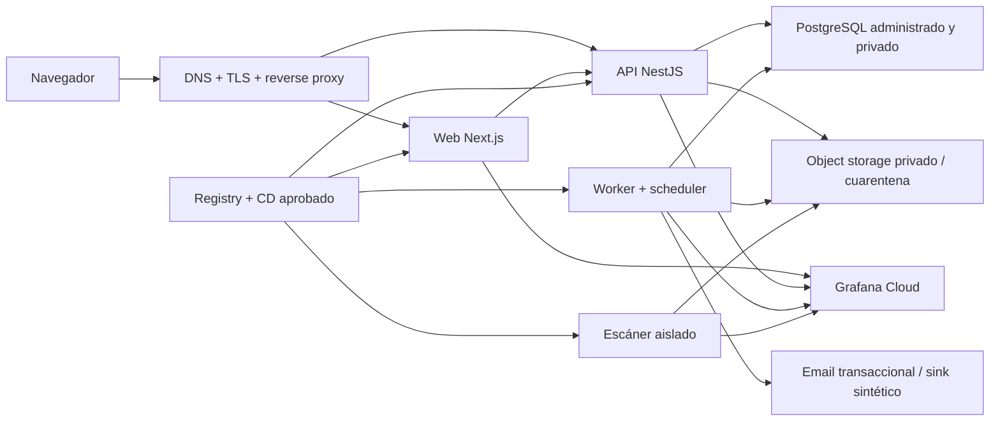

# G5 — Opciones de plataforma para preproducción y futuro piloto

## Decision block

| Campo | Valor |
| --- | --- |
| ID | `G5-PLATFORM-OPT-001` |
| Estado | `DRAFT / HUMAN DECISION REQUIRED` |
| Fecha de contraste de fuentes | `2026-08-24` |
| Compuerta actual | `DOCUMENTARY ONLY / NO PROVISIONING` |
| Decisión adoptada | Ninguna |
| Proveedor, región y presupuesto | `NOT SELECTED / NOT AUTHORIZED` |
| Datos de preproducción | Sólo sintéticos |
| Datos reales, piloto y producción | `NOT AUTHORIZED` |
| Bloqueos relacionados | `Q-203 = OPEN`; `LP3-ART-014 = OPEN / PROVIDER_REVIEW_REQUIRED` |
| Base arquitectónica | `ADR-0005 = ACCEPTED` |

Este documento compara opciones, pero no autoriza cuentas, contratos, dominios,
infraestructura, secretos, gasto, despliegues ni tratamiento de datos reales. La selección
de proveedor y región requiere una decisión humana específica y el cierre aplicable de
`LP3-ART-014` y `Q-203`.

## 1. Propósito y clasificación de la información

El propósito es disponer de una comparación verificable para autorizar, en fases
separadas, una preproducción exclusivamente sintética y, después de las compuertas
legales, institucionales, técnicas y operativas, un eventual piloto.

### Hechos confirmados

- `ADR-0005` exige runtime Linux containerizado para web, API y worker, detrás de reverse
  proxy, y prefiere un patrón híbrido cuando presupuesto, residencia y contrato lo
  permitan.
- PostgreSQL, object storage, escáner y administración deben permanecer privados; los
  secretos no se versionan.
- La preproducción sólo puede usar datos y destinatarios sintéticos.
- RPO de 1 hora y RTO de 4 horas son objetivos técnicos iniciales, no SLA ni garantía.
- `Q-203` no ha resuelto residencia ni proveedores permitidos.
- `LP3-ART-014` exige revisión específica de DPA, subprocesadores, residencia,
  transferencias, minimización y seguridad de cada proveedor productivo.

### Decisiones aprobadas que condicionan la comparación

- Web Next.js, API NestJS y worker/scheduler son procesos independientes y
  supervisables.
- PostgreSQL y almacenamiento privado de objetos se prefieren administrados cuando la
  revisión comercial y legal lo permita.
- El antivirus debe permanecer aislado y con credenciales de mínimo privilegio.
- Deben existir artefactos inmutables, health checks, rollback de aplicación, backups,
  restore ensayado, observabilidad y separación por ambiente.

### Supuestos de trabajo, no decisiones

- Se compara un único ambiente de preproducción de carga baja y datos sintéticos. No se
  supone volumen, concurrencia, disponibilidad ni tamaño de archivos de un piloto.
- Grafana Cloud se evalúa como destino futuro de telemetría porque ya forma parte del
  modelo operativo documentado; su región, plan y contrato siguen abiertos.
- El correo de preproducción usa una identidad y destinatarios sintéticos controlados o
  un sink de pruebas. No se presupone permiso para enviar a familias reales.
- Las marcas citadas representan topologías comprobables, no una lista cerrada de
  proveedores ni una recomendación de contratación.

## 2. Línea base obligatoria para cualquier opción

Controles no negociables:

1. Sólo edge/web/API estrictamente necesarios tienen ingreso público. Base, worker,
   scanner y administración no exponen puertos de negocio a Internet.
2. Buckets privados, enlaces firmados de duración acotada, credenciales distintas para
   carga, escaneo y lectura, y cuarentena separada del contenido liberado.
3. Imágenes Linux inmutables referidas por digest; una compilación promovida entre
   ambientes, no reconstruida con código diferente.
4. Secretos en un store externo al repositorio y a la imagen, con acceso por ambiente,
   owner, rotación, revocación y auditoría.
5. CI separada de CD. El despliegue requiere CI verde, aprobación humana de ambiente y
   migraciones compatibles expand/contract. La reversión de aplicación no ejecuta un
   rollback destructivo de base.
6. PostgreSQL con TLS, backups automáticos, PITR y restore a un recurso nuevo ensayado.
   Los objetos requieren versionado/retención y una recuperación independiente; un
   backup de VM no sustituye ambos mecanismos.
7. Logs, métricas, alertas y trazas separados por ambiente y tenant cuando corresponda.
   Telemetría sin documentos, nombres, correos, tokens, URLs firmadas ni identificadores
   sensibles.
8. Alertas mínimas: disponibilidad, tasa de error, saturación de base, worker detenido,
   edad de outbox/jobs, scanner detenido, fallos o backlog de escaneo, email degradado,
   backup fallido y prueba de restore vencida.
9. DNS, TLS, correo y telemetría también son proveedores/subprocesadores potenciales y
   entran en `LP3-ART-014`; no sólo el proveedor de compute.
10. La preproducción no recibe copias anonimizadas de producción: usa fixtures y personas
    completamente sintéticas.

## 3. Resumen comparativo

| Dimensión | A. Plataforma administrada multi-proveedor | B. VPS Linux + contenedores | C. Híbrida cloud administrada |
| --- | --- | --- | --- |
| Ejemplo contrastado | Render + storage S3-compatible separado | DigitalOcean Droplet + Managed PostgreSQL + Spaces | AWS ECS/Fargate + RDS + S3 |
| Web/API/worker | Servicios Docker separados; worker persistente | Contenedores separados bajo Docker y supervisor | Servicios/tareas ECS separados sobre Fargate |
| PostgreSQL | Render Postgres privado | DigitalOcean Managed PostgreSQL | Amazon RDS for PostgreSQL |
| Objetos privados | Proveedor S3-compatible separado | DigitalOcean Spaces privado | Amazon S3 con Block Public Access |
| Escáner aislado | Private service dedicado, sin ingreso público | Contenedor o Droplet dedicado en red privada | Tarea Fargate privada o Malware Protection for S3, sujeto a spike |
| Email | Proveedor transaccional pendiente; sink sintético en preprod | Proveedor transaccional pendiente; sink sintético en preprod | SES es candidato regional, no seleccionado |
| Observabilidad | Grafana Cloud, egreso mínimo | Grafana Cloud, egreso mínimo | Grafana Cloud; integración con telemetría cloud por evaluar |
| TLS/DNS | TLS administrado por plataforma; DNS externo | Reverse proxy y renovación TLS operados por el equipo | ALB + ACM; Route 53 o DNS aprobado |
| Secret store | Secret/env store de plataforma; revisar rotación/auditoría | Store externo administrado obligatorio | AWS Secrets Manager; acceso por rol de tarea |
| Backups/PITR | PITR PostgreSQL según plan; objetos requieren control adicional | PITR de DB; Spaces no incluye backup | PITR RDS; S3 versionado/lifecycle y copia separada por diseñar |
| Registry/CD | GHCR + GitHub Actions + deploy por digest | DOCR o GHCR + GitHub Actions + promoción por digest | ECR + GitHub Actions/OIDC + ECS deployment |
| Complejidad inicial | `MEDIUM` | `HIGH` | `HIGH` |
| Carga operativa estable | `LOW–MEDIUM` | `HIGH` | `MEDIUM` |
| Lock-in | `MEDIUM–HIGH` en plataforma y red | `LOW–MEDIUM`; runtime portable, operación propia | `MEDIUM–HIGH` en IAM, red y servicios administrados |
| Ajuste a ADR-0005 | Compatible si el storage y scanner externos superan revisión | Compatible y con máximo control | Compatible con la preferencia híbrida |
| Riesgo dominante | Transferencias y coordinación entre proveedores | Parches, hardening, guardias y error operativo | Complejidad/IaC, costo variable y dependencia de servicios cloud |

Las complejidades son ordinales. No equivalen a jornadas ni presupuesto porque aún no se
han aprobado volumen, alta disponibilidad, soporte ni capacidad operativa.

## 4. Opción A — plataforma administrada multi-proveedor

### Topología de referencia

- Render web service para Next.js y otro para la API.
- Render background worker para el worker/scheduler.
- Render Postgres en la misma región y red privada.
- Private service dedicado para el scanner, sin ruta pública, o worker que consuma una
  cola de cuarentena. No comparte credenciales administrativas con API/worker.
- Storage S3-compatible privado de un proveedor revisado por separado. DigitalOcean
  Spaces demuestra compatibilidad parcial con S3 y URLs firmadas, pero es sólo un
  candidato ilustrativo.
- Proveedor de email aún abierto; en preproducción, sink o destinatarios sintéticos.
- Grafana Cloud con logs/métricas minimizados y credencial de sólo escritura.
- GHCR como registry y GitHub Actions como CI/CD, con imágenes por digest. Render admite
  imágenes privadas y rollback, pero el digest debe seguir disponible.
- TLS automático para dominios personalizados; DNS en proveedor aprobado.

### Evidencia y límites relevantes

- Render ofrece web services, private services y background workers, red privada por
  región, secretos/configuración por ambiente, Docker, despliegues y rollback.
- Sus regiones publicadas son Oregon, Ohio, Virginia, Frankfurt y Singapore. No se puede
  mover un servicio o una base existentes entre regiones: se crea un recurso nuevo y se
  migran configuración/datos.
- En PostgreSQL de pago, Render documenta backup continuo y PITR a una base nueva; la
  ventana publicada depende del plan (3 días en Hobby y 7 días en Pro o superior). Debe
  probarse que el plan seleccionado satisface RPO/RTO y retención aprobada.
- Un storage externo agrega al menos un flujo transfronterizo/proveedor entre API,
  scanner y objetos. Debe diagramarse antes de `LP3-ART-014`.
- DigitalOcean Spaces tiene API S3 sólo parcialmente compatible. Soporta ACL privada,
  políticas y versionado vía API, pero no incluye backups y no permite trasladar un
  bucket directamente entre regiones/equipos. No debe tratarse como backup por sí solo.

### Ventajas

- Menor operación del sistema operativo, proxy, TLS y ciclo de despliegue.
- Servicios web/API/worker/scanner escalables y reiniciables por separado.
- Preproducción rápida de reproducir con Blueprint y configuración por ambiente.
- Rollback de aplicación disponible sin reconstruir, si se conserva el artefacto por
  digest.

### Riesgos, lock-in y operación

- No reúne todos los componentes en un único proveedor: storage, email, observabilidad y
  posiblemente registry agregan contratos, disponibilidad y transferencias.
- La red privada es regional y específica de Render. Cambiar región requiere migración.
- Rollback no revierte cambios actuales de configuración, dominios ni discos; tampoco
  sustituye rollback lógico de migraciones.
- Los secretos de plataforma son adecuados como configuración protegida, pero se debe
  confirmar historial de acceso, rotación, exportación y segregación antes del piloto.
- El scanner debe probar límites de CPU/RAM, tiempos máximos, tamaño de archivo,
  cuarentena y comportamiento ante archivos comprimidos o protegidos.

### Complejidad y costo

- Complejidad inicial `MEDIUM`; operación estable `LOW–MEDIUM`.
- No se publica aquí un total: la página de precios de Render, el plan PostgreSQL, el
  storage externo, el scanner, el correo, Grafana, soporte y transferencia deben cotizarse
  juntos el día de la decisión. Un precio aislado de compute no representa esta
  topología.

## 5. Opción B — VPS Linux + contenedores y datos administrados

### Topología de referencia

- Uno o más Droplets Linux con reverse proxy, Docker y supervisor para web, API y worker.
  El mínimo aceptable separa procesos, redes, usuarios, límites y health checks aunque
  compartan host en preproducción.
- Scanner en contenedor fuertemente aislado o, preferentemente antes de datos reales, en
  un Droplet dedicado sin ingreso público. Sólo accede a cuarentena y al destino de
  resultados necesarios.
- DigitalOcean Managed PostgreSQL por endpoint privado/VPC y TLS.
- DigitalOcean Spaces con bucket/listado privados, credenciales de alcance limitado,
  versionado y lifecycle explícitos.
- Store de secretos administrado externo. Un VPS desnudo no aporta por sí mismo un store
  con rotación y auditoría; archivos `.env` persistentes no satisfacen la línea base.
- DOCR o GHCR para imágenes inmutables. GitHub Actions promociona digest aprobado y el
  host sólo tiene permiso de lectura del registry.
- Reverse proxy con HTTPS y renovación automática; DNS en proveedor aprobado.
- Email transaccional aún abierto y Grafana Cloud por salida TLS.

### Evidencia y límites relevantes

- DigitalOcean define Droplet como VPS/IaaS no administrado: el cliente opera sistema
  operativo, aplicaciones y datos.
- Managed PostgreSQL realiza backups diarios, conserva siete días y permite restaurar la
  última transacción o un punto en el tiempo a un cluster nuevo. Destruir el cluster
  destruye sus backups, por lo que se requiere copia/retención independiente según la
  política aprobada.
- Spaces es S3-compatible con diferencias de funciones. Su documentación advierte que no
  incluye backups. El tráfico privado desde Droplets depende del resolver VPC-local y de
  la región/grupo; debe demostrarse en la región elegida.
- DOCR es un registry privado, pero la limpieza, retención, escaneo de vulnerabilidades,
  firma y promoción de imágenes deben diseñarse; no se suponen incluidas por contratarlo.

### Ventajas

- Mayor control sobre Docker, reverse proxy, red, scanner, límites de recursos y ventanas
  de mantenimiento.
- Menor acoplamiento del runtime: las imágenes y configuración pueden migrarse a otro
  host Linux.
- Compute, PostgreSQL y Spaces pueden quedar en el mismo proveedor/región si la revisión
  lo autoriza.
- Costos base de infraestructura más visibles que en una combinación completamente
  administrada.

### Riesgos, lock-in y operación

- El equipo asume hardening, SSH, MFA del panel, parchado, kernel, Docker, proxy,
  certificados, firewall, monitoreo del host, capacidad, reemplazo y respuesta 24/7.
- Un único VPS es un punto único de fallo y no demuestra alta disponibilidad. Separar el
  scanner aumenta costo pero reduce blast radius.
- Un backup/snapshot de Droplet no produce una recuperación consistente entre PostgreSQL
  administrado y objetos.
- El acceso de CD a SSH y el secreto del host son superficies adicionales. Debe existir
  aprobación de ambiente, cuenta no-root, allowlist, registro de cambios y procedimiento
  break-glass.
- La compatibilidad parcial de Spaces y la falta de backup incorporado elevan el costo de
  salida y recuperación aunque la API sea S3-compatible.

### Complejidad y costo

- Complejidad inicial y estable `HIGH`; sólo es razonable con owner operativo y cobertura
  documentada.
- Precios públicos oficiales al `2026-08-24`, usados sólo como anclas y no como sizing:
  Droplet Basic de 2 GiB desde USD 12/mes; Managed PostgreSQL de 1 GiB desde USD
  15,15/mes; Spaces Standard USD 5/mes; DOCR Basic USD 5/mes. El plan mínimo puede ser
  técnicamente insuficiente, en especial para ClamAV/scanner.
- No se calcula total porque faltan scanner dedicado, alta disponibilidad, backups de
  VPS/objetos, load balancer, secret store, email, Grafana, egreso, soporte, impuestos y
  volumen. El presupuesto debe modelar escenarios de preprod y piloto por separado.

## 6. Opción C — híbrida cloud administrada

### Topología de referencia

- Web, API y worker como servicios/tareas separados en Amazon ECS sobre Fargate. Web/API
  reciben tráfico únicamente por Application Load Balancer; worker no tiene ingreso.
- Subredes privadas, security groups por función y roles IAM de tarea con mínimo
  privilegio. Endpoints privados o salida controlada para ECR, Secrets Manager, S3 y
  telemetría, sujetos al diseño final.
- Amazon RDS for PostgreSQL privado, cifrado, TLS forzado, backups automáticos y PITR.
- S3 privado con Block Public Access, versionado, lifecycle y, si se aprueba, retención o
  réplica/copia separada.
- Scanner como tarea Fargate privada con ClamAV y credencial sólo de cuarentena, o como
  Malware Protection for S3. La segunda variante requiere un spike de contrato de eventos,
  estados, cuarentena, límites, región y costo antes de sustituir el scanner del diseño.
- Amazon SES como candidato de email regional; antes de uso real requiere identidad de
  dominio, DKIM, salida del sandbox en la región, límites y manejo de bounce/complaint.
- Grafana Cloud para observabilidad minimizada; CloudWatch puede actuar como buffer/fuente
  operacional, sujeto a retención y costos.
- AWS Secrets Manager como store de runtime. Los secretos inyectados como variables no se
  actualizan en una tarea ya ejecutándose: una rotación exige un nuevo deployment.
- ECR privado como registry; GitHub Actions usa OIDC de corta duración, build firmado/
  atestado y promoción por digest. ECS usa circuit breaker y rollback a la última revisión
  sana.
- ALB con HTTPS y certificado ACM; Route 53 o DNS aprobado.

### Evidencia y límites relevantes

- Cada tarea Fargate recibe una interfaz de red/IP privada; la conectividad con ECR,
  Secrets Manager y otros servicios depende del diseño de subred, NAT o endpoints.
- RDS permite recuperar PostgreSQL a un segundo dentro de la ventana configurada, creando
  una instancia nueva. La ventana, retención y costo deben cerrarse con el plan.
- S3 bloquea acceso público a nivel de organización/cuenta/bucket; versionado conserva
  variantes, pero debe habilitarse expresamente y cada versión genera almacenamiento.
- Malware Protection for S3 escanea cargas nuevas en un entorno aislado del servicio y
  puede etiquetar resultados, pero su disponibilidad, cobertura de formatos, cuotas y
  semántica deben validarse contra los requisitos del producto.
- ECR ofrece registry privado y scanning; el scanning de imagen detecta vulnerabilidades
  de paquetes, no malware en documentos cargados, por lo que no reemplaza el scanner de
  archivos.
- SES tiene identidad, sandbox y límites por región; elegir región de compute no autoriza
  automáticamente esa región de correo.

### Ventajas

- Controles administrados de red, identidades de workload, secretos, base, objetos,
  registry y rollback en una plataforma con APIs/IaC maduras.
- Aislamiento y escalado por proceso sin administrar hosts Fargate.
- Recuperación granular de PostgreSQL y controles nativos fuertes para buckets privados.
- Posibilidad de reducir credenciales largas en CI mediante OIDC y roles temporales.

### Riesgos, lock-in y operación

- Mayor trabajo inicial de cuentas, IAM, VPC, subredes, endpoints, DNS, IaC, presupuestos,
  tagging, auditoría y guardrails.
- NAT, load balancer, logs, escaneo, almacenamiento, solicitudes y transferencia pueden
  dominar el costo de una preproducción pequeña.
- IAM, ECS task definitions, GuardDuty, CloudWatch y políticas de cuenta aumentan lock-in
  aunque las imágenes, PostgreSQL y API S3 conserven portabilidad parcial.
- Un solo proveedor cloud no elimina subprocesadores ni transferencias: Grafana, GitHub y
  eventuales servicios de soporte siguen en el inventario.
- La recuperación coordinada entre RDS y S3 sigue siendo responsabilidad del equipo; PITR
  de base no revierte objetos al mismo instante.

### Complejidad y costo

- Complejidad inicial `HIGH`; operación estable `MEDIUM` si IaC, alertas y roles quedan
  probados.
- AWS publica precios por vCPU/memoria/tiempo para Fargate y por región, instancia,
  almacenamiento, backup y transferencia para RDS. No existe un mínimo único fiable para
  esta topología. Debe cotizarse con AWS Pricing Calculator usando región, tareas 24/7,
  ALB, NAT/endpoints, RDS, S3, GuardDuty, ECR, SES, logs, egreso y soporte.

## 7. Servicios transversales obligatorios

### Email

El proveedor sigue abierto (`Q-404`). Para toda opción se deben aprobar:

- región de procesamiento, DPA, subprocesadores y transferencias;
- dominio remitente, SPF, DKIM y DMARC;
- sandbox, cuotas, rate limits y calentamiento si corresponde;
- suppression list, bounce, complaint, reintentos e idempotencia;
- contenido mínimo de plantillas y prohibición de datos sensibles innecesarios;
- retención de contenido/metadatos y procedimiento de borrado/exportación;
- sink de preproducción que impida destinatarios reales.

### Grafana Cloud

Grafana Cloud es común a las tres opciones, pero no queda contratado por este documento.
La revisión debe elegir región de stack, plan, retención y límites; inventariar
subprocesadores; confirmar DPA/transferencias; activar MFA y cuentas de servicio de mínimo
privilegio; y excluir PII/secrets en labels, logs y trazas. Grafana publica más de 15
regiones, pero la región de stack no implica que cada función opcional procese sólo allí.
Funciones de IA/Assistant deben quedar deshabilitadas hasta una revisión separada.

### Backups y restore

El plan aprobado debe cubrir como mínimo:

1. PITR de PostgreSQL dentro del RPO técnico objetivo;
2. versionado y retención de objetos conforme a la futura matriz legal;
3. copia independiente o mecanismo recuperable frente a borrado de cuenta/bucket/cluster;
4. inventario de secretos y configuración necesarios para reconstrucción;
5. prueba trimestral inicial de restore completo con datos sintéticos;
6. evidencia de tiempo real de recuperación contra RTO 4 h;
7. reconciliación de base/objetos/outbox después del restore;
8. restauración a recurso nuevo, validación y promoción controlada;
9. owner, runbook, alertas de backup y criterios de caducidad de la evidencia.

Ni PITR, ni versionado, ni snapshot de VM constituyen por separado un plan de recuperación
completo.

### Registry y CD

La opción elegida debe implementar el mismo contrato de entrega:

1. CI en pull request sin secretos productivos;
2. build único de imágenes `linux/amd64` o arquitectura aprobada;
3. SBOM, escaneo de dependencias/imagen y attestación de procedencia;
4. push a registry privado con tags inmutables y digest;
5. GitHub Environment separado para preproducción y, en el futuro, producción;
6. aprobación humana, branch protection y una sola promoción concurrente;
7. credencial efímera/OIDC cuando el proveedor lo soporte;
8. migración compatible y registrada antes del tráfico;
9. smoke post-deploy, ventana de observación y rollback por digest;
10. retención suficiente del artefacto anterior y prueba de rollback.

GitHub documenta environments con revisores, protección y secretos; su disponibilidad
exacta depende de visibilidad y plan del repositorio y debe verificarse antes de basar una
compuerta en esa función.

## 8. Región, residencia y transferencias: preguntas bloqueantes

Estas preguntas deben responderse por cada proveedor y por cada servicio antes de
aprovisionar algo que pueda evolucionar a piloto:

| ID | Pregunta requerida | Gate |
| --- | --- | --- |
| `PLAT-Q-001` | ¿Qué jurisdicción/región puede almacenar datos de postulantes y documentos, y quién la aprueba? | `Q-203`, `LP3-ART-014` |
| `PLAT-Q-002` | ¿Runtime, DB, objetos, backups, scanner, email y telemetría pueden permanecer en la misma región aprobada? | `Q-203` |
| `PLAT-Q-003` | ¿Dónde residen control plane, soporte, billing, metadatos, logs de auditoría y copias de desastre? | `LP3-ART-014` |
| `PLAT-Q-004` | ¿Qué transferencias transfronterizas y subprocesadores introduce cada flujo? | `LP3-ART-014` |
| `PLAT-Q-005` | ¿DPA, cláusulas de transferencia, notificación de cambios y derecho de objeción son aceptables? | `LP3-ART-014` |
| `PLAT-Q-006` | ¿El soporte puede acceder a contenido o secretos; desde dónde y con qué auditoría/aprobación? | `LP3-ART-014`, `Q-205` |
| `PLAT-Q-007` | ¿Quién controla claves, rotación, revocación, exportación y borrado al terminar el contrato? | `LP3-ART-014` |
| `PLAT-Q-008` | ¿Qué servicios replican automáticamente fuera de región o usan endpoints globales? | `Q-203` |
| `PLAT-Q-009` | ¿Cuál es el costo y tiempo de exportar DB, objetos, imágenes, logs y evidencia de auditoría? | Decisión comercial |
| `PLAT-Q-010` | ¿Qué categorías mínimas pueden salir a Grafana/email sin PII ni datos sensibles? | `LP3-ART-014/016` |
| `PLAT-Q-011` | ¿Retención, eliminación, legal hold y recuperación son configurables por la matriz futura? | `LP3-ART-009/010` |
| `PLAT-Q-012` | ¿La región ofrece todos los servicios y cuotas necesarios, incluido email/scanning/PITR? | Decisión técnica |

No se debe inferir que una certificación, un DPA publicado o una región disponible resuelve
por sí sola estas preguntas.

## 9. Criterios de decisión

### Criterios eliminatorios

Una opción queda `REJECTED FOR PILOT` si no puede demostrar cualquiera de los siguientes:

- región/proveedor aprobado mediante `Q-203` y `LP3-ART-014`;
- aislamiento privado de DB, objetos, worker y scanner;
- RLS y autorización tenant intactas de extremo a extremo;
- secretos fuera de código/imagen con rotación y revocación;
- PITR, recuperación de objetos y restore ensayado dentro de objetivos aprobados;
- scanner aislado con fail-closed y cuarentena verificable;
- imágenes inmutables, aprobación de despliegue y rollback probado;
- observabilidad y alertas sin exposición de datos sensibles;
- exportación/borrado y salida contractual factibles;
- owner operativo y modelo de soporte/incidente confirmado.

### Criterios comparables después de superar los eliminatorios

| Criterio | Evidencia esperada |
| --- | --- |
| Tiempo a preprod sintética | Plan reproducible, responsables y dependencias, no una promesa comercial |
| Carga operativa | Matriz RACI para parches, guardia, backup, restore, incidentes y soporte |
| Recuperación | Resultados medidos de backup/restore/rollback y fallos inducidos |
| Seguridad | Threat model, red, IAM, scanner, secretos, logs y auditoría |
| Privacidad | DPA, subprocesadores, regiones, transferencias, retención y soporte |
| Portabilidad | Export de PostgreSQL/objetos/imágenes/configuración y tiempo de salida |
| Costo | Escenarios mensuales preprod/piloto, picos, egreso, soporte e impuestos |
| Capacidad | Prueba de carga con volumen aprobado; no estimación inventada |
| Operabilidad | Runbooks, dashboards, alertas accionables y on-call real |
| Encaje del equipo | Competencias actuales y tiempo disponible para IaC/Linux/cloud |

Los pesos y el presupuesto deben aprobarlos owner técnico, owner operativo y autoridad
institucional. Este documento no los inventa.

## 10. Recomendación condicionada

No se selecciona proveedor. La decisión recomendada es por condiciones:

- Si la prioridad autorizada es llegar rápidamente a una **preproducción sintética** y se
  acepta una revisión multi-proveedor, evaluar primero la topología A. No promoverla a
  piloto hasta resolver storage/backup, scanner, región y transferencias.
- Si existe owner con capacidad demostrable de Linux/containers, guardia y parchado, y la
  prioridad es control/portabilidad del runtime, evaluar B. Sin esa capacidad operativa,
  B debe descartarse aunque el compute parezca más barato.
- Si se priorizan identidades de workload, servicios administrados integrados, controles
  de cuenta e infraestructura reproducible para un futuro piloto, evaluar C. Sólo es
  razonable con IaC, FinOps y revisión contractual/regional completas.

La preferencia de `ADR-0005` hace que, para un futuro piloto, el patrón híbrido sea el
punto de comparación principal; no determina que AWS ni otro proveedor concreto sea el
elegido. Para preproducción, A puede ser el camino de menor operación y C el de mayor
continuidad de controles hacia piloto. La decisión humana debe comparar ambos con una
cotización y cuestionario `LP3-ART-014`; B permanece como alternativa sólo si se confirma
capacidad operativa.

## 11. Fases autorizables

| Fase | Alcance que podría autorizarse | Evidencia de salida | No autoriza |
| --- | --- | --- | --- |
| `P0 — decisión` | Cuestionario, cotizaciones, diagrama de datos, threat model y matriz de decisión | Proveedor/región/presupuesto elegidos por humanos; respuestas `PLAT-Q-*` | Cuentas, gasto o infraestructura |
| `P1 — foundation sintética` | Cuentas, IaC, DNS técnico, registry, secret store y ambiente preprod vacío | IaC revisada, IAM/red/secretos/branch gates verificados | Datos reales, email real o piloto |
| `P2 — preprod sintética` | Web/API/worker/DB/storage/scanner/email sink/Grafana con fixtures sintéticos | CI/CD, RLS, scan, backup/restore, rollback, alertas, DR y carga sintética en verde | Familias reales o uso institucional operativo |
| `P3 — readiness de piloto` | Cierre legal/contractual, runbooks, soporte, retención, accesos, pentest y capacitación | Todos los gates G5/piloto cerrados con evidencia y sign-off | Producción general |
| `P4 — piloto limitado` | Tenant, usuarios, volumen, ventana y datos expresamente autorizados | Criterios de éxito/stop, on-call y revisión diaria | Expansión a otros tenants/volúmenes |
| `P5 — producción` | Promoción posterior a resultado de piloto y nueva aprobación | SLO/SLA, capacidad, DR, legal, soporte y aceptación ejecutiva | Expansiones futuras no aprobadas |

Cada fase necesita aprobación explícita. Completar documentación o una preproducción
sintética no avanza automáticamente a piloto.

## 12. Checklist para la decisión humana de P0

- [ ] Owner técnico, owner operativo, autoridad institucional y revisor legal/privacy
      identificados.
- [ ] Categorías de datos y diagrama de transferencias por proveedor aprobados.
- [ ] Región de cada data plane/control plane/backup/telemetría/email documentada.
- [ ] DPA, subprocesadores, soporte y mecanismo de transferencia revisados.
- [ ] Cotización comparable para preprod y dos escenarios de piloto.
- [ ] Límites/cuotas de worker, scanner, DB, storage, email y observabilidad confirmados.
- [ ] RPO/RTO contrastados con plan y restore, no sólo con marketing.
- [ ] RACI de parches, incidentes, backup, restore, claves y billing aprobado.
- [ ] Plan de salida con exportación de DB, objetos, imágenes, logs y secretos.
- [ ] Condiciones y costo de rollback, egreso y cierre de cuenta revisados.
- [ ] Separación Admisión/EduPay preservada; ninguna integración técnica implícita.
- [ ] Decisión registrada como nueva aprobación humana, sin alterar `ADR-0005`.

## 13. Referencias oficiales

Fuentes consultadas y contrastadas el `2026-08-24`. Los precios y catálogos pueden
cambiar; deben revalidarse al solicitar la aprobación P0.

### Render

- [Regions](https://render.com/docs/regions)
- [Private Services](https://render.com/docs/private-services)
- [Private Network](https://render.com/docs/private-network)
- [Environment Variables and Secrets](https://render.com/docs/configure-environment-variables)
- [Projects and Environments](https://render.com/docs/projects)
- [Deploy a Prebuilt Docker Image](https://render.com/docs/deploying-an-image)
- [Deploying on Render](https://render.com/docs/deploys)
- [Rollbacks](https://render.com/docs/rollbacks)
- [Custom Domains and TLS](https://render.com/docs/custom-domains)
- [PostgreSQL Backups and Recovery](https://render.com/docs/postgresql-backups)
- [Blueprint YAML Reference](https://render.com/docs/blueprint-spec)
- [Security and Trust / Subprocessors](https://render.com/security)
- [Data Processing Addendum](https://render.com/dpa)
- [Pricing](https://render.com/pricing)

### DigitalOcean

- [Droplet pricing](https://www.digitalocean.com/pricing/droplets)
- [Managed Databases pricing](https://www.digitalocean.com/pricing/managed-databases)
- [Restore PostgreSQL from backups/PITR](https://docs.digitalocean.com/products/databases/postgresql/how-to/restore-from-backups/)
- [Spaces features](https://docs.digitalocean.com/products/spaces/details/features/)
- [Spaces S3 compatibility](https://docs.digitalocean.com/products/spaces/reference/s3-compatibility/)
- [Spaces limits](https://docs.digitalocean.com/products/spaces/details/limits/)
- [Spaces pricing and private traffic](https://docs.digitalocean.com/products/spaces/details/pricing/)
- [Container Registry pricing](https://docs.digitalocean.com/products/container-registry/details/pricing/)
- [App Platform encrypted variables](https://docs.digitalocean.com/products/app-platform/how-to/use-environment-variables/)
- [Data Processing Agreement](https://www.digitalocean.com/legal/data-processing-agreement)

### AWS

- [Fargate task networking](https://docs.aws.amazon.com/AmazonECS/latest/developerguide/fargate-task-networking.html)
- [Fargate pricing](https://aws.amazon.com/fargate/pricing/)
- [RDS automated backups and PITR](https://docs.aws.amazon.com/AmazonRDS/latest/UserGuide/USER_WorkingWithAutomatedBackups.html)
- [RDS encryption](https://docs.aws.amazon.com/AmazonRDS/latest/UserGuide/Overview.Encryption.html)
- [RDS for PostgreSQL security/TLS](https://docs.aws.amazon.com/AmazonRDS/latest/UserGuide/PostgreSQL.Concepts.General.Security.html)
- [S3 Block Public Access](https://docs.aws.amazon.com/AmazonS3/latest/userguide/access-control-block-public-access.html)
- [S3 Versioning](https://docs.aws.amazon.com/AmazonS3/latest/userguide/Versioning.html)
- [Malware Protection for S3](https://docs.aws.amazon.com/guardduty/latest/ug/gdu-malware-protection-s3.html)
- [ECR private registry](https://docs.aws.amazon.com/AmazonECR/latest/userguide/Registries.html)
- [ECR/Inspector image scanning](https://docs.aws.amazon.com/inspector/latest/user/scanning-ecr.html)
- [ECS secrets from Secrets Manager](https://docs.aws.amazon.com/AmazonECS/latest/developerguide/secrets-envvar-secrets-manager.html)
- [ECS deployment circuit breaker](https://docs.aws.amazon.com/AmazonECS/latest/developerguide/deployment-circuit-breaker.html)
- [ALB HTTPS listener and ACM certificate](https://docs.aws.amazon.com/elasticloadbalancing/latest/application/create-https-listener.html)
- [SES regions, sandbox and identities](https://docs.aws.amazon.com/ses/latest/dg/regions.html)
- [SES TLS](https://docs.aws.amazon.com/ses/latest/dg/security-protocols.html)
- [AWS subprocessors](https://aws.amazon.com/compliance/sub-processors/)
- [AWS Pricing Calculator](https://calculator.aws/)

### GitHub y Grafana Cloud

- [GitHub Actions deployments and environments](https://docs.github.com/en/actions/reference/workflows-and-actions/deployments-and-environments)
- [GitHub Actions: publishing Docker images](https://docs.github.com/en/actions/tutorials/publish-packages/publish-docker-images)
- [GitHub Actions OIDC](https://docs.github.com/en/actions/reference/security/oidc)
- [Grafana Cloud documentation](https://grafana.com/docs/grafana-cloud/)
- [Grafana Cloud data residency and compliance](https://grafana.com/docs/learning-hub/which-grafana/02-understand-your-options/10-data-residency-and-compliance/)
- [Grafana Cloud pricing](https://grafana.com/pricing/)
- [Grafana legal, DPA and security](https://grafana.com/legal/)
- [Grafana subprocessors](https://grafana.com/legal/list-of-subprocessors/)

## 14. Trazabilidad y límites

- Decisión base: `ADR-0005`.
- Pregunta abierta: `Q-203`.
- Artefacto legal/privacy: `LP3-ART-014`.
- Artefactos relacionados: `LP3-ART-009`, `LP3-ART-010`, `LP3-ART-015` y
  `LP3-ART-016`.
- Objetivos técnicos: RPO 1 h y RTO 4 h, sujetos a revalidación.
- Datos utilizados: ninguno; el documento sólo usa arquitectura y fuentes públicas.

Fuera de alcance: aprovisionamiento, código, IaC, cuentas, contratos, compras, configuración
DNS/TLS, secretos, datos reales, pruebas externas, envío de correo, conexión a Grafana,
integración EduPay y cualquier avance de compuerta.
