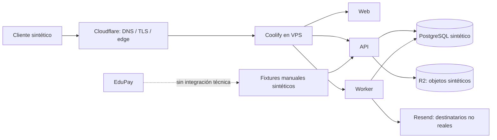

# G5-P1/P2 — Registro Coolify y addendum Ley N.° 21.719

## 1. Propósito, autoridad y límites

Este documento registra las decisiones humanas entregadas para preparar `P1 — foundation
sintética` y `P2 — preproducción sintética` sobre infraestructura existente. También
incorpora un addendum de preparación legal/privacy basado en fuentes oficiales chilenas.
No constituye asesoría legal ni una declaración de cumplimiento.

| Campo | Estado |
| --- | --- |
| Fecha del registro | `2026-08-24 / America/Santiago` |
| Autoridad de la decisión técnica | owner del producto y responsable técnico de BaseLogic |
| Ambiente autorizado | `P1/P2 / SYNTHETIC DATA ONLY` |
| Datos, personas, documentos y destinatarios reales | `NOT AUTHORIZED` |
| Captura de salud | `DISABLED` |
| Piloto institucional | `NOT AUTHORIZED` |
| Producción con datos reales | `NOT AUTHORIZED` |
| Integración técnica EduPay | `NOT AUTHORIZED` |
| DAST/pentest | `AUTHORIZED FOR A LATER PHASE / NOT IN P1-P2` |
| `LP3-ART-014` | `OPEN / PROVIDER_REVIEW_REQUIRED` |

Este registro no contiene IP, hostname, credenciales, RUT, nombres personales completos,
datos de contacto ni identificadores de personas. Los valores operativos correspondientes
deben vivir en el secret store o en registros institucionales de acceso restringido.

## 2. Clasificación de la información

### 2.1 Hechos confirmados

1. BaseLogic dispone de una VPS ya contratada y administrada mediante Coolify.
2. El proveedor informado para la VPS es Hostinger y la región informada es Brasil.
3. La zona DNS es administrada mediante Cloudflare y se reservará un subdominio específico
   para Admisión. El hostname exacto se excluye deliberadamente de este registro.
4. Resend es el proveedor seleccionado técnicamente para email y Cloudflare R2 el
   proveedor seleccionado técnicamente para object storage.
5. El primer tenant institucional fue identificado por la autoridad humana. Este documento
   conserva únicamente el rol `tenant piloto designado` y no replica datos personales de
   sus representantes.
6. No se usarán personas, destinatarios, documentos ni datos reales antes del cierre
   legal/privacy y de una autorización formal y fechada de piloto.

### 2.2 Decisiones aprobadas para P1/P2

| ID | Decisión | Alcance | Estado |
| --- | --- | --- | --- |
| `CP-P1-D-001` | Usar la VPS existente con Coolify como foundation de preproducción | Runtime containerizado y servicios de soporte exclusivamente sintéticos | `APPROVED / SYNTHETIC ONLY` |
| `CP-P1-D-002` | Usar Cloudflare para DNS/TLS y controles perimetrales aplicables | Subdominio dedicado; configuración y secretos fuera de documentación | `APPROVED FOR IMPLEMENTATION` |
| `CP-P1-D-003` | Mantener separación de ambientes y secretos | P1 vacío antes de fixtures; ningún secreto en Git, imágenes, logs o URLs | `APPROVED` |
| `CP-P1-D-004` | Mantener captura de salud deshabilitada | Sin campo, formulario, fixture ni importación de salud en P1/P2 | `APPROVED / FAIL-CLOSED` |
| `CP-P1-D-005` | Mantener Admisión y EduPay desacoplados | Sin tablas compartidas, acceso directo a DB, sincronización ni dependencia runtime | `APPROVED` |
| `CP-P1-D-006` | Usar un procedimiento manual para preparar fixtures | Sólo registros íntegramente sintéticos; EduPay no es fuente técnica de P1/P2 | `APPROVED / SYNTHETIC ONLY` |
| `CP-P2-D-001` | Usar Resend como proveedor técnico de email | Pruebas con destinatarios controlados no reales; envío real bloqueado | `APPROVED WITH ART-014 CONDITION` |
| `CP-P2-D-002` | Usar Cloudflare R2 como object storage técnico | Objetos sintéticos, acceso privado y adapter S3-compatible | `APPROVED WITH ART-014 CONDITION` |
| `CP-P2-D-003` | Someter Hostinger, Cloudflare, Resend y R2 a revisión individual | DPA, subencargados, residencia, transferencias, seguridad, retención y salida | `LP3-ART-014 REQUIRED` |
| `CP-P2-D-004` | Diferir DAST y pentest | Se planifican para una fase avanzada previa a piloto; no bloquean P1/P2 sintéticos | `DEFERRED / AUTHORIZED LATER` |
| `CP-P2-D-005` | Evitar promoción automática | Completar P2 no autoriza P3, piloto, datos reales ni producción | `APPROVED` |

### 2.3 Supuestos de trabajo, no aprobaciones

1. La VPS tendrá capacidad suficiente para ejecutar P1/P2; debe comprobarse con medición
   sintética y no con una cifra inventada.
2. Coolify puede operar el despliegue reproducible, health checks y rollback requeridos;
   cada capacidad debe demostrarse en evidencia P1/P2.
3. La región informada de la VPS describe el data plane principal, no necesariamente las
   regiones de backups, soporte, telemetría, control planes o subencargados.
4. El tenant piloto designado probablemente decidirá las finalidades del tratamiento y
   BaseLogic probablemente tratará datos por encargo. La calificación final depende del
   contrato y de las decisiones efectivas por finalidad.
5. Resend y Cloudflare pueden implicar tratamiento o transferencia fuera de Chile. La
   topología y garantías reales deben verificarse por producto y flujo en `LP3-ART-014`.

### 2.4 Preguntas abiertas

1. ¿Cuál es la persona jurídica que será responsable del tratamiento y quién posee
   facultades para aprobar los instrumentos institucionales?
2. ¿Quién será el revisor legal/privacy designado y quién asumirá el owner institucional
   de incidentes y solicitudes de titulares?
3. ¿Dónde residen data plane, control plane, backups, logs, soporte y subencargados de cada
   proveedor seleccionado?
4. ¿Qué contrato/DPA, mecanismo de transferencia y reglas de devolución o supresión se
   aprobarán para cada proveedor?
5. ¿Qué finalidades, campos y bases de licitud se aprobarán para un futuro piloto real?
6. ¿Qué período de retención se aplicará a cada categoría, evento, objeto, log y backup?
7. ¿Qué relación contractual y flujo mínimo se aprobarán en el futuro entre el tenant,
   Admisión y EduPay?

## 3. Topología P1/P2 autorizada

Reglas obligatorias de la topología:

- un identificador entregado por el cliente no constituye autorización;
- RLS y autorización tenant/propósito/rol permanecen fail-closed;
- DB y objetos de Admisión no se comparten con EduPay;
- ninguna exportación desde EduPay alimenta P1/P2;
- email no puede dirigirse a personas reales;
- objetos y ejemplos no pueden contener documentos reales;
- Cloudflare, Resend y R2 no quedan legalmente aprobados por aparecer en el diagrama.

## 4. Addendum Ley N.° 21.719

### 4.1 Vigencia y transición

La Ley N.° 21.719 fue promulgada el `2024-11-25`, publicada en el Diario Oficial el
`2024-12-13` y sus modificaciones principales entran en vigencia el `2026-12-01`. Hasta
el `2026-11-30` continúa vigente el texto actual de la Ley N.° 19.628; desde el
`2026-12-01` rige el texto reformado. El período de transición no equivale a autorización
para tratar datos reales ni elimina las obligaciones vigentes.

Fuentes oficiales:

- [BCN — Ley N.° 21.719 y fecha de vigencia](https://www.bcn.cl/leychile/navegar?i=1209272)
- [BCN — Ley N.° 19.628 vigente hasta el 30 de noviembre de 2026](https://www.bcn.cl/leychile/Navegar?idNorma=141599&idParte=8642680)
- [Diario Oficial — publicación de la Ley N.° 21.719](https://www.diariooficial.interior.gob.cl/publicaciones/2024/12/13/44023/01/2583630.pdf)

Este addendum prepara el producto para el régimen reformado por su proximidad, pero no
promueve ninguna clasificación candidata a opinión legal final.

### 4.2 Roles probables que deben validarse

| Actor | Rol probable de trabajo | Validación pendiente |
| --- | --- | --- |
| Tenant piloto designado | `controller / responsable` si decide fines y medios | persona jurídica, representante, finalidades y responsabilidades contractuales |
| BaseLogic | `processor / encargado` cuando actúa bajo instrucciones | alcance, instrucciones, soporte, subencargados, devolución/supresión y finalidades propias inexistentes o separadas |
| EduPay | fuente, encargado o responsable independiente según el flujo futuro | titularidad, licitud de origen, finalidad compatible, contrato y tipo de comunicación/cesión |
| Hostinger | encargado/subencargado de infraestructura | producto, región, soporte, backups, DPA, subencargados y eliminación |
| Cloudflare/R2 | encargado/subencargado de edge y objetos | productos activados, regiones, logs, DPA, subencargados, transferencias y retención |
| Resend | encargado/subencargado de comunicaciones | contenido mínimo, destinatarios, eventos, logs, DPA, subencargados, transferencias y eliminación |

El artículo 15 bis del texto reformado exige que el encargo documente, entre otros,
objeto, duración, finalidad, tipos de datos, categorías de titulares y obligaciones; la
subdelegación requiere autorización específica y escrita. La relación real entre las
partes debe validarse antes del piloto.

### 4.3 Menores y datos especialmente protegidos

El artículo 16 quáter dispone que el tratamiento de datos de niños, niñas y adolescentes
debe atender su interés superior y autonomía progresiva. Para niños y niñas menores de
14 años exige consentimiento de quien legalmente corresponda salvo autorización o mandato
legal expreso; para datos sensibles de adolescentes menores de 16 años aplica una regla
especial equivalente. Además, impone una obligación especial de protección a los
establecimientos educacionales y a quienes administran esos datos.

Fuente oficial: [BCN — artículo 16 quáter del texto reformado](https://www.bcn.cl/leychile/navegar?idNorma=141599&idParte=10528071&idVersion=2026-12-01).

Implicancias de producto ya aprobadas para P1/P2:

- `HEALTH_COLLECTION = DISABLED`;
- no se presume autoridad parental por conocer un identificador o tener email verificado;
- no se importa información de alumnos, cursos o apoderados desde EduPay;
- no se prueban consentimientos con actores reales;
- cualquier futuro catálogo sensible/PIE/NEE requiere `LP3-ART-007/008`.

### 4.4 Finalidad, minimización, retención y derechos

El texto reformado exige licitud demostrable, finalidad específica, proporcionalidad,
calidad, seguridad, transparencia y confidencialidad. La conservación sólo puede durar lo
necesario para la finalidad, salvo fundamento aplicable; luego corresponde supresión o
anonimización. Reconoce acceso, rectificación, supresión, oposición, portabilidad y
bloqueo.

Antes del piloto se necesitan una matriz finalidad/base jurídica aprobada, avisos
versionados, un canal de derechos y una tabla numérica de retención. P1/P2 sólo pueden
probar mecánicamente esos procedimientos con fixtures sintéticos.

### 4.5 Seguridad e incidentes

Los artículos 14 quáter a 14 sexies incorporan protección desde el diseño y por defecto,
medidas técnicas y organizativas acordes al riesgo, y deberes de registro/reporte ante
vulneraciones aplicables. Para datos sensibles o de niños menores de 14 años también
existen reglas de comunicación a titulares o representantes cuando corresponda.

Fuente oficial: [BCN — protección por diseño, seguridad y vulneraciones](https://www.bcn.cl/leychile/navegar?f=2026-12-01&i=1209272).

P1/P2 deben producir evidencia técnica de secretos, aislamiento, cifrado aplicable,
backup/restore, rollback, logging minimizado y respuesta a incidentes sintéticos. Esa
evidencia no reemplaza el runbook institucional/legal `LP3-ART-015`.

### 4.6 Evaluación de impacto

El artículo 15 ter exige una evaluación previa cuando un tratamiento pueda producir alto
riesgo y la exige siempre, entre otros casos, ante evaluación automatizada con efectos
significativos, tratamiento masivo o a gran escala, monitoreo sistemático de zonas
públicas y tratamiento de datos sensibles/especialmente protegidos bajo excepciones al
consentimiento.

Fuente oficial: [Diario Oficial — artículo 15 ter](https://www.diariooficial.interior.gob.cl/publicaciones/2024/12/13/44023/01/2583630.pdf).

Antes del piloto debe existir una EIPD o una decisión legal documentada que explique por
qué no corresponde para los tratamientos efectivamente aprobados. P1/P2 no incluyen
perfilamiento ni decisiones automatizadas sobre personas reales.

### 4.7 Transferencias y revisión de proveedores

Los artículos 27 y 28 regulan transferencias internacionales mediante decisión de
adecuación, garantías contractuales u otros mecanismos previstos. La región principal de
la VPS no demuestra por sí sola dónde se tratan backups, objetos, correo, logs, soporte o
metadatos.

Fuente oficial: [BCN — transferencias internacionales, artículos 27 y 28](https://www.bcn.cl/leychile/navegar?i=1209272).

Hostinger Brasil, Cloudflare, Resend y R2 permanecen en
`LP3-ART-014 = OPEN / PROVIDER_REVIEW_REQUIRED`. Su selección técnica para P1/P2 no
autoriza tratamiento real, ni declara suficiencia de sus DPA, subencargados, residencia,
transferencias o medidas de seguridad.

## 5. Checklist legal/privacy prepiloto

Cada checkbox requiere evidencia, versión, owner, aprobadores y fecha; no se cierra por
la sola existencia de este documento.

### 5.1 Identidad, roles y contratos

- [ ] `LP3-ART-001`: individualizar al responsable institucional y validar la matriz
      controller/processor por finalidad y tenant.
- [ ] `LP3-ART-002`: aprobar contrato/DPA tenant–BaseLogic con instrucciones, seguridad,
      subencargados, incidentes, auditoría y devolución/supresión.
- [ ] Registrar quién puede aprobar institucionalmente el piloto y las operaciones de
      tratamiento, sin exponer esa identidad en documentación técnica pública.
- [ ] Confirmar que BaseLogic no usa datos para finalidades propias no documentadas o
      clasificarlas separadamente si existieran.

### 5.2 Finalidades, menores y transparencia

- [ ] `LP3-ART-003`: aprobar matriz campo/actor/finalidad/base de licitud/restricción.
- [ ] `LP3-ART-004`: aprobar aviso corto, claro y ubicado antes de la primera captura.
- [ ] `LP3-ART-005`: aprobar política completa, pública y versionada.
- [ ] `LP3-ART-006`: aprobar procedimiento Q-106 de relación y autoridad del adulto.
- [ ] Definir evidencia mínima y revisión de discrepancias sin presumir autoridad por
      email, conocimiento de un identificador o existencia previa en EduPay.
- [ ] Definir cuándo se requiere consentimiento, quién puede otorgarlo, cómo se prueba y
      cómo se revoca; mantenerlo separado del mero reconocimiento del aviso.
- [ ] Preparar información apropiada para apoderados y, cuando corresponda, para menores
      atendiendo edad y autonomía progresiva.

### 5.3 Datos sensibles y salud

- [ ] `LP3-ART-007`: aprobar catálogo exhaustivo de campos PIE/NEE/sensibles, finalidad,
      mínimo dato, roles, acceso, retención y restricciones.
- [ ] `LP3-ART-008`: demostrar `HEALTH_COLLECTION = DISABLED_BY_DEFAULT` en formulario,
      API, importaciones, exportaciones y fixtures.
- [ ] Mantener salud deshabilitada hasta una nueva aprobación institucional/legal expresa;
      una necesidad operacional no constituye por sí sola base suficiente.
- [ ] Prohibir criterios automáticos de elegibilidad o priorización basados en salud,
      PIE/NEE u otra categoría sensible no aprobada.

### 5.4 Retención, eliminación y derechos

- [ ] `LP3-ART-009`: aprobar matriz numérica por categoría, finalidad, trigger, proveedor,
      backup, log, excepción y owner.
- [ ] `LP3-ART-010`: aprobar y ensayar delete/anonymize/block/archive/legal hold, incluidas
      copias y proveedores.
- [ ] `LP3-ART-011`: publicar canal y procedimiento para solicitudes de titulares, con
      verificación de identidad/autoridad, trazabilidad y respuesta.
- [ ] `LP3-ART-012`: aprobar matriz legal de acceso/exportación/terceros/portabilidad y
      datos `HIGHLY_RESTRICTED`.
- [ ] `LP3-ART-013`: resolver tratamiento de originales físicos y cualquier excepción
      sectorial aplicable.

### 5.5 Proveedores y transferencias — ART-014

- [ ] Inventariar por separado Hostinger, Cloudflare edge, Cloudflare R2 y Resend.
- [ ] Verificar entidad contractual, servicio/producto exacto y rol en cada flujo.
- [ ] Documentar data plane, control plane, soporte, logs, backups, metadatos y regiones.
- [ ] Obtener y revisar DPA, subencargados, notificación de cambios y condiciones de
      soporte/acceso.
- [ ] Identificar cada transferencia internacional y el mecanismo aplicable.
- [ ] Documentar cifrado, claves, aislamiento, retención, exportación, devolución,
      supresión, cierre de cuenta y evidencia de borrado.
- [ ] Minimizar correo, objetos, edge logs y telemetría; excluir secretos, documentos
      crudos, salud/PIE/NEE y respuestas irrestrictas.
- [ ] Registrar aprobación institucional, técnica, operativa y legal/privacy por proveedor.
- [ ] Mantener `LP3-ART-014 = OPEN` hasta completar todas las revisiones, aunque P1/P2
      sintéticos estén operativos.

### 5.6 Incidentes, auditoría y evaluación de impacto

- [ ] `LP3-ART-015`: aprobar runbook privacy/security, owner institucional, owner técnico,
      asesoría legal, escalamiento, evidencia y comunicaciones aplicables.
- [ ] `LP3-ART-016`: aprobar acceso y retención numérica de `AuditEvent` y
      `SecurityEvent`, manteniendo sus propósitos separados.
- [ ] Elaborar EIPD antes del piloto o registrar la decisión legal fundamentada de no
      aplicabilidad sobre los tratamientos definitivos.
- [ ] Documentar revisión humana de cualquier futura decisión automatizada con efecto
      significativo; P1/P2 no la habilitan.
- [ ] Ejecutar DAST y pentest en la fase avanzada autorizada y cerrar hallazgos según
      severidad antes de solicitar piloto.

### 5.7 EduPay

- [ ] Mantener `EDUPAY_TECHNICAL_INTEGRATION = NOT AUTHORIZED` durante P1/P2.
- [ ] No compartir tablas, usuarios DB, buckets, secretos ni dependencia runtime.
- [ ] Antes de cualquier flujo futuro, definir rol de cada parte, origen lícito, finalidad,
      campos mínimos, tipo de comunicación/cesión/encargo, autoridad, actualización,
      corrección, retención, eliminación, auditoría e incidentes.
- [ ] Someter el contrato y diagrama del flujo a aprobación institucional/legal y a una
      autorización técnica separada de E7/G7 o la compuerta que corresponda.

## 6. Criterios documentales de salida P1/P2

| Control | Evidencia requerida | Efecto |
| --- | --- | --- |
| Datos sintéticos | fixtures y destinatarios controlados revisados, sin PII real | habilita pruebas P1/P2, no piloto |
| Health disabled | evidencia UI/API/import/export/fixtures fail-closed | conserva `LP3-ART-008` abierto hasta aprobación final |
| EduPay desacoplado | ausencia de conexión, secretos, tablas y dependencias directas | conserva integración real fuera de alcance |
| Provider inventory | fichas preliminares de los cuatro servicios | aporta insumos; no cierra `LP3-ART-014` |
| Seguridad técnica | backup/restore, rollback, secretos, RLS, aislamiento y logs minimizados | evidencia técnica, no cumplimiento legal |
| Gates | aprobación humana separada para cada fase siguiente | evita promoción implícita |

## 7. Disposición de compuertas

| Elemento | Estado posterior a este registro |
| --- | --- |
| `P1 — foundation sintética` | `AUTHORIZED FOR IMPLEMENTATION` |
| `P2 — preproducción sintética` | `AUTHORIZED FOR IMPLEMENTATION` |
| `LP3-ART-001..016` | `OPEN` |
| `LP3-ART-014` | `OPEN / PROVIDER_REVIEW_REQUIRED` |
| `G5-EXIT-11` | `BLOCKED / PREPILOT_LEGAL_ARTIFACTS_REQUIRED` |
| Datos personales reales | `NOT AUTHORIZED` |
| Destinatarios reales | `NOT AUTHORIZED` |
| Piloto | `NOT AUTHORIZED` |
| Producción | `NOT AUTHORIZED` |
| EduPay técnico | `NOT AUTHORIZED` |

La siguiente acción humana no es entregar datos. Es designar al revisor legal/privacy y
al owner institucional, individualizar contractualmente al responsable, y completar
`LP3-ART-001..016`, comenzando por roles/DPA/finalidades y la revisión específica
`LP3-ART-014` de Hostinger, Cloudflare, Resend y R2.

## 8. Fuera de alcance

No se modificaron código, schema, migraciones, infraestructura, DNS, cuentas, contratos,
secretos, providers, datos, fixtures, destinatarios ni integraciones. Este documento no
aprueba textos legales finales, bases jurídicas, períodos numéricos, una EIPD, una
transferencia internacional, un piloto, producción ni el uso real de EduPay.
