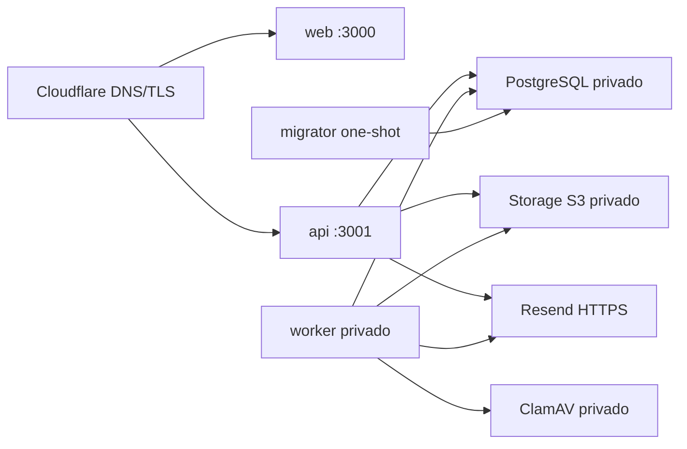

# G5 — Runbook de preproducción sintética en Coolify

## 1. Estado y alcance

| Campo | Valor |
| --- | --- |
| Entorno | `PREPRODUCTION / SYNTHETIC DATA ONLY` |
| Runtime | VPS Linux existente administrado mediante Coolify |
| Artefacto | `compose.coolify.yaml` |
| Despliegue | Manual desde GitHub Environment `admission-preprod` |
| Datos y destinatarios reales | `NOT AUTHORIZED` |
| Piloto y producción | `NOT AUTHORIZED` |
| Integración EduPay | `NOT INCLUDED` |

Este runbook prepara infraestructura reproducible. No constituye un acto de puesta en
producción ni permite cargar personas, documentos, correos o identificadores reales.

## 2. Topología



`web` y `api` son los únicos servicios con dominio público. `worker`, `migrator`,
PostgreSQL, storage y ClamAV no publican puertos del host. Coolify crea la red aislada del
stack; los recursos privados separados deben conectarse mediante **Connect to Predefined
Network**. No se deben declarar redes Docker personalizadas en el Compose.

## 3. Preparación del servidor

Antes del primer despliegue registrar como evidencia:

1. versión de Coolify, Docker, distribución Linux y arquitectura;
2. capacidad y espacio libre del VPS, además de las cargas que comparte;
3. firewall con ingreso público limitado a HTTP/HTTPS y administración restringida;
4. MFA y acceso restringido al panel Coolify;
5. parcheo del host, owner operativo y ventana de mantenimiento;
6. destino de backup fuera del VPS y procedimiento de restauración.

No se considera suficiente un volumen Docker, el backup de la configuración de Coolify
ni un snapshot aislado del VPS.

### Decisiones R6-HARD vigentes

La auditoría read-only de la VPS y la aprobación humana están registradas en
[`29-g5-hardening-decision-record.md`](29-g5-hardening-decision-record.md). La ventana
preferida para parcheo y reinicio es 21:00–07:00 `America/Santiago`.

Cloudflare Access debe proteger el panel Coolify. El dashboard/API de Traefik y realtime
deben quedar deshabilitados. SSH conserva temporalmente la excepción `root/password` y
no se debe convertir a llave-only, VPN o allowlist en esta etapa; esto mantiene un P0
documentado para postproducción y no autoriza datos reales.

## 4. Recursos privados

### PostgreSQL

Crear PostgreSQL como recurso de base en Coolify, sin dominio ni port mapping público.
El bootstrap administrativo debe crear:

- base `admission_preprod`, propiedad de `admission_migrator`;
- rol `admission_migrator` sin privilegios de superusuario, `CREATEDB`, `CREATEROLE`,
  replicación ni bypass de RLS;
- rol `admission_app` separado, con las mismas restricciones;
- `CONNECT` sólo para ambos roles, y `CREATE` sobre `public` sólo para migrator.

Las contraseñas son aleatorias, distintas y se guardan únicamente como variables secretas
en Coolify. API y worker reciben sólo `DATABASE_APP_URL`; el contenedor one-shot recibe
sólo `DATABASE_MIGRATION_URL`.

Configurar dump horario para el objetivo técnico RPO 1 h, retención aprobada y copia en un
destino externo al VPS. Un backup exitoso no cierra la compuerta: restaurar en una base
desechable, ejecutar smoke sintético y medir el RTO.

### Storage y antivirus

El storage S3-compatible y ClamAV se despliegan como recursos privados separados. Deben
existir áreas distintas para cuarentena y aprobados, con credenciales diferentes para API
y worker. Ningún bucket admite acceso público. El worker es el único que puede leer
cuarentena, solicitar escaneo, promover contenido limpio y eliminar el objeto temporal.
Errores, archivos infectados o no escaneables permanecen fail-closed.

El contenido requiere backup/versionado independiente de PostgreSQL y una prueba de
reconciliación entre registros y objetos después del restore.

## 5. Variables y secretos

`.env.coolify.example` es el inventario canónico de nombres y usa exclusivamente dominios
`.invalid`, UUID sintético y placeholders. No debe importarse como si contuviera secretos.

Clasificación:

- **Build variables públicas:** `ADMISSION_API_PUBLIC_URL`,
  `ADMISSION_TENANT_PUBLIC_ID`.
- **Runtime no secreto:** origins, límites, intervalos, buckets, región y hosts internos.
- **Runtime secreto:** ambas URLs PostgreSQL, access/secret keys del storage,
  `RESEND_API_KEY`, `RESEND_WEBHOOK_SECRET`, `CSRF_SIGNING_SECRET`,
  `EMAIL_SUPPRESSION_HMAC_SECRET` y claves históricas de supresión.
- **Guard de preproducción:** `EMAIL_DELIVERY_MODE=synthetic` y
  `REAL_EMAIL_DELIVERY_AUTHORIZED=false`; el adaptador rechaza cualquier dominio distinto
  de `resend.dev`.

No usar variables secretas como build args. Al rotar la clave HMAC de supresión, aumentar
`EMAIL_SUPPRESSION_HASH_KEY_VERSION` y conservar las versiones anteriores en
`EMAIL_SUPPRESSION_PREVIOUS_KEYS_JSON` hasta que la política de retención permita
retirarlas. Rotar cualquier secreto implica redeploy controlado y prueba posterior; nunca
se imprime su valor en logs.

## 6. Dominios y edge

Asignar en Coolify dos FQDN distintos usando nombres previamente aprobados:

- web hacia puerto interno `3000`;
- API hacia puerto interno `3001`.

En Cloudflare, los registros HTTP pueden quedar proxied y el modo TLS debe verificar el
certificado del origen (`Full (strict)`). SPF, DKIM, MX y verificaciones del dominio de
correo permanecen DNS-only. No cachear API, descargas autenticadas ni respuestas con
cookies. El límite de carga del edge debe ser igual o mayor que
`DOCUMENT_UPLOAD_HARD_MAX_BYTES`.

`ADMISSION_WEB_ORIGIN` y `ADMISSION_APP_ORIGIN` contienen exactamente el origin público
de web; `ADMISSION_API_PUBLIC_URL` contiene el origin público de API, sin path final.

## 7. Configuración de Coolify

1. Crear proyecto y environment exclusivos para preproducción.
2. Conectar GitHub mediante App limitada a este repositorio.
3. Crear una aplicación Git-based con build pack **Docker Compose**.
4. Seleccionar rama `main`, base directory `/` y archivo `/compose.coolify.yaml`.
5. Conectar el stack a la red predefinida de los recursos privados.
6. Copiar los nombres de `.env.coolify.example` y suministrar valores por el secret store.
7. Asignar dominios sólo a `web:3000` y `api:3001`.
8. Mantener Auto Deploy desactivado; el despliegue se solicita tras la compuerta GitHub.
9. Conservar `exclude_from_hc: true` para `migrator`: es una extensión de Coolify para un
   contenedor que debe terminar exitosamente.
10. Configurar límites de CPU/memoria después de medir el host y la carga sintética.

El migrator es serial y bloquea API/worker mediante `service_completed_successfully`.
Una falla de migración detiene el despliegue. El rollback revierte la imagen anterior, no
ejecuta migraciones destructivas hacia atrás.

## 8. Compuerta GitHub y despliegue

Crear el GitHub Environment `admission-preprod` con reviewer humano y configurar:

- secrets `COOLIFY_DEPLOY_TOKEN`, `COOLIFY_DEPLOY_WEBHOOK` y
  `COOLIFY_API_BASE_URL` (base HTTPS terminada en `/api/v1`);
- variables `PREPROD_API_HEALTH_URL` apuntando a `/health/ready` y
  `PREPROD_WEB_HEALTH_URL` apuntando a la raíz web.

El token de Coolify debe tener únicamente permiso `deploy`, alcance al equipo correcto y
caducidad. El workflow sólo acepta `main`, exige escribir `PREPROD_SYNTHETIC`, valida el
contrato y solicita el deploy sin mostrar webhook ni token. Conserva los UUID de despliegue,
consulta cada ejecución hasta `finished`, exige que el commit sea exactamente el SHA del
workflow y sólo entonces verifica health público. Un `2xx` inicial nunca se considera
evidencia de despliegue.

## 9. Validación y rollback

Antes de solicitar un deploy:

```bash
pnpm g5coolify:config:smoke
pnpm format:check
pnpm lint
pnpm typecheck
pnpm build
```

Después del despliegue verificar:

1. migrator terminó con exit `0` y la versión de schema esperada;
2. API readiness y web responden por HTTPS;
3. worker permanece healthy y responde correctamente a `SIGTERM`;
4. DB, storage y ClamAV no son accesibles desde Internet;
5. carga, escaneo y promoción de un archivo sintético limpio;
6. rechazo fail-closed de controles sintéticos infectado/no escaneable;
7. correo únicamente a destinatarios de prueba y recepción idempotente de webhook;
8. ausencia de secretos, cookies, documentos y datos personales en logs.

Para rollback: detener nuevas promociones, conservar evidencia, seleccionar la imagen local
anterior en Coolify, desplegarla sin revertir la base y repetir health/smoke. Si una
migración no es backward-compatible, el despliegue es `NO-GO` antes de recibir tráfico.

## 10. Bloqueos para producción

La preproducción no puede promoverse mientras falte cualquiera de estos elementos:

- auditoría read-only de recursos y convivencia en la VPS;
- backup externo y restore ensayado;
- alertas, logs sanitizados, rollback y operación/on-call probados;
- cierre legal/privacy, contrato institucional, retención y derechos;
- DAST/pentest en la compuerta autorizada;
- autorización humana explícita de piloto y, posteriormente, producción.

La información académica existente en EduPay no se copia ni consulta para esta
preproducción. Cualquier integración futura mantiene bases separadas y requiere contrato,
autenticación, minimización, idempotencia y aprobación específica.

## 11. Referencias oficiales

- [Coolify — Docker Compose](https://coolify.io/docs/applications/build-packs/docker-compose)
- [Coolify — health checks](https://coolify.io/docs/knowledge-base/health-checks)
- [Coolify — persistent storage](https://coolify.io/docs/knowledge-base/persistent-storage)
- [Coolify — database backups](https://next.coolify.io/docs/databases/backups)
- [Coolify — deploy webhooks](https://next.coolify.io/docs/core/automation/deploy-webhooks)
- [Cloudflare — proxy status](https://developers.cloudflare.com/dns/proxy-status/)
- [Cloudflare — origin TLS](https://developers.cloudflare.com/ssl/origin-configuration/)
- [Resend — domains](https://resend.com/docs/dashboard/domains/introduction)
- [Resend — test recipients](https://resend.com/docs/dashboard/emails/send-test-emails)
- [Resend — webhook verification](https://resend.com/docs/webhooks/verify-webhooks-requests)
